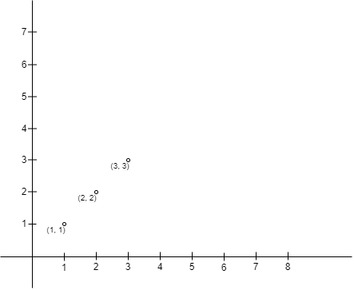
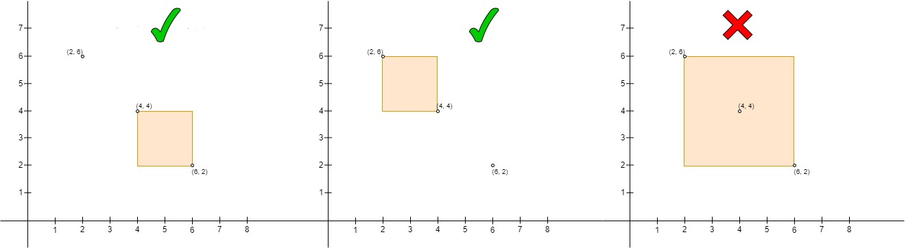
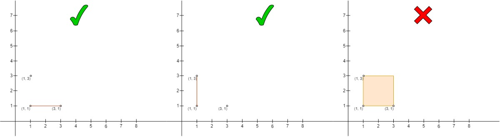

### 1. Description

You are given a 2D array `points` of size `n x 2` representing integer coordinates of some points on a 2D plane, where $\text{points}[i] = [x_{i}, y_{i}]$.

Count the number of pairs of points `(A, B)`, where

- `A` is on the **upper left** side of `B`, and

- there are no other points in the rectangle (or line) they make (**including the border**), except for the points `A` and `B`.

Return the count.

### 2. Function Contract

- `n`: Input parameter.
- Returns expected result.

### 3. Examples

#### Example 1

**Input:** points = [[1,1],[2,2],[3,3]]

**Output:** 0

**Explanation:**

There is no way to choose `A` and `B` such that `A` is on the upper left side of `B`.

#### Example 2

**Input:** points = [[6,2],[4,4],[2,6]]

**Output:** 2

**Explanation:**

- The left one is the pair $(\text{points}[1], \text{points}[0])$, where $\text{points}[1]$ is on the upper left side of $\text{points}[0]$ and the rectangle is empty.

- The middle one is the pair $(\text{points}[2], \text{points}[1])$, same as the left one it is a valid pair.

- The right one is the pair $(\text{points}[2], \text{points}[0])$, where $\text{points}[2]$ is on the upper left side of $\text{points}[0]$, but $\text{points}[1]$ is inside the rectangle so it's not a valid pair.

#### Example 3

**Input:** points = [[3,1],[1,3],[1,1]]

**Output:** 2

**Explanation:**

- The left one is the pair $(\text{points}[2], \text{points}[0])$, where $\text{points}[2]$ is on the upper left side of $\text{points}[0]$ and there are no other points on the line they form. Note that it is a valid state when the two points form a line.

- The middle one is the pair $(\text{points}[1], \text{points}[2])$, it is a valid pair same as the left one.

- The right one is the pair $(\text{points}[1], \text{points}[0])$, it is not a valid pair as $\text{points}[2]$ is on the border of the rectangle.

### 4. Constraints

- $2 \le n \le 50$

- $\text{points}[i].length = 2$

- $0 \le \text{points}[i][0], \text{points}[i][1] \le 50$

- All $\text{points}[i]$ are distinct.