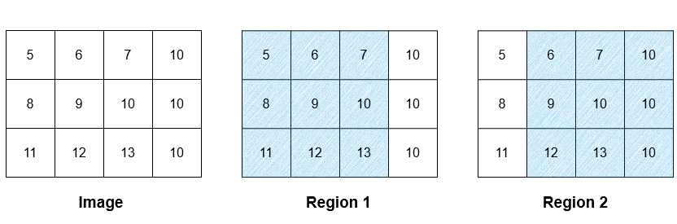
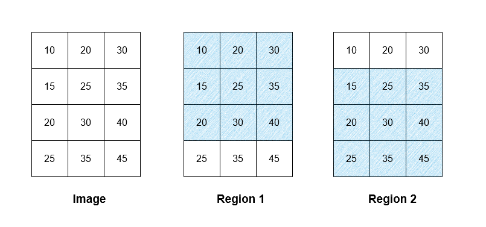

### 1. Description

You are given `m x n` grid `image` which represents a grayscale image, where $\text{image}[i][j]$ represents a pixel with intensity in the range `[0..255]`. You are also given a **non-negative** integer `threshold`.

Two pixels are **adjacent** if they share an edge.

A **region** is a `3 x 3` subgrid where the **absolute difference** in intensity between any two **adjacent** pixels is **less than or equal to** `threshold`.

All pixels in a region belong to that region, note that a pixel can belong to **multiple** regions.

You need to calculate a `m x n` grid `result`, where $\text{result}[i][j]$ is the **average** intensity of the regions to which $\text{image}[i][j]$ belongs, **rounded down** to the nearest integer. If $\text{image}[i][j]$ belongs to multiple regions, $\text{result}[i][j]$ is the **average **of the** rounded-down average **intensities of these regions, **rounded down** to the nearest integer. If $\text{image}[i][j]$ does** not** belong to any region, $\text{result}[i][j]$ is **equal to** $\text{image}[i][j]$.

Return the grid `result`.

### 2. Function Contract

- `n`: Input parameter.
- Returns expected result.

### 3. Examples

#### Example 1

**Input:** image = [[5,6,7,10],[8,9,10,10],[11,12,13,10]], threshold = 3

**Output:** [[9,9,9,9],[9,9,9,9],[9,9,9,9]]

**Explanation:**

There are two regions as illustrated above. The average intensity of the first region is 9, while the average intensity of the second region is 9.67 which is rounded down to 9. The average intensity of both of the regions is (9 + 9) / 2 = 9. As all the pixels belong to either region 1, region 2, or both of them, the intensity of every pixel in the result is 9.

Please note that the rounded-down values are used when calculating the average of multiple regions, hence the calculation is done using 9 as the average intensity of region 2, not 9.67.

#### Example 2

**Input:** image = [[10,20,30],[15,25,35],[20,30,40],[25,35,45]], threshold = 12

**Output:** [[25,25,25],[27,27,27],[27,27,27],[30,30,30]]

**Explanation:**

There are two regions as illustrated above. The average intensity of the first region is 25, while the average intensity of the second region is 30. The average intensity of both of the regions is (25 + 30) / 2 = 27.5 which is rounded down to 27.

All the pixels in row 0 of the image belong to region 1, hence all the pixels in row 0 in the result are 25. Similarly, all the pixels in row 3 in the result are 30. The pixels in rows 1 and 2 of the image belong to region 1 and region 2, hence their assigned value is 27 in the result.

#### Example 3

**Input:** image = [[5,6,7],[8,9,10],[11,12,13]], threshold = 1

**Output:** [[5,6,7],[8,9,10],[11,12,13]]

**Explanation:**

There is only one `3 x 3` subgrid, while it does not have the condition on difference of adjacent pixels, for example, the difference between $\text{image}[0][0]$ and $\text{image}[1][0]$ is $|5 - 8| = 3 > threshold = 1$. None of them belong to any valid regions, so the `result` should be the same as `image`.

### 4. Constraints

- $3 \le n, m \le 500$

- $0 \le \text{image}[i][j] \le 255$

- $0 \le threshold \le 255$