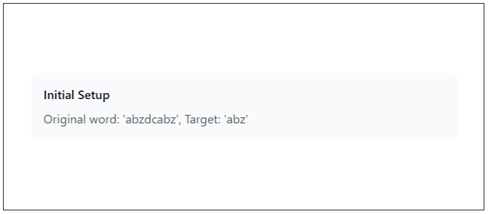
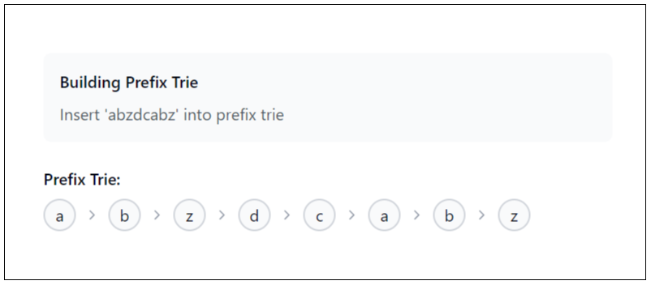
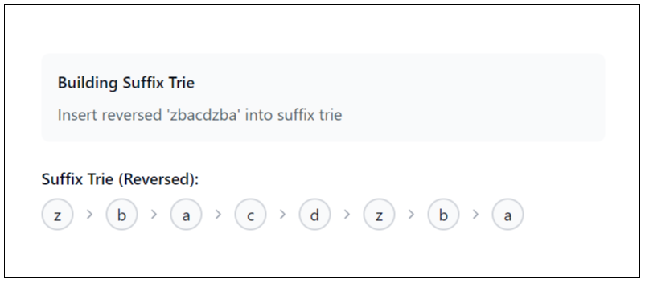
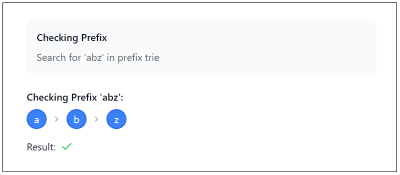
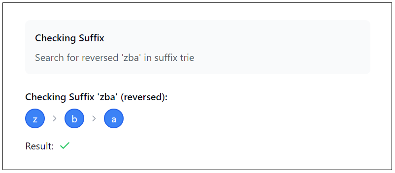
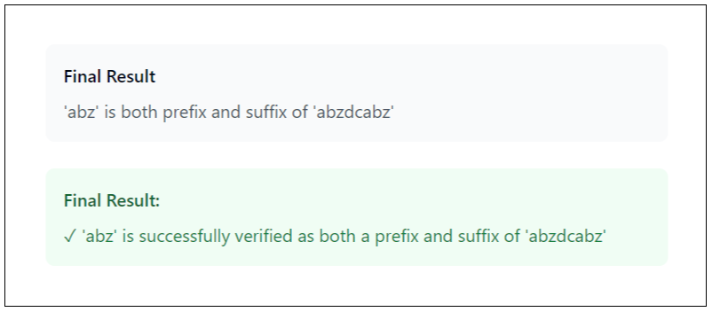

## Solution

---

### Approach 1: Brute Force

#### Intuition

We need to count pairs of words where one word is both a prefix and a suffix of the other. A prefix of a string is a part of the string that appears at the start, and a suffix is a part of the string that appears at the end. For example, in the word `"ababa"`, `"aba"` is both a prefix and a suffix.

A simple logical solution is to use a brute-force approach, which involves comparing all pairs of words and checking if one word is a prefix and a suffix of the other.

> To check if one string is a prefix or suffix of another, we can use specific built-in functions in different programming languages:
>
> - In C++, the `find` function checks if a string appears at the start, and `rfind` checks if it appears at the end.
> - In Java and Python3, the `startsWith` method verifies if a string appears at the start, and the `endsWith` method checks if it appears at the end.

To implement this, we loop through all pairs of words (`i`, `j`) and:
- For each pair, if `str1` is longer than `str2`, we skip that pair because `str1` cannot be a prefix or suffix of a smaller string.
- If `str1` is both a prefix and a suffix of `str2`, we increment our count.

We repeat this process until we exhaust all possibilities.

This works well for small inputs but becomes inefficient for larger input sizes because of the repeated checks for each pair of words.

#### Algorithm

- Initialize `n` as the size of the list of words and `count` as `0` to track prefix-suffix pairs.
- Iterate over all pairs of words:
  - For each word at index `i`, iterate over all words at index `j` where `j > i`.

- For each pair of words (`word1` and `word2`):
  - Skip the pair if the length of `word1` is greater than the length of `word2`.
  - Check if `word1` is both a prefix and a suffix of `word2`:
- Verify if `word2` starts with `word1`.
- Verify if `word2` ends with `word1`.
  - If both conditions are satisfied, increment `count`.

- Return `count` as the total number of prefix-suffix pairs.

#### Implementation

```python
class Solution:
    def countPrefixSuffixPairs(self, words: List[str]) -> int:
        n = len(words)
        count = 0

        # Step 1: Iterate through each pair of words
        for i in range(n):
            for j in range(i + 1, n):
                str1 = words[i]
                str2 = words[j]

                # Step 2: Skip if the first string is larger than the second
                if len(str1) > len(str2):
                    continue

                # Step 3: Check if str1 is both the prefix and suffix of str2
                if str2.startswith(str1) and str2.endswith(str1):
                    count += 1

        # Step 4: Return the total count of prefix-suffix pairs
        return count
```

#### Complexity Analysis

Let $n$ be the number of words in the input array `words`, and let $m$ be the average length of the words.

- Time complexity: $O(n^2 \cdot m)$

    The algorithm involves a nested loop where the outer loop runs $n$ times and the inner loop runs $n - i - 1$ times for each iteration of the outer loop. For each pair of elements, the algorithm performs two operations:
1. A prefix check using a substring search.
2. A suffix check using a reverse substring search.

    Both operations take $O(m)$ time in the worst case, where $m$ is the length of the element being processed. Therefore, the overall time complexity is $O(n^2 \cdot m)$.

- Space complexity: $O(1)$

    The space complexity is constant because the algorithm uses a fixed amount of extra space, regardless of the input size. The only additional space used is for the loop variables and the `count` variable, which do not depend on the input size.

---

### Approach 2: Dual Trie

#### Intuition

The main challenge in the brute force approach is repeatedly checking for prefixes and suffixes for each word pair. This brings us to the idea of improving efficiency by using a Trie, a data structure that helps with fast prefix matching.

##### What is a Trie?

A Trie is a tree-like structure where each node represents a character. When we insert words into a Trie, common prefixes are shared, allowing for efficient prefix lookups. For example, if we store `"bat"` and `"ball"`, the Trie would look like this:

```
      (root)
       |
       b
       |
       a
      / \
     t   l
          \
           l
```
Notice how `"b"` and `"a"` are shared to save space.

Tries are useful in everyday examples like autocomplete, dictionaries, and word games:
- Autocomplete: When you type "ca" on your phone, it suggests words like "cat", "car", or "can". It does this by looking up all the words that start with "ca" in a Trie.
- Dictionaries: If you’re searching for words that begin with "app", a Trie quickly finds options like "apple", "apply", and "application" without going through the whole list.
- Word Games: In games like Scrabble or Boggle, Tries help check if a word is real or suggest possible words from your letters. Some puzzles, like Sudoku, use them too.

When inserting a word into the prefix Trie, we are essentially storing all possible prefixes of that word. For example, if the word is `"abzdcabz"`, we add the following prefixes to the Trie: [`"a"`, `"ab"`, `"abz"`, `"abzd"`, `"abzdc"`, `"abzdca"`, `"abzdcab"`, `"abzdcabz"`]. This allows us to quickly determine if any other word starts with the same prefix.

For suffixes, rather than directly storing and checking suffixes (which would require reversing and checking repeatedly for every comparison), we use a trick to convert them to a prefix Trie:
1. Reverse the word.
2. Insert the reversed word into a separate Trie.

By treating the reversed word as a prefix, the suffix-checking problem is reduced to a prefix-matching problem. This allows us to use the same Trie structure for both tasks.

With both the prefix Trie and the suffix Trie set up, we can efficiently check for valid word pairs:
- For a given word $\text{word}[i]$, use the prefix Trie to check if another word shares the same prefix.
- Use the suffix Trie to check if another word shares the same suffix (by checking the reversed version of the word).

Let's check if `"abz"` is both a prefix and a suffix of `"abzdcabz"`.

First, we insert the string `"abzdcabz"` into a prefix Trie. This allows us to check if any prefix of a word matches the start of `"abzdcabz"`. Next, we reverse the string to `"zbacdzba"` and insert this reversed version into a suffix Trie. This enables us to check if any prefix of a word matches the reversed suffix of `"abzdcabz"`.

In this way:
- The prefix Trie for `"abzdcabz"` stores `"abzdcabz"`, `"abzdcab"`, `"abzdc"`, and so on.
- The suffix Trie for `"abzdcabz"` stores `"zbacdzba"`, `"zbacdzb"`, `"zbacdz"`, and so on.

Now, we check each previous word (where `j < i`). For instance, let's consider `"abz"` as a previous word.

To verify, we check whether `"abz"` is a prefix in the prefix Trie and whether `"zba"` (the reverse of `"abz"`) is a prefix in the suffix Trie.

In this case:
- `"abz"` is a prefix of `"abzdcabz"`, and
- `"zba"` (the reversed `"abz"`) is a prefix of `"zbacdzba"`, the reversed string of `"abzdcabz"`.

Thus, we count this pair as valid.

The algorithm is visualized below:













> For a more comprehensive understanding of tries, check out the [Trie Explore Card 🔗](https://leetcode.com/explore/learn/card/trie/). This resource provides an in-depth look at the trie data structure, explaining its key concepts and applications with a variety of problems to solidify understanding of the pattern.

#### Algorithm

##### Trie Initialization:

  - Define a `Node` class that represents each node in the Trie. Each node contains an array $\text{links}[26]$ to represent links to `26` lowercase letters (`a` - `z`).
  - Provide functions:
- `contains(c)`: Check if a link for character `c` exists.
- `put(c, node)`: Insert a new node for character `c`.
- `next(c)`: Get the next node for character `c`.

##### Trie Insertions / Prefix Search:

  - Define a `Trie` class which contains a root node and provides the function `insert(word)` to insert a word into the Trie and `startsWith(prefix)` for prefix search:
  - `insert(word)` function:
- For each character in the word, check if it already exists as a link from the current node. If not, create a new node.
- Move to the next node for each character until the entire word is inserted.

  - `startsWith(prefix)` function:
- Traverse the Trie from the root, following the links for each character in the prefix.
- If a character link does not exist, return `false`, indicating the prefix doesn't exist in the Trie.
- If the traversal finishes successfully, return `true`, indicating the prefix exists.

##### Main Algorithm (countPrefixSuffixPairs):

  - Initialize a counter `count` to 0.
  - For each word in `words`, do the following:
- Create two Tries: `prefixTrie` for storing prefixes of the word and `suffixTrie` for storing reversed suffixes.
- Insert the word into `prefixTrie` and its reversed version into `suffixTrie`.

  - For each word $\text{words}[j]$ (where `j < i`), check the following:
- If the length of $\text{words}[j]$ is greater than $\text{words}[i]$, skip to the next `j`.
- Extract the prefix `prefixWord` from $\text{words}[j]$ and reverse it to get `revPrefixWord`.
- Check if `prefixWord` exists in the `prefixTrie` and `revPrefixWord` exists in the `suffixTrie`:
      - If both are true, increment the `count`.

- Return the `count` of prefix-suffix pairs.

#### Implementation

```python
class Node:
    def __init__(self):
        self.links = [None] * 26

    # Check if the character is present in the current node
    def _contains(self, c: str) -> bool:
        return self.links[ord(c) - ord("a")] is not None

    # Insert a new node for the character
    def _put(self, c: str, node: "Node") -> None:
        self.links[ord(c) - ord("a")] = node

    # Get the next node for the character
    def _next(self, c: str) -> "Node":
        return self.links[ord(c) - ord("a")]

class Trie:
    def __init__(self):
        self.root = Node()

    # Insert a word into the Trie
    def insert(self, word: str) -> None:
        node = self.root
        for c in word:
            if not node._contains(c):
                node._put(c, Node())
            node = node._next(c)

    # Check if the Trie contains a given prefix
    def starts_with(self, prefix: str) -> bool:
        node = self.root
        for c in prefix:
            if not node._contains(c):
                return False
            node = node._next(c)
        return True

class Solution:
    def countPrefixSuffixPairs(self, words: List[str]) -> int:
        n = len(words)
        count = 0

        # Step 1: Iterate over each word
        for i in range(n):
            prefix_trie = Trie()
            suffix_trie = Trie()

            # Step 2: Insert the current word into the prefix Trie
            prefix_trie.insert(words[i])

            # Step 3: Reverse the word and insert it into the suffix Trie
            rev_word = words[i][::-1]
            suffix_trie.insert(rev_word)

            # Step 4: Iterate over all previous words
            for j in range(i):
                # Step 5: Skip words[j] if it is longer than words[i]
                if len(words[j]) > len(words[i]):
                    continue

                # Step 6: Extract the prefix and reversed prefix of words[j]
                prefix_word = words[j]
                rev_prefix_word = prefix_word[::-1]

                # Step 7: Check if words[j] is both a prefix and suffix of words[i]
                if prefix_trie.starts_with(
                    prefix_word
                ) and suffix_trie.starts_with(rev_prefix_word):
                    count += 1

        # Step 8: Return the total count of valid pairs
        return count
```

#### Complexity Analysis

Let $n$ be the number of words in the input array `words`, and let $m$ be the average length of the words.

- Time complexity: $O(n^2 \cdot m)$

    The algorithm involves a nested loop where the outer loop runs $n$ times and the inner loop runs $i$ times for each iteration of the outer loop. For each pair of words, the `insert` and `startsWith` operations are performed on the Trie. The `insert` operation takes $O(m)$ time, and the `startsWith` operation also takes $O(m)$ time. Therefore, the overall time complexity is $O(n^2 \cdot m)$.

- Space complexity: $O(n \cdot m)$

    The space complexity is determined by the space used by the Tries. Each Trie can store up to $m$ nodes (one for each character in the word), and since there are $n$ words, the total space required for the Tries is $O(n \cdot m)$. Additionally, the algorithm uses a constant amount of extra space for variables and temporary storage, but this is dominated by the space used by the Tries.

---