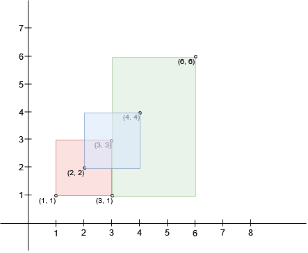
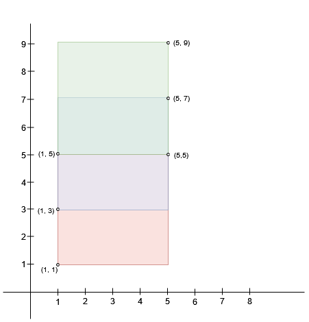
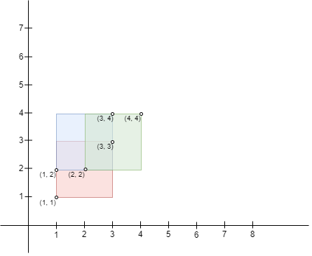
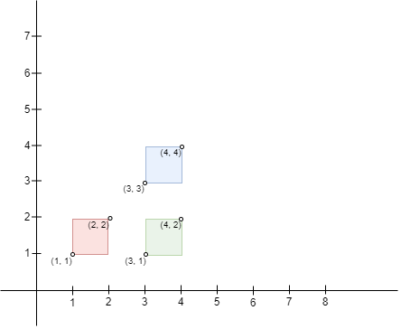

### 1. Description

There exist `n` rectangles in a 2D plane with edges parallel to the x and y axis. You are given two 2D integer arrays `bottomLeft` and `topRight` where $\text{bottomLeft}[i] = [a_{i}, b_{i}]$ and $\text{topRight}[i] = [c_{i}, d_{i}]$ represent the **bottom-left** and **top-right** coordinates of the $i^{\text{th}}$ rectangle, respectively.

You need to find the **maximum** area of a **square** that can fit inside the intersecting region of at least two rectangles. Return `0` if such a square does not exist.

### 2. Function Contract

**Inputs**

- `bottomLeft`: Input parameter (`List[List[int]]`).
- `topRight`: Input parameter (`List[List[int]]`).

**Return value**

- Returns `int`.

### 3. Examples

#### Example 1

- **Input:** bottomLeft = [[1,1],[2,2],[3,1]], topRight = [[3,3],[4,4],[6,6]]

- **Output:** 1

- **Explanation:** A square with side length 1 can fit inside either the intersecting region of rectangles 0 and 1 or the intersecting region of rectangles 1 and 2. Hence the maximum area is 1. It can be shown that a square with a greater side length can not fit inside any intersecting region of two rectangles.

#### Example 2

- **Input:** bottomLeft = [[1,1],[1,3],[1,5]], topRight = [[5,5],[5,7],[5,9]]

- **Output:** 4

- **Explanation:** A square with side length 2 can fit inside either the intersecting region of rectangles 0 and 1 or the intersecting region of rectangles 1 and 2. Hence the maximum area is $2 * 2 = 4$. It can be shown that a square with a greater side length can not fit inside any intersecting region of two rectangles.

#### Example 3

`

 `

- **Input:** bottomLeft = [[1,1],[2,2],[1,2]], topRight = [[3,3],[4,4],[3,4]]

- **Output:** 1

- **Explanation:** A square with side length 1 can fit inside the intersecting region of any two rectangles. Also, no larger square can, so the maximum area is 1. Note that the region can be formed by the intersection of more than 2 rectangles.

#### Example 4

`

 `

- **Input:** bottomLeft = [[1,1],[3,3],[3,1]], topRight = [[2,2],[4,4],[4,2]]

- **Output:** 0

- **Explanation:** No pair of rectangles intersect, hence, the answer is 0.

### 4. Constraints

- $n = \text{bottomLeft.length} = \text{topRight.length}$

- $2 \le n \le 10^{3}$

- $\text{bottomLeft}[i].length = \text{topRight}[i].length = 2$

- $1 \le \text{bottomLeft}[i][0], \text{bottomLeft}[i][1] \le 10^{7}$

- $1 \le \text{topRight}[i][0], \text{topRight}[i][1] \le 10^{7}$

- $\text{bottomLeft}[i][0] < \text{topRight}[i][0]$

- $\text{bottomLeft}[i][1] < \text{topRight}[i][1]$
