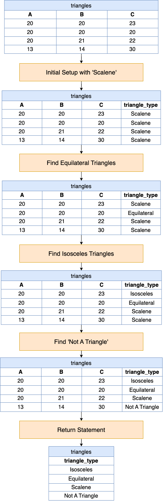

# Solution

---

## pandas

### Approach: Utilizing `loc`

This approach systematically evaluates and categorizes the types of triangles based on the lengths of their sides, starting with a default assumption (`Scalene`), then adjusting based on more specific conditions (`Equilateral`, `Isosceles`), and finally applying the triangle inequality theorem to filter out non-triangles.

**Visualization of Approach:**



#### Intuition

Let's review the intuition behind each step given the following input DataFrames:

Triangles DataFrame (`triangles`):

| A  | B  | C  |
| -- | -- | -- |
| 20 | 20 | 23 |
| 20 | 20 | 20 |
| 20 | 21 | 22 |
| 13 | 14 | 30 |
<br>

1. **Initial Setup with 'Scalene'**:

- This step initializes a new column in the DataFrame called $\text{triangle}_{type}$ and sets its value to `'Scalene'` for all rows.
- It assumes all triangles are `Scalene` by default, which means all three sides have different lengths.

   ```python
   triangles['triangle_type'] = 'Scalene'
   ```

| A  | B  | C  | triangle_type |
|----|----|----|---------------|
| 20 | 20 | 23 | Scalene       |
| 20 | 20 | 20 | Scalene       |
| 20 | 21 | 22 | Scalene       |
| 13 | 14 | 30 | Scalene       |
<br>

2. **Find Equilateral Triangles**:

- This step updates the $\text{triangle}_{type}$ to `'Equilateral'` for rows where all three sides (`A`, `B`, `C`) are equal.
- It uses `.loc[]` to locate and assign values based on the condition provided.

   ```python
   triangles.loc[
       (triangles["A"] == triangles["B"]) & (triangles["A"] == triangles["C"]),
       "triangle_type",
   ] = "Equilateral"
   ```

| A  | B  | C  | triangle_type |
|----|----|----|---------------|
| 20 | 20 | 23 | Scalene       |
| 20 | 20 | 20 | Equilateral   |
| 20 | 21 | 22 | Scalene       |
| 13 | 14 | 30 | Scalene       |
<br>

3. **Find Isosceles Triangles**:

- This step updates the $\text{triangle}_{type}$ to `'Isosceles'` for rows where any two sides are equal, and the triangle is not already marked as `Equilateral`.
- It covers the cases where exactly two sides of the triangle are equal, making it an `Isosceles` triangle.

   ```python
   triangles.loc[
       (
           (triangles["A"] == triangles["B"])
           | (triangles["A"] == triangles["C"])
           | (triangles["C"] == triangles["B"])
       )
       & (triangles["triangle_type"] != "Equilateral"),
       "triangle_type",
   ] = "Isosceles"
   ```

| A  | B  | C  | triangle_type |
|----|----|----|---------------|
| 20 | 20 | 23 | Isosceles     |
| 20 | 20 | 20 | Equilateral   |
| 20 | 21 | 22 | Scalene       |
| 13 | 14 | 30 | Scalene       |
<br>

4. **Find 'Not A Triangle'**:

- This step sets the $\text{triangle}_{type}$ to `'Not A Triangle'` for rows that do not satisfy the triangle inequality theorem.
- According to the triangle inequality theorem, for any three lengths to form a triangle, the sum of the lengths of any two sides must be greater than the length of the remaining side.
- This condition checks if any side is greater than or equal to the sum of the other two sides, and if so, indicates that these values cannot form a triangle.

   ```python
   triangles.loc[
       (triangles["A"] >= triangles["B"] + triangles["C"])
       | (triangles["B"] >= triangles["A"] + triangles["C"])
       | (triangles["C"] >= triangles["B"] + triangles["A"]),
       "triangle_type",
   ] = "Not A Triangle"
   ```

| A  | B  | C  | triangle_type  |
|----|----|----|--------------- |
| 20 | 20 | 23 | Isosceles      |
| 20 | 20 | 20 | Equilateral    |
| 20 | 21 | 22 | Scalene        |
| 13 | 14 | 30 | Not A Triangle |
<br>

5. **Return Statement**:

- Finally, the last step is to return a DataFrame containing only the $\text{triangle}_{type}$ column, showing the categorization for each set of sides provided in the input DataFrame.

   ```python
   return triangles[['triangle_type']]
   ```

| triangle_type  |
|----------------|
| Isosceles      |
| Equilateral    |
| Scalene        |
| Not A Triangle |
<br>

#### Implementation

```python
import pandas as pd

def type_of_triangle(triangles: pd.DataFrame) -> pd.DataFrame:
    triangles["triangle_type"] = "Scalene"

    triangles.loc[
        (triangles["A"] == triangles["B"]) & (triangles["A"] == triangles["C"]),
        "triangle_type",
    ] = "Equilateral"

    triangles.loc[
        (
            (triangles["A"] == triangles["B"])
            | (triangles["A"] == triangles["C"])
            | (triangles["C"] == triangles["B"])
        )
        & (triangles["triangle_type"] != "Equilateral"),
        "triangle_type",
    ] = "Isosceles"

    triangles.loc[
        (triangles["A"] >= triangles["B"] + triangles["C"])
        | (triangles["B"] >= triangles["A"] + triangles["C"])
        | (triangles["C"] >= triangles["B"] + triangles["A"]),
        "triangle_type",
    ] = "Not A Triangle"

    return triangles[["triangle_type"]]

```

---

## Database

### Approach: Utilizing `CASE`

This approach uses `CASE` statements to categorize each row into the type of triangle it represents based on the lengths of its sides. The key points to remember when categorizing triangles are:

- **Equilateral Triangle**: All three sides are of equal length.
- **Isosceles Triangle**: Exactly two sides are of equal length.
- **Scalene Triangle**: All three sides are of different lengths.
- **Not A Triangle**: The sum of the lengths of any two sides must be greater than the length of the third side. This is known as the triangle inequality theorem.

#### Intuition

Let's break down the SQL query step by step and explain the intuition behind each part:

- The `CASE` statement is used to evaluate the conditions for each triangle type.
- The first condition checks the triangle inequality theorem to determine if the given sides can form a triangle. If any side is greater than or equal to the sum of the other two, it is not a valid triangle.
- If all sides are equal, it categorizes the triangle as `Equilateral`.
- If any two sides are equal, it categorizes it as `Isosceles`.
- If none of the above conditions are met, the triangle is categorized as `Scalene`.
- The result is selected from the `Triangles` table based on these conditions.

#### Implementation

```mysql []
SELECT
  CASE
    WHEN A + B <= C OR A + C <= B OR B + C <= A THEN 'Not A Triangle'
    WHEN A = B AND B = C THEN 'Equilateral'
    WHEN A = B OR A = C OR B = C THEN 'Isosceles'
    ELSE 'Scalene'
  END AS triangle_type
FROM Triangles;
```