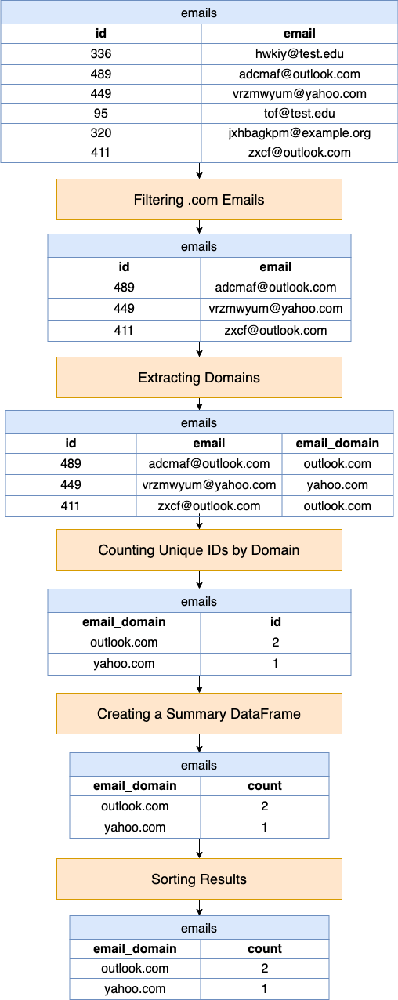

[TOC]

# Solution

---

## pandas

### Approach: Regex Filtering

The algorithm is designed to analyze a dataset of email addresses by focusing on those that end with ".com". It performs a series of steps to first filter out relevant email addresses, then extract their domain names, and subsequently count how many unique identifiers (IDs) are associated with each domain.

**Visualization of Approach:**



#### Intuition

Let's review the intuition behind each step given the following input DataFrames:

Emails DataFrame (`emails`):

| id  | email                 |
| --- | --------------------- |
| 336 | hwkiy@test.edu        |
| 489 | adcmaf@outlook.com    |
| 449 | vrzmwyum@yahoo.com    |
| 95  | tof@test.edu          |
| 320 | jxhbagkpm@example.org |
| 411 | zxcf@outlook.com      |
<br>

1. **Filtering `.com` Emails**:
The algorithm starts by selecting rows from the `emails` DataFrame where the email addresses end with ".com". This is done using the `emails[emails['email'].str.endswith('.com')]` condition. The goal is to narrow down the analysis to a specific subset of email addresses.

```python
emails[emails["email"].str.endswith(".com")]
```

| id  | email               |
| --- | ------------------- |
| 489 | adcmaf@outlook.com  |
| 449 | vrzmwyum@yahoo.com  |
| 411 | zxcf@outlook.com    |
<br>

2. **Extracting Domains**:
Next, it extracts the domain part of each email address using a regular expression pattern in the `assign` method. The pattern $@([^@]+)$$captures the text after the '@' character until the end of the string, which corresponds to the domain of the email address. This extraction is assigned to a new column in the DataFrame called$\text{email}_{domain}$.

```python
emails[emails["email"].str.endswith(".com")].assign(
    email_domain=lambda df: df["email"].str.extract("@([^@]+)$")
)
```

| id  | email               | email_domain |
| --- | ------------------- | ------------ |
| 489 | adcmaf@outlook.com  | outlook.com  |
| 449 | vrzmwyum@yahoo.com  | yahoo.com    |
| 411 | zxcf@outlook.com    | outlook.com  |
<br>

3. **Counting Unique IDs by Domain**:
After extracting the domains, the algorithm groups the DataFrame by these domains using $groupby('\text{email}_{domain}')$. For each domain group, it then counts the number of unique IDs (`'id'`). This step is critical for understanding how many distinct entities (as represented by unique IDs) are associated with each email domain.

```python
emails[emails["email"].str.endswith(".com")].assign(
    email_domain=lambda df: df["email"].str.extract("@([^@]+)$")
).groupby("email_domain")["id"].nunique()
```

| email_domain | id |
| ------------ | -- |
| outlook.com  | 2  |
| yahoo.com    | 1  |
<br>

4. **Creating a Summary DataFrame**:
The counting step produces a Series with the counts of unique IDs for each domain. This Series is then turned back into a DataFrame using $\text{reset}_{index}(name='count')$, which also names the column of counts as `'count'`. This step essentially structures the results into a tabular format that clearly shows each domain and the number of unique IDs associated with it.

```python
emails[emails["email"].str.endswith(".com")].assign(
    email_domain=lambda df: df["email"].str.extract("@([^@]+)$")
).groupby("email_domain")["id"].nunique().reset_index(name="count")
```

| email_domain | count |
| ------------ | ----- |
| outlook.com  | 2     |
| yahoo.com    | 1     |
<br>

5. **Sorting Results**:
Finally, the results are sorted by the domain names in ascending order ($\text{sort}_{values}(by='\text{email}_{domain}', ascending=True)$).

```python
emails[emails["email"].str.endswith(".com")].assign(
    email_domain=lambda df: df["email"].str.extract("@([^@]+)$")
).groupby("email_domain")["id"].nunique().reset_index(name="count").sort_values(
    by="email_domain", ascending=True
)
```

| email_domain | count |
|--------------|-------|
| outlook.com  | 2     |
| yahoo.com    | 1     |
<br>

#### Implementation

By chaining the operations from the intuition section, the code becomes more readable and eliminates the need for intermediate variables, making the code cleaner and potentially faster by reducing the number of assignments and temporary variables.

```python
import pandas as pd

def find_unique_email_domains(emails: pd.DataFrame) -> pd.DataFrame:
    return (
        emails[emails["email"].str.endswith(".com")]
        .assign(email_domain=lambda df: df["email"].str.extract("@([^@]+)$"))
        .groupby("email_domain")["id"]
        .nunique()
        .reset_index(name="count")
        .sort_values(by="email_domain", ascending=True)
    )

```

---

## Database

### Approach: Filter Utilizing `LIKE`

This SQL query provides a high-level analysis of email domain distribution within a dataset, focusing specifically on ".com" domains. It filters email addresses to include only those ending with ".com", then extracts and isolates the domain portion of each email. By counting the unique identifiers (IDs) associated with each domain, the query identifies the number of distinct entities linked to every ".com" domain present in the data. The results are then grouped by domain and sorted in ascending order to offer a clear, organized view of domain popularity and usage.

#### Intuition

Let's break down the SQL query step by step and explain the intuition behind each part:

1. **Extracting Domains**:
The $\text{SUBSTRING}_{INDEX}(email, '@', -1)$ function is used to extract the domain part of the email address. This function splits the email string at the '@' symbol and returns everything after it (i.e., the domain). This extraction is pivotal for grouping the data by domain, as the analysis aims to understand domain-based distribution.

2. **Counting Unique IDs**:
The `COUNT(DISTINCT id)` part counts the number of unique IDs associated with each domain. Counting distinct IDs ensures that each ID is only counted once per domain, providing a clear picture of how many unique entities are represented within each domain.

3. **Filtering `.com` Emails**:
The `WHERE` clause (`email LIKE '%.com'`) filters the dataset to consider only those email addresses that end with ".com". This specificity is crucial because it narrows down the analysis to a particular category of email domains, which are among the most common and thus likely of particular interest.

4. **Grouping by Domain**:
The $GROUP BY \text{email}_{domain}$ clause groups the results by the extracted domains. This is essential for the count to apply separately to each domain, enabling the analysis to quantify the unique IDs per domain rather than giving a single overall count.

5. **Sorting Results**:
Finally, the $ORDER BY \text{email}_{domain} asc$ clause sorts the resulting list of domains in ascending order. This sorting makes the output easier to read and analyze, allowing for quick identification of specific domains or comparison between the counts of unique IDs across domains.

#### Implementation

```mysql []
SELECT
  SUBSTRING_INDEX(email, '@', -1) AS email_domain,
  COUNT(DISTINCT id) AS count
FROM
  Emails
WHERE
  email LIKE '%.com'
GROUP BY
  email_domain
ORDER BY
  email_domain asc;

```