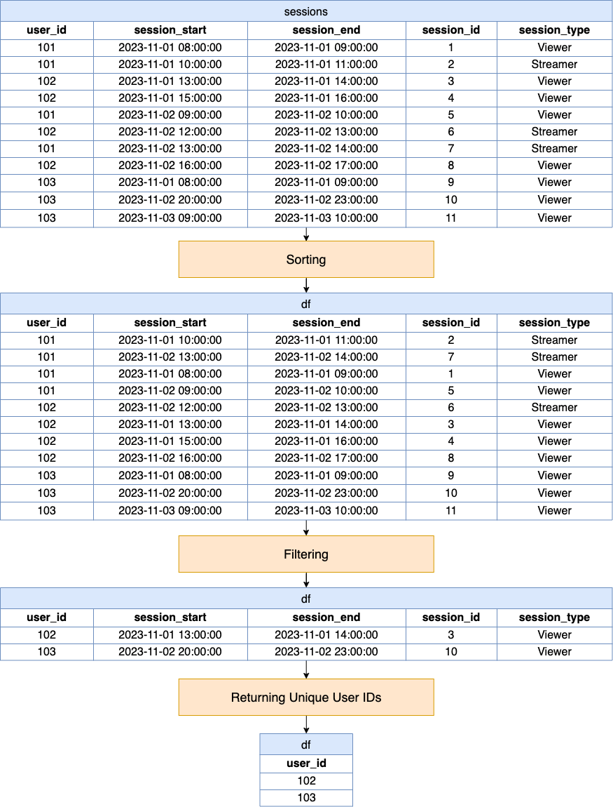

[TOC]

# Solution

---

## pandas

### Approach: Sorting and Filtering

The approach utilizes pandas to identify users with consecutive sessions of the same type within a 12-hour gap by sorting the sessions data by user ID and session type, and then applying a filtering condition. This condition checks for sessions of the same user and type where the next session starts within 12 hours of the current session's end. After filtering, unique user IDs of those who meet these criteria are returned. This method capitalizes on pandas' sorting, shifting, and boolean masking capabilities to streamline the identification process without the need for additional data structures.

**Visualization of Approach:**



#### Intuition

Let's review the intuition behind each step given the following input DataFrames:

Sessions DataFrame (`sessions`):

| user_id | session_start       | session_end         | session_id | session_type |
| ------- | ------------------- | ------------------- | ---------- | ------------ |
| 101     | 2023-11-01 08:00:00 | 2023-11-01 09:00:00 | 1          | Viewer       |
| 101     | 2023-11-01 10:00:00 | 2023-11-01 11:00:00 | 2          | Streamer     |
| 102     | 2023-11-01 13:00:00 | 2023-11-01 14:00:00 | 3          | Viewer       |
| 102     | 2023-11-01 15:00:00 | 2023-11-01 16:00:00 | 4          | Viewer       |
| 101     | 2023-11-02 09:00:00 | 2023-11-02 10:00:00 | 5          | Viewer       |
| 102     | 2023-11-02 12:00:00 | 2023-11-02 13:00:00 | 6          | Streamer     |
| 101     | 2023-11-02 13:00:00 | 2023-11-02 14:00:00 | 7          | Streamer     |
| 102     | 2023-11-02 16:00:00 | 2023-11-02 17:00:00 | 8          | Viewer       |
| 103     | 2023-11-01 08:00:00 | 2023-11-01 09:00:00 | 9          | Viewer       |
| 103     | 2023-11-02 20:00:00 | 2023-11-02 23:00:00 | 10         | Viewer       |
| 103     | 2023-11-03 09:00:00 | 2023-11-03 10:00:00 | 11         | Viewer       |
<br>

1. **Sorting**:

   - The DataFrame is sorted first by $\text{user}_{id}$, then by $\text{session}_{type}$, and finally by $\text{session}_{start}$ and $\text{session}_{end}$.
   - This sorting ensures that sessions are grouped by users and then by session type, making consecutive sessions of the same type for the same user adjacent to each other in the DataFrame.
   - This is crucial because it handles the scenario where a user might have sessions of different types interleaved, but we're only interested in consecutive sessions of the same type.
   - Sorting by $\text{session}_{type}$ right after $\text{user}_{id}$ is essential to bring sessions of the same type together, facilitating the comparison of their start and end times.

   ```python
   df = sessions.sort_values(
           ["user_id", "session_type", "session_start", "session_end"]
       )
   ```

| user_id | session_start        | session_end          | session_id | session_type |
|---------|----------------------|----------------------|------------|--------------|
| 101     | 2023-11-01 10:00:00  | 2023-11-01 11:00:00  | 2          | Streamer     |
| 101     | 2023-11-02 13:00:00  | 2023-11-02 14:00:00  | 7          | Streamer     |
| 101     | 2023-11-01 08:00:00  | 2023-11-01 09:00:00  | 1          | Viewer       |
| 101     | 2023-11-02 09:00:00  | 2023-11-02 10:00:00  | 5          | Viewer       |
| 102     | 2023-11-02 12:00:00  | 2023-11-02 13:00:00  | 6          | Streamer     |
| 102     | 2023-11-01 13:00:00  | 2023-11-01 14:00:00  | 3          | Viewer       |
| 102     | 2023-11-01 15:00:00  | 2023-11-01 16:00:00  | 4          | Viewer       |
| 102     | 2023-11-02 16:00:00  | 2023-11-02 17:00:00  | 8          | Viewer       |
| 103     | 2023-11-01 08:00:00  | 2023-11-01 09:00:00  | 9          | Viewer       |
| 103     | 2023-11-02 20:00:00  | 2023-11-02 23:00:00  | 10         | Viewer       |
| 103     | 2023-11-03 09:00:00  | 2023-11-03 10:00:00  | 11         | Viewer       |
<br>

2. **Filtering**:

   - This step filters the DataFrame to keep only the sessions where the next session (shift(-1)) belongs to the same user and has the same session type, and also checks if the session end time is within 12 hours of the start time of the next session.
   - The use of `shift(-1)` shifts the series down, meaning we're comparing each row to the one that follows it.
   - We set the condition to check for three things:
      - the user ID of the current session matches the user ID of the next session,
      - the session type matches the session type of the next session, and
      - the gap between the current session's end time and the next session's start time is less than or equal to 12 hours.
   - This effectively identifies pairs of consecutive sessions where the second session starts within 12 hours after the first session ends.

   ```python
   df = df.loc[
       (df["user_id"] == df["user_id"].shift(-1))
       & (df["session_type"] == df["session_type"].shift(-1))
       & (
           df["session_end"]
           >= df["session_start"].shift(-1) - pd.Timedelta(12, unit="H")
       )
   ]
   ```

| user_id | session_start        | session_end          | session_id | session_type |
|---------|----------------------|----------------------|------------|--------------|
| 102     | 2023-11-01 13:00:00  | 2023-11-01 14:00:00  | 3          | Viewer       |
| 103     | 2023-11-02 20:00:00  | 2023-11-02 23:00:00  | 10         | Viewer       |
<br>

3. **Returning Unique User IDs**:

   - The final step returns a DataFrame of unique $\text{user}_{id}$s who meet the criteria, removing any duplicates.
   - After filtering in the previous step, the DataFrame might contain multiple rows for the same user if they have multiple qualifying pairs of sessions; but we must ensure that each user who fits the criteria is only counted once, regardless of how many pairs of qualifying sessions they have.

   ```python
   return df[["user_id"]].drop_duplicates()
   ```

| user_id |
|---------|
| 102     |
| 103     |
<br>

#### Implementation

```python
import pandas as pd

def user_activities(sessions: pd.DataFrame) -> pd.DataFrame:
    df = sessions.sort_values(
        ["user_id", "session_type", "session_start", "session_end"]
    )
    df = df.loc[
        (df["user_id"] == df["user_id"].shift(-1))
        & (df["session_type"] == df["session_type"].shift(-1))
        & (
            df["session_end"]
            >= df["session_start"].shift(-1) - pd.Timedelta(12, unit="H")
        )
    ]
    return df[["user_id"]].drop_duplicates()

```

---

## Database

### Approach: Window Functions

This approach utilizes window functions to analyze sessions data. By partitioning the data by user ID and session type and then ordering by session start times, the query efficiently identifies consecutive sessions for the same user of the same type. It then applies a condition to select cases where the gap between sessions does not exceed 12 hours. The use of `LEAD` or `LAG` functions facilitates the comparison of the end time of one session with the start time of the next session. Finally, the query returns a list of distinct user IDs who have at least one pair of consecutive sessions meeting the specified criteria.

#### Intuition

Let's break down the SQL query step by step and explain the intuition behind each part:

1. **Partitioning and Ordering Data with Window Functions**:
   - The query uses window functions, specifically `LEAD`, to look ahead to the next session for each user-session type combination.
   - By partitioning the data by $\text{user}_{id}$ and $\text{session}_{type}$ and ordering it by $\text{session}_{start}$, the query prepares the dataset so that each row (session) is immediately followed by the next session of the same type by the same user.
   - This step is crucial for directly comparing consecutive sessions for overlaps or gaps without physically rearranging or duplicating the dataset.

2. **Calculating the Gap Between Sessions**:
   - With the data partitioned and ordered, the query calculates the time difference between the end of the current session and the start of the next session for each row. This is where the `LEAD` function comes into play, fetching the $\text{session}_{start}$ time of the subsequent session.
   - The purpose here is to identify whether the subsequent session starts within 12 hours after the current session ends, meeting the criterion for consecutive sessions.

3. **Filtering Based on Time Difference**:
   - The query applies a condition to filter out the pairs of sessions that do not meet the 12-hour gap requirement. This is done by comparing the calculated time difference to a 12-hour threshold.
   - This step is essential for focusing only on those user sessions that have a qualifying subsequent session, according to the problem's criteria.

4. **Selecting Distinct Users**:
   - After identifying all sessions that have a qualifying next session based on the specified criteria, the query returns a list of distinct $\text{user}_{id}$s to ensure that each user who meets the condition is counted once, regardless of how many pairs of qualifying sessions they have.

#### Implementation

```mysql []
SELECT
  DISTINCT a.user_id
FROM
  (
    SELECT
      s1.user_id,
      s1.session_type,
      s1.session_end,
      LEAD(s1.session_start) OVER(
        PARTITION BY s1.user_id,
        s1.session_type
        ORDER BY
          s1.session_start
      ) AS next_session_start
    FROM
      Sessions s1
  ) a
WHERE
  a.next_session_start IS NOT NULL
  AND TIMESTAMPDIFF(
    HOUR, a.session_end, a.next_session_start
  ) <= 12;

```