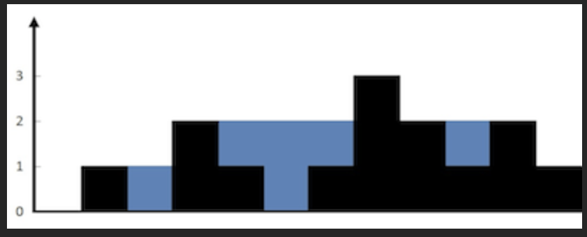

### 1. Description

Table: Heights

```
+-------------+------+
| Column Name | Type |
+-------------+------+
| id          | int  |
| height      | int  |
+-------------+------+
id is the primary key (column with unique values) for this table, and it is guaranteed to be in sequential order.
Each row of this table contains an id and height.
```

Write a solution to calculate the amount of rainwater can be **trapped between the bars** in the landscape, considering that each bar has a **width** of `1` unit.

Return *the result table in ***any*** order.*

The result format is in the following example.

### 2. Function Contract

- Refer to method signature.

### 3. Examples

#### Example 1

```
**Input:**
Heights table:
+-----+--------+
| id  | height |
+-----+--------+
| 1   | 0      |
| 2   | 1      |
| 3   | 0      |
| 4   | 2      |
| 5   | 1      |
| 6   | 0      |
| 7   | 1      |
| 8   | 3      |
| 9   | 2      |
| 10  | 1      |
| 11  | 2      |
| 12  | 1      |
+-----+--------+
**Output:**
+---------------------+
| total_trapped_water |
+---------------------+
| 6                   |
+---------------------+
**Explanation:**



The elevation map depicted above (in the black section) is graphically represented with the x-axis denoting the id and the y-axis representing the heights [0,1,0,2,1,0,1,3,2,1,2,1]. In this scenario, 6 units of rainwater are trapped within the blue section.
```