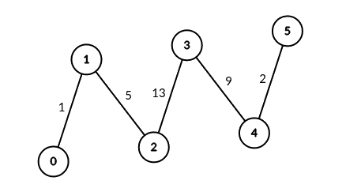
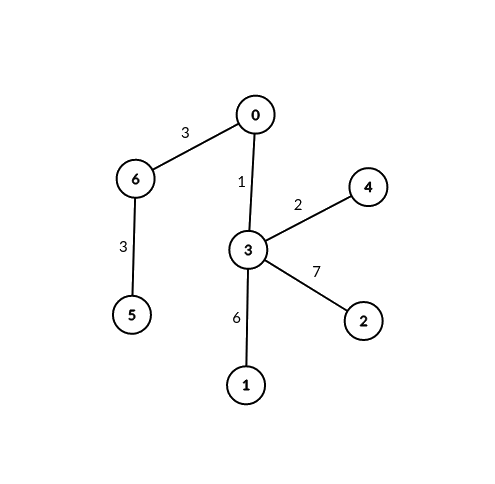

### 1. Description

You are given an unrooted weighted tree with `n` vertices representing servers numbered from `0` to $n - 1$, an array `edges` where $\text{edges}[i] = [a_{i}, b_{i}, \text{weight}_{i}]$ represents a bidirectional edge between vertices $a_{i}$ and $b_{i}$ of weight $\text{weight}_{i}$. You are also given an integer `signalSpeed`.

Two servers `a` and `b` are **connectable** through a server `c` if:

- `a < b`, $a \neq c$ and $b \neq c$.

- The distance from `c` to `a` is divisible by `signalSpeed`.

- The distance from `c` to `b` is divisible by `signalSpeed`.

- The path from `c` to `b` and the path from `c` to `a` do not share any edges.

Return *an integer array* `count` *of length* `n` *where* $\text{count}[i]$ *is the **number** of server pairs that are **connectable** through* *the server* `i`.

### 2. Function Contract

**Inputs**

- `edges`: Input parameter (`List[List[int]]`).
- `signalSpeed`: Input parameter (`int`).

**Return value**

- Returns `List[int]`.

### 3. Examples

#### Example 1

- **Input:** $edges = [[0,1,1],[1,2,5],[2,3,13],[3,4,9],[4,5,2]], signalSpeed = 1$
- **Output:** `[0,4,6,6,4,0]`
- **Explanation:** Since signalSpeed is 1, count[c] is equal to the number of pairs of paths that start at c and do not share any edges.
In the case of the given path graph, count[c] is equal to the number of servers to the left of c multiplied by the servers to the right of c.

#### Example 2

- **Input:** $edges = [[0,6,3],[6,5,3],[0,3,1],[3,2,7],[3,1,6],[3,4,2]], signalSpeed = 3$
- **Output:** `[2,0,0,0,0,0,2]`
- **Explanation:** Through server 0, there are 2 pairs of connectable servers: (4, 5) and (4, 6).
Through server 6, there are 2 pairs of connectable servers: (4, 5) and (0, 5).
It can be shown that no two servers are connectable through servers other than 0 and 6.

### 4. Constraints

- $2 \le n \le 1000$

- $\text{edges.length} = n - 1$

- $\text{edges}[i].length = 3$

- $0 \le a_{i}, b_{i} < n$

- $\text{edges}[i] = [a_{i}, b_{i}, \text{weight}_{i}]$<!-- notionvc: a2623897-1bb1-4c07-84b6-917ffdcd83ec -->

- $1 \le \text{weight}_{i} \le 10^{6}$

- $1 \le signalSpeed \le 10^{6}$

- The input is generated such that `edges` represents a valid tree.
