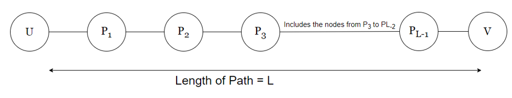
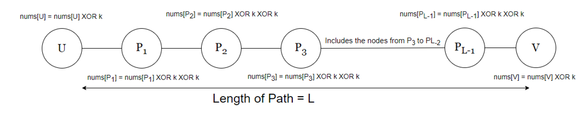

## Solution

---

### Overview

We aim to maximize the sum of values of all nodes in an undirected tree by performing a specific operation.
The operation allows us to replace the values of any two **adjacent** nodes with their XOR values, with a given integer `k`.

**Key Observations:**
1. Alice can perform an operation on any edge `[u, v]` by XOR-ing the values of nodes `u` and `v` with a positive integer `k`.
2. Alice wants to maximize the sum of the values of the tree nodes. This means she aims to maximize the total value represented by the sum of individual node values after performing the specified operations.
3. Alice can perform the operation any number of times (including zero) on the tree. This implies she can selectively choose edges and perform the XOR operation to maximize the sum of node values.

> **Note:** The XOR (exclusive OR) operator compares corresponding bits of two operands and returns 1 if the bits are different and 0 if they are the same. For instance, in binary $1010 XOR 1100 = 0110$ indicating that the second and third bits differ while the first and fourth bits are the same.
> Bitwise XOR operation is commutative and associative. That means $a XOR b XOR b = a$, and $a XOR b = b XOR a$. Hence, the order of applying XOR operations doesn't matter.
> XORing a number with itself ($a XOR a$) results in $0$. Therefore, performing the XOR operation twice on the same number yields the original number.
---

### Approach 1: Top-Down Dynamic Programming - Memoization

#### Intuition

Let's assume we want to replace the values of any two arbitrary nodes `U` and `V` with their XOR values, where `U` and `V` are not adjacent. Since, the tree is connected, undirected, and acyclic, there always exists a path between `U` and `V`. Let's assume the length of this path is `L` and $P =\{P_1, P_2, P_3...P_{L-1}\}$ denotes the set of nodes on this path, following the order in which they appear on the path from `U` to `V`. Below is a diagram for better understanding:



Now, let's operate on every edge from `U` to `V`. Since, there are exactly `L` edges between both the nodes, we will be performing `L` operations in total.

The value of each node after these `L` operations will change as shown below:



Since the XOR operation obeys the properties of commutativity and identity, $A\; XOR\; B\; XOR\; B = A$ for any two integers `A` and `B`. Therefore, the values of all nodes in the set `P` will remain unchanged. However, for the nodes `U` and `V`, their value will be replaced with the XOR value with `k`.

So, for any two non-adjacent nodes `U` and `V` in the tree we can replace their values with the XOR values as if they were connected by an edge. Let's call this operation as "effective operation" for simplicity.

After performing a sequence of effective operations on some pairs of nodes, exactly `m` nodes in the tree have their value replaced with the XOR value (where $m \le n$ and `n` denotes the number of nodes in the tree). It can be observed that the value of `m` will always be `even` because "effective operation" is performed on a pair of nodes.

Now, the brute force approach is based on recursion. During recursion, it's crucial to incorporate both: the node's value with XOR operation (XORing with `k`) and without XOR operation while traversing the tree. We try to maximize the total sum of the values, where the operation is performed on an **even** number of nodes.

Let's adapt our recursive solution based on these insights:

* The base case occurs when we have traversed through all the nodes of the tree. If the number of nodes on which we have performed the operation is even, we return 0. Otherwise, we return $\text{INT}_{MIN}$ (minimum integer value).

* We also need to include the parity of the number of elements on which the operation has been performed as a parameter in the recursive solution. If the number of operated elements is even, it is a valid assignment.

> Parity of a number refers to whether it contains an odd or even number of 1-bits.
* The two choices that we have here for every node are to perform an operation on it or not. The recursive calls for each case can be explained as:

  * If we perform the operation on the node at the position `index`, then the value of this node would be modified to $\text{nums}[index] XOR k$. Since we are operating on a node, the parity of the total number of elements on which the XOR operation has been performed will be flipped. Therefore, even parity flips to odd, and vice versa. To obtain the answer for this case, we will store the sum of $\text{nums}[index] XOR k$ and the subsequent recursive function call for the next node at `index+1` and the flipped parity (denoted by `isEven XOR 1`).

  * If we do not perform the operation on the node at the position `index`, then the value of this node would remain the same. The parity of the total number of elements on which the operation is performed will remain the same. To obtain the answer for this case, we will store the sum of $\text{nums}[index]$ and the subsequent recursive function call for the next node at `index+1` and the given parity.

* Since we want to maximize the sum of all nodes, we will return the maximum value of both the cases discussed above.

The recursive approach will result in Time Limit Exceeded (TLE) issues due to the exponential nature of possibilities.

To tackle this issue, we'll use dynamic programming (DP) with a two-dimensional table.

The DP table caches the results of subproblems, with rows representing different indices of the nodes given by `index` and columns representing the parity of the number of operated nodes denoted by `isEven`(`0` indicates `odd`, `1` indicates `even` parity). Each cell stores an integer denoting the maximum possible sum of all the nodes up to `index` and where the parity of the number of operated nodes is `isEven`.

By caching the calculated states in the dp table, we can avoid recalculating the result for the same combination of index and parity. When encountering a state that has already been computed and stored in the dp table, instead of recursively exploring further, we can directly retrieve the cached result, significantly reducing the time complexity of the algorithm.

#### Algorithm

##### Main Function: `maximumValueSum(nums, k, edges)`
1. Initialize a 2D memoization array `memo` with all values set to `-1`.
2. Call the helper function `maxSumOfNodes` with the initial parameters:
   - $index = 0$
   - $isEven = 1$ (start with an odd number of elements)
   - $nums = the input array$
   - $k = the given XOR value$
   - $memo = the initialized memoization array$
3. Return the result from the `maxSumOfNodes` function.

##### Recursive Function: `maxSumOfNodes(index, isEven, nums, k, memo)`
1. If the `index` is equal to the size of the `nums` array, return:
   - If `isEven` is 1, return 0 (no operation performed on an odd number of elements).
   - Else, return $\text{INT}_{MIN}$.
2. If the result for the current `index` and `isEven` is already memoized, return the memoized value.
3. Calculate the maximum sum of nodes in two cases:
   - `noXorDone`: No XOR operation is performed on the current element.
     - The sum is the current element value $\text{nums}[index]$ plus the maximum sum of the remaining elements.
   - `xorDone`: The XOR operation is performed on the current element.
     - The sum is the current element value $\text{nums}[index] ^ k$ plus the maximum sum of the remaining elements with `isEven` flipped.
4. Memoize the maximum of `noXorDone` and `xorDone`, and return the result.

#### Implementation

```python
class Solution:
    def maxSumOfNodes(self, index, isEven, nums, k, memo):
        if index == len(nums):
            # If the operation is performed on an odd number of elements return INT_MIN
            return 0 if isEven == 1 else -float("inf")
        if memo[index][isEven] != -1:
            return memo[index][isEven]

        # No operation performed on the element
        noXorDone = nums[index] + self.maxSumOfNodes(index + 1, isEven, nums, k, memo)
        # XOR operation is performed on the element
        xorDone = (nums[index] ^ k) + self.maxSumOfNodes(
            index + 1, isEven ^ 1, nums, k, memo
        )

        # Memoize and return the result
        memo[index][isEven] = max(xorDone, noXorDone)
        return memo[index][isEven]

    def maximumValueSum(self, nums: List[int], k: int, edges: List[List[int]]) -> int:
        memo = [[-1] * 2 for _ in range(len(nums))]
        return self.maxSumOfNodes(0, 1, nums, k, memo)
```

#### Complexity Analysis

Let $n$ be the number of nodes in the tree.

- Time complexity: $O(n)$

    The time complexity of the `maxSumOfNodes` function can be analyzed by considering the number of unique subproblems that need to be solved. There are at most $n \cdot 2$ unique subproblems, indexed by `index` and `isEven` values, because the number of possible values for `index` is `n` and `isEven` is `2` (parity).

    Here, each subproblem is computed only once (due to memoization). So, the time complexity is bounded by the number of unique subproblems.

    Therefore, the time complexity can be stated as $O(n)$.

- Space complexity: $O(n)$

    The space complexity of the algorithm is primarily determined by two factors: the auxiliary space used for memoization and the recursion stack space. The memoization table, denoted as `memo`, consumes $O(n)$ space due to its size being proportional to the length of the input node list.

    Additionally, the recursion stack space can grow up to $O(n)$ in the worst case, constrained by the length of the input node list, as each recursive call may add a frame to the stack.

    Therefore, the overall space complexity is the sum of these two components, resulting in $O(n) + O(n)$, which simplifies to $O(n)$.

---

### Approach 2: Bottom-up Dynamic Programming (Tabulation)

#### Intuition

Tabulation is a dynamic programming technique that involves systematically iterating through all possible combinations of changing parameters. Since tabulation operates iteratively, rather than recursively, it does not require overhead for the recursive stack space, making it more efficient than memoization. We have two variables that change as we progress through the node values: the current index we're considering and the parity of even elements. To thoroughly explore the combinations, we use two nested loops to iterate through these variables.

First, let's establish the base case:

```cpp
if (index == nums.size()) {
    return isEven == 1 ? 0 : INT_MIN;
}
```

We represent this base case in our tabulation matrix as $dp[\text{nums.size}()][1] = 0$ and $dp[\text{nums.size}()][0] = \text{INT}_{MIN}$. This indicates that if the parity of the number of operations after iterating the array is odd, then it is an invalid assignment.

Our ultimate goal is to determine the maximum sum of all node values after performing the operation on an even number of nodes, and this information will be stored in $\text{dp}[0][1]$. To accomplish this, we traverse through every combination of index and parity using the two nested loops. The outer loop iterates over the index, while the inner loop makes the choice of parity (1 for even and 0 for odd).

Throughout this traversal, we evaluate each state and update our tabulation matrix accordingly. Upon completing the traversal of the entire array, the value of $\text{dp}[0][1]$ represents the maximum node value sum possible after performing all operations.

#### Algorithm

1. Initialize a 2D dynamic programming array `dp` with dimensions $(n + 1) x 2$, where `n` is the size of the `nums` array.
2. Initialize the base case values:
   - $\text{dp}[n][1] = 0$ (no operation performed on an odd number of elements)
   - $\text{dp}[n][0] = \text{INT}_{MIN}$
3. Iterate through the `nums` array in reverse order (from $n - 1$ to `0`):
   - For each index `index` and each parity state `isEven` (0 or 1):
     - Calculate the maximum value sum in two cases:
       - `performOperation`: Perform the XOR operation on the current element.
         - The sum is $dp[index + 1][isEven ^ 1] + (\text{nums}[index] ^ k)$.
       - `dontPerformOperation`: Don't perform the XOR operation on the current element.
         - The sum is $dp[index + 1][isEven] + \text{nums}[index]$.
     - Update $\text{dp}[index][isEven]$ with the maximum of `performOperation` and `dontPerformOperation`.
4. Return the value stored in $\text{dp}[0][1]$, which represents the maximum value sum when starting with an odd number of elements.

#### Implementation

```python
class Solution:
    def maximumValueSum(self, nums: List[int], k: int, edges: List[List[int]]) -> int:
        n = len(nums)
        dp = [[0] * 2 for _ in range(n + 1)]
        dp[n][1] = 0
        dp[n][0] = -float('inf')

        for index in range(n - 1, -1, -1):
            for isEven in range(2):
                # Case 1: we perform an operation on this element.
                performOperation = dp[index + 1][isEven ^ 1] + (nums[index] ^ k)
                # Case 2: we don't perform operation on this element.
                dontPerformOperation = dp[index + 1][isEven] + nums[index]

                dp[index][isEven] = max(performOperation, dontPerformOperation)

        return dp[0][1]
```

#### Complexity Analysis

Let $n$ be the number of elements in the node value list.

* Time complexity: $O(n)$

    We iterate through a nested loop where the total number of iterations is given by $n \cdot 2$. Inside the nested loops, we perform constant time operations. Therefore, time complexity is given by $O(n)$.

* Space complexity: $O(n)$

    Since we create a new `dp` matrix of size $n \cdot 2$, the total additional space becomes $n \cdot 2$. So, the net space complexity is $O(n)$.

---

### Approach 3: Greedy (Sorting based approach)

#### Intuition

If the operation is performed on a node indexed at `U`, the new value of the node would become $\text{nums}[U] XOR k$. For every node, the net change in its value after performing the operation is given by $\text{netChange}[U] = \text{nums}[U] XOR k - \text{nums}[U]$.

If this net change is greater than zero, it will increase the total sum of all node values. Otherwise, it would decrease it.

Let's assume we want to perform the "effective operation" on a pair of nodes that would provide the greatest increment to the node sum. Observe that choosing the nodes with the greatest positive `netChange` values will provide the greatest increment to node sum.

For all nodes, we can calculate their net change values using the formula discussed above. On sorting these values in **decreasing** order, we can pick the values in pairs from the start of the sorted `netChange` array with a positive sum.

If the sum of a pair is positive, then it will increase the value of the total node sum when the operation is performed on this pair.

#### Algorithm

1. Initialise the `netChange` array of size `n` and an integer `nodeSum` that stores the current sum of `nums`. Here, `n` is the size of the `nums` array.
2. Iterate through the `nums` array (from `0` to `n-1`):
   - For each index, store the value of `netChange` using the idea discussed in intuition.
3. Sort the array `netChange` in decreasing order.
4. Iterate through the `netChange` array (from `0` to `n-1`, stepsize = `2`):
   - If we can not create a pair of adjacent elements, break the iteration.
   - If the sum of a pair of adjacent elements is positive then add this sum to `nodeSum`.
5. After iterating through all `netChange` elements, return `nodeSum` as the maximum possible sum of nodes after performing the operations.

!?!../Documents/3068/slideshow1.json:960,540!?!

#### Implementation

```python
class Solution:
    def maximumValueSum(self, nums: List[int], k: int, edges: List[List[int]]) -> int:
        n = len(nums)
        netChange = [(nums[i] ^ k) - nums[i] for i in range(n)]
        nodeSum = sum(nums)

        netChange.sort(reverse=True)

        for i in range(0, n, 2):
            # If netChange contains odd number of elements break the loop
            if i + 1 == n:
                break
            pairSum = netChange[i] + netChange[i + 1]
            # Include in nodeSum if pairSum is positive
            if pairSum > 0:
                nodeSum += pairSum

        return nodeSum
```

#### Complexity Analysis

Let $n$ be the number of elements in the node value list.

* Time complexity: $O(n \cdot \log n)$

    Other than the `sort` invocation, we perform simple linear operations on the list, so the runtime is dominated by the $O(n \cdot \log n)$ complexity of sorting.

* Space complexity: $O(n)$

    Since we create a new `netChange` array of size `n` and sort it, the additional space becomes $O(n)$ for `netChange` array and $O(log n)$ or $O(n)$ for sorting it (depending on the sorting algorithm used). So, the net space complexity is $O(n)$.

---

### Approach 4: Greedy (Finding local maxima and minima)

#### Intuition

Recall that "effective operation" allows us to pick any two nodes and perform an operation on it. Let's assume for two nodes, the `netChange` values are positive. If we pick both these nodes as a pair to perform "effective operation", the node sum value will be increased. So, we can observe that if the number of elements with positive `netChange` values is even, then all of them can be included in the final sum to maximize it.

If the number of elements with positive `netChange` values is **odd**, then let's assume that `positiveMinimum` denotes the **minimum positive** value and `negativeMaximum` denotes the **maximum non-positive** value in the `netChange` array. It is clear that both these values will occur as a pair in the `netChange` array.

Now, there can be two cases for the same:-

1. If the sum of `positiveMinimum` and `negativeMaximum` is greater than zero, then the node value sum will be increased by including this pair. So, we include both elements.

2. If the sum of `positiveMinimum` and `negativeMaximum` is less than or equal to zero, then the node value sum will be decreased or have no change on including this pair. So, we exclude this pair.

Therefore, we don't need the `netChange` array from the previous approach. We calculate `positiveMinimum` and `negativeMaximum` values which is enough to calculate the maximum node value sum possible for the array.

#### Algorithm

1. Initialize integers `positiveMinimum` and `negativeMaximum` with $\text{INT}_{MAX}$ and $\text{INT}_{MIN}$ respectively. Also, initialize `count` and `sum` with `0`.
2. Iterate through the `nums` array (from `0` to $n - 1$):
- Add the unchanged node values to `sum`.
- Calculate the value of `netChange` for the current node.
      - If `netChange` is positive, assign the minimum of `netChange` and `positiveMinimum` to `positiveMinimum`. Add `netChange` to the `sum` and increment the `count` by 1.
      - If `netChange` is non-positive, assign the maximum of `netChange` and `negativeMaximum` to `negativeMaximum`.
3. If the `count` of number values with positive `netChange` is even, we return the current `sum` as the maximum node value sum possible.
4. If the `count` is odd, we can either subtract `positiveMinimum` or add `negativeMaximum` to make the `count` even. The maximum of both these cases is returned as the maximum node value sum.

!?!../Documents/3068/slideshow2.json:960,540!?!

#### Implementation

```python
class Solution:
    def maximumValueSum(self, nums: List[int], k: int, edges: List[List[int]]) -> int:
        sumVal = 0
        count = 0
        positiveMinimum = 1 << 30
        negativeMaximum = -1 * (1 << 30)

        for nodeValue in nums:
            operatedNodeValue = nodeValue ^ k
            sumVal += nodeValue
            netChange = operatedNodeValue - nodeValue
            if netChange > 0:
                positiveMinimum = min(positiveMinimum, netChange)
                sumVal += netChange
                count += 1
            else:
                negativeMaximum = max(negativeMaximum, netChange)

        # If the number of positive netChange values is even, return the sum.
        if count % 2 == 0:
            return sumVal

        # Otherwise return the maximum of both discussed cases.
        return max(sumVal - positiveMinimum, sumVal + negativeMaximum)
```

#### Complexity Analysis

Let $n$ be the number of elements in the node value list.

* Time complexity: $O(n)$

    We perform a single pass linear scan on the list which takes $O(n)$ time. All other operations are performed in constant time. This makes the net time complexity as $O(n)$.

* Space complexity: $O(1)$

    We do not allocate any additional auxiliary memory proportional to the size of the given node list. Therefore, overall space complexity is given by $O(1)$.

---