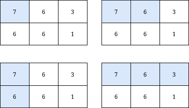
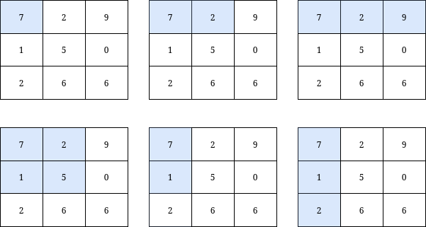

### 1. Description

You are given a **0-indexed** integer matrix `grid` and an integer `k`.

Return *the **number** of submatrices that contain the top-left element of the* `grid`, *and have a sum less than or equal to *`k`.

### 2. Function Contract

- `n`: Input parameter.
- Returns expected result.

### 3. Examples

#### Example 1

- **Input:** `grid = [[7,6,3],[6,6,1]], k = 18`
- **Output:** `4`
- **Explanation:** There are only 4 submatrices, shown in the image above, that contain the top-left element of grid, and have a sum less than or equal to 18.
#### Example 2

- **Input:** `grid = [[7,2,9],[1,5,0],[2,6,6]], k = 20`
- **Output:** `6`
- **Explanation:** There are only 6 submatrices, shown in the image above, that contain the top-left element of grid, and have a sum less than or equal to 20.

### 4. Constraints

- $m = \text{grid.length}$

- $n = \text{grid}[i].length$

- $1 \le n, m \le 1000$

- $0 \le \text{grid}[i][j] \le 1000$

- $1 \le k \le 10^{9}$