[TOC]

## Solution

---

### Overview

We are given an array `happiness` that represents the happiness scores of `n` children when they are selected at a given turn. Each time a child is selected from the array, the happiness scores of all the other children, not selected, will decrease by one. Our objective is to determine the maximum total achieved happiness if we select `k` children.

**Key Observations:**
1. Once a child's happiness value reaches zero, it remains at zero and no longer decreases with further selections, preventing any negative adjustments to the overall happiness sum.
2. Each selection reduces the happiness of the remaining children by one, which means that early decisions significantly affect the potential maximum happiness that can be achieved with later selections.

---

### Approach 1: Sort + Greedy

#### Intuition

The goal is to maximize the sum of happiness of the selected children. A possible approach seems to be selecting the children with the highest happiness values at each turn.

This is because the happiness values of the children who are not selected in a given turn will decrease. This means that the longer a child remains unselected, the lower their happiness value will become.

Considering the decreasing nature of the happiness of unselected children, it makes sense to prioritize selecting the children with the higher happiness values first. This way, we can "lock in" the larger happiness scores before they start to diminish.

Selecting the children with the highest happiness values at each turn is intuitive because it allows us to maximize the sum of happiness in the short term. By selecting the "biggest" values first, we can ensure that we're capturing the maximum possible happiness from the available options.

Considering these factors, we can adopt a greedy approach that selects the `k` children with the highest happiness values from the given array.

To ensure that this greedy approach provides the optimal solution, we can reason as follows: Let's assume that for a given optimal solution `optimalSelection`, the selection made for the `i`th turn (let's call this value `selectedValue`) is not the `i`th largest happiness score in the array (let's call this value `nextLargest`). If we were to swap `selectedValue` with `nextLargest`, we would achieve a higher total happiness score, as `nextLargest` is greater than `selectedValue` by definition. This means that the greedy approach of selecting the top `k` happiness scores from the happiness array results in the maximum sum of happiness.

Let's consider another example where the happiness values are `[4, 3, 6, 9, 1, 5, 8, 7, 2]` and $k = 3$. The slideshow below illustrates that at each turn, the highest unpicked happiness value is chosen and added to the total happiness score, and the rest of the unpicked values are decremented by one (the lower limit is set to zero).

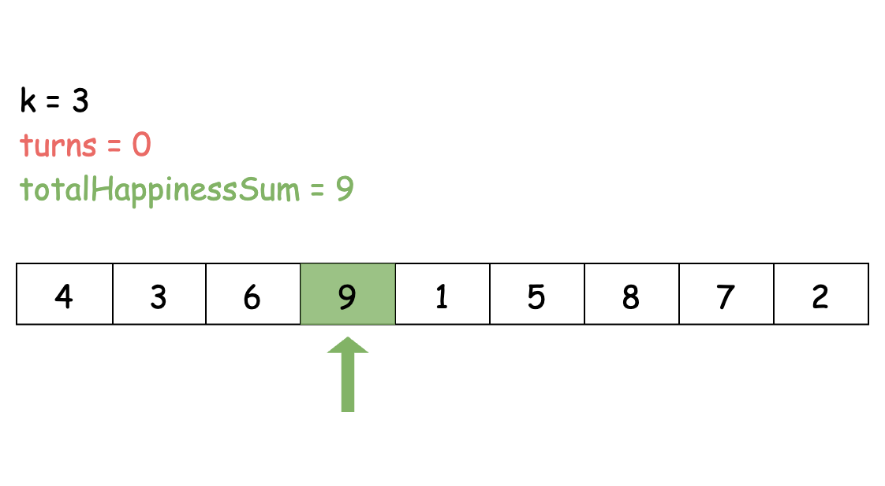

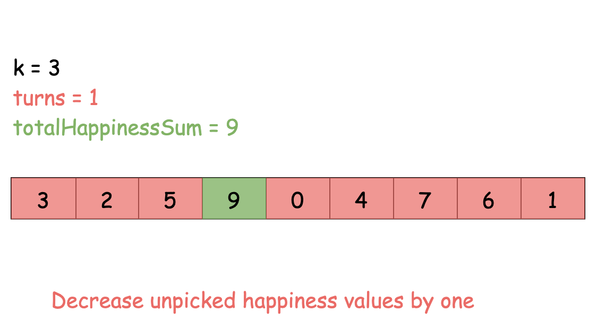

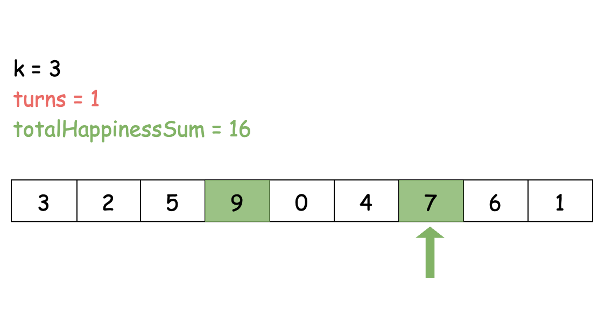

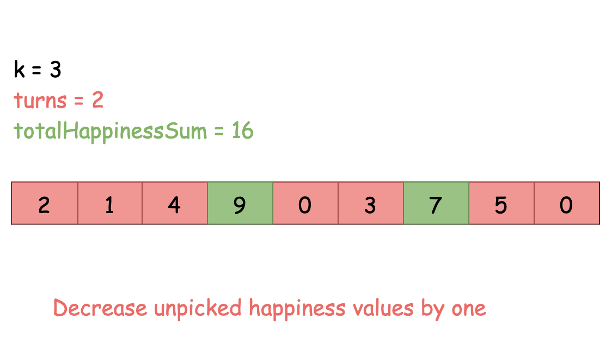

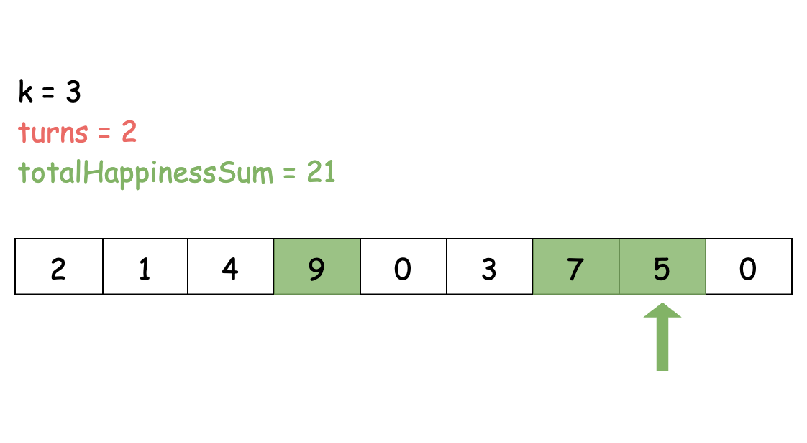

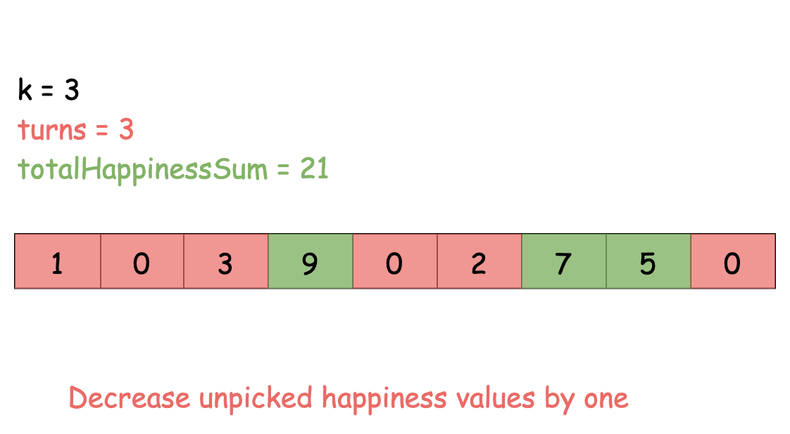

#### Algorithm

1. Sort `happiness` in descending order.
2. Initialize variable $turns = 0$ to represent the number of selection rounds passed.
3. Initialize variable $totalHappinessSum = 0$ to accumulate the total sum of happiness achieved.
4. For the `i`th selection round ($0 \le i < k$, zero indexed):
- Pick the `i`th biggest happiness score, subtract it from `turns` and add it to `totalHappinessSum` if the result of the subtraction is bigger than zero.
- Increment `turns` by one.
5. Return `totalHappinessSum`.

#### Implementation

```python
class Solution:
    def maximumHappinessSum(self, happiness: List[int], k: int) -> int:
        # Sort in descending order
        happiness.sort(reverse=True)

        total_happiness_sum = 0
        turns = 0

        # Calculate the maximum happiness sum
        for i in range(k):
            # Adjust happiness and ensure it's not negative
            total_happiness_sum += max(happiness[i] - turns, 0)

            # Increment turns for the next iteration
            turns += 1

        return total_happiness_sum

```

#### Complexity Analysis

Given $n$ as the length of `happiness`,

- Time complexity: $O(n \cdot \log n)$

    Sorting the happiness array requires $O(n \cdot \log n)$ time.

    Iterating through the first `k` elements of the sorted array takes $O(k)$ time.

    Inside the loop, the `max()` function and addition operations take constant time.

    Overall, the time complexity of the solution is dominated by the sorting step, making the time complexity $O(n \cdot \log n)$.

- Space complexity: $O(n)$

    In Python, the sort method sorts a list using the Timesort algorithm which is a combination of Merge Sort and Insertion Sort and has $O(n)$ additional space.

    In C++, the sort() function is implemented as a hybrid of Quick Sort, Heap Sort, and Insertion Sort, with a worse-case space complexity of  $O(\log n)$.

    In Java, Arrays.sort() is implemented using a variant of the Quick Sort algorithm which has a space complexity of $O(\log n )$ for sorting two arrays. We also convert the array into an Integer array which has an additional space complexity of $O(n)$.

    As the dominating term is $O(n)$, the overall space complexity is $O(n)$.

---

### Approach 2: Max Heap / Priority Queue + Greedy

#### Intuition

Since in our problem we need the largest element available at each turn to maximize the total happiness, the choice of data structure becomes crucial. The max heap data structure is particularly well suited for this purpose. By organizing all the happiness scores into a max heap, we ensure that the largest element is always at the top, making it efficiently accessible. This property aligns perfectly with our greedy algorithm's strategy of selecting the highest happiness value available at each turn.

First, we create a max heap using all the values from the `happiness` array. Then, for each of the `k` turns, we remove the maximum value from the heap. After that, we adjust this value by subtracting the number of turns that have already been completed. This adjustment accounts for the decrease in happiness of the children who haven't been selected yet. Finally, we add this adjusted value to our total happiness so far.

While it retains its greedy nature by selecting the largest happiness values at each step, the use of the heap data structure significantly improves efficiency compared to sorting the `happiness` array.

Let's illustrate this approach using the happiness values `[4, 7, 3, 8, 1, 5]` with $k = 2$. Initially, we build a max heap using these happiness values. Then, in each turn, we pop the largest element from the max heap and include it in the `totalHappinessSum`. It's important to subtract the number of turns that have passed so far from the current largest element before adding it to the `totalHappinessSum`.

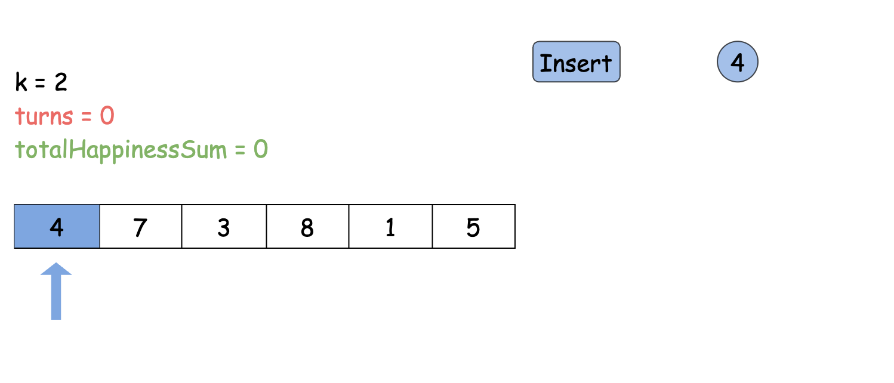

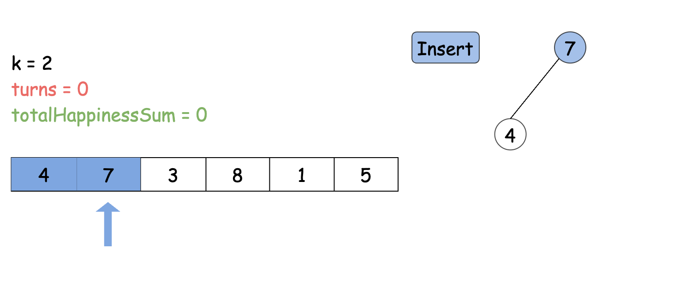

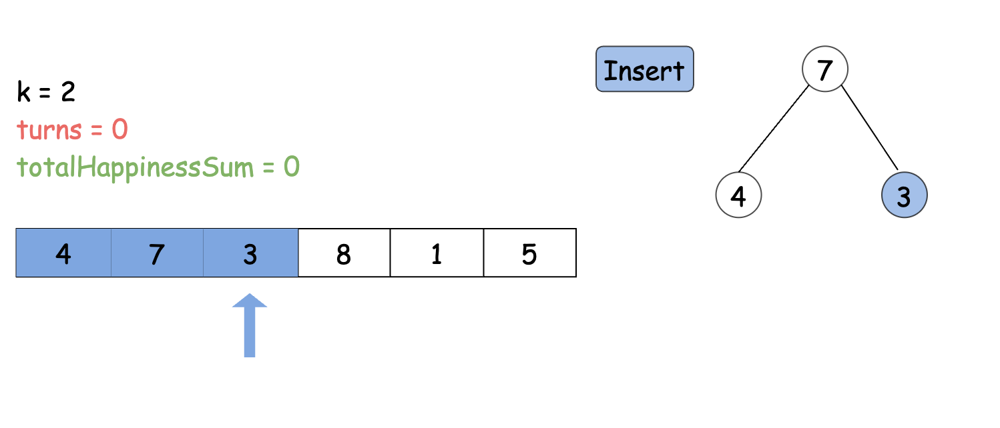

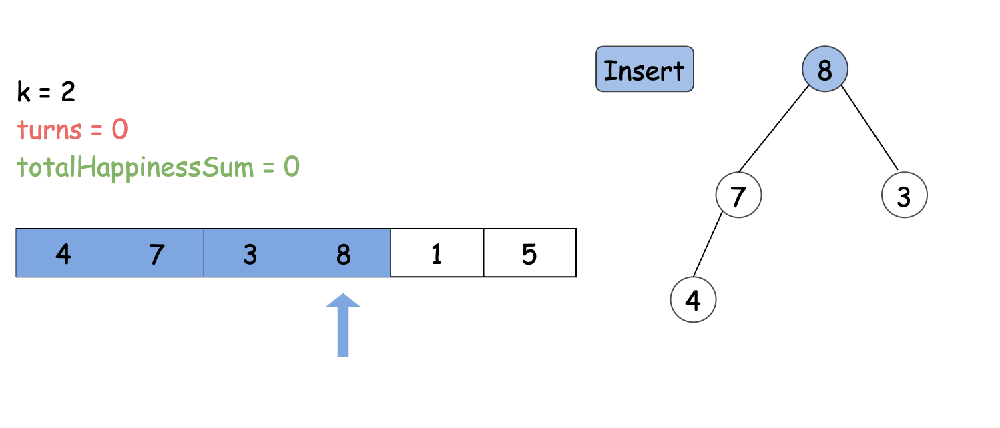

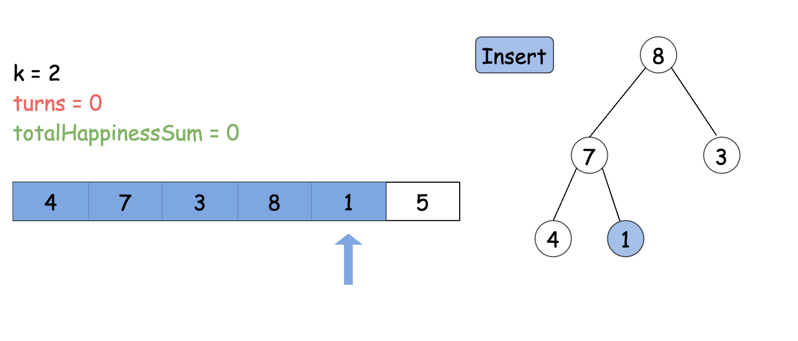

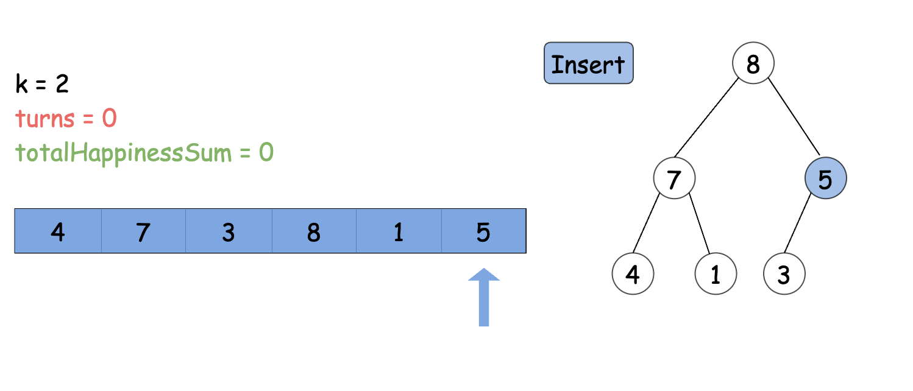

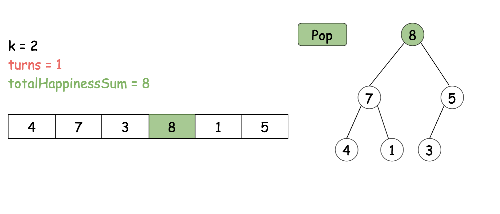

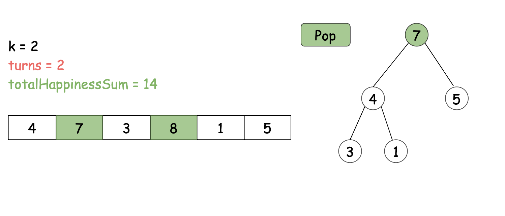

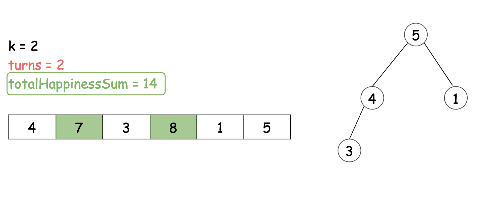

> Note: Instead of using a max heap, we can use a min heap with a fixed size `k` to find and maintain the `k` largest elements of a given array.
>
> A min heap operates the same way as the max heap with the sole difference that the min heap maintains the smallest element at the top instead of the largest element.
>
> Fixing the min heap's size to be `k`, and popping elements from the heap as soon as the size exceeds `k` ensures that by the end we have the `k` largest elements of the array stored in the min heap.
>
> This method is more efficient because it avoids storing the entire `happiness` array in the heap data structure. Thus, a min heap with a fixed size `k` achieves the same outcome as a max heap with reduced space complexity.
>
> For more in-depth discussion regarding finding the `k`th largest element of a given array you can refer to the editorial of [215. Kth Largest Element in an Array](https://leetcode.com/problems/kth-largest-element-in-an-array/editorial/).

#### Algorithm

1. Declare a max heap `pq`.
2. Initialize variable $turns = 0$ to represent the number of selection rounds passed.
3. Initialize variable $totalHappinessSum = 0$ to accumulate the total sum of happiness achieved.
4. Push all the elements of the `happiness` into `pq`.
5. For the `i`th selection round ($0 \le i < k$, zero indexed):
- Pick the `i`th biggest happiness score by querying the top element stored in `pq`, subtract it from `turns` and add it to `totalHappinessSum` if the result of the subtraction is bigger than zero.
- Pop the maximum value stored in `pq`.
- Increment `turns` by one.
6. Return `totalHappinessSum`.

#### Implementation

```python
class Solution:
    def maximumHappinessSum(self, happiness: List[int], k: int) -> int:
        # Convert the list into a max heap by inverting the happiness values
        # Python's default heap data structure is a min heap
        max_heap = [-h for h in happiness]
        heapq.heapify(max_heap)

        total_happiness_sum = 0
        turns = 0

        for i in range(k):
            # Invert again to get the original value
            total_happiness_sum += max(-heapq.heappop(max_heap) - turns, 0)

            # Increment turns for the next iteration
            turns += 1

        return total_happiness_sum

```

#### Complexity Analysis

Given $n$ as the length of `happiness`, and noting that insertion and deletion for the $\text{priority}_{queue}$ data structure takes $O(\log n)$ time,

* Time complexity: $O(n \cdot \log n + k \cdot \log n)$ (C++ and Java) or $O(n + k \cdot \log n)$ (Python3)

    C++ and Java: Building the priority queue `pq` involves pushing all elements from the `happiness` array, which takes $O(n \cdot \log n)$ time.

    Python3: Building the priority queue `pq` using `heapify()` takes $O(n)$ time.

    Iterating through the first `k` elements of `pq` takes $O(k \cdot \log n)$ time. In each iteration, a `pop()` operation (deletion) is performed, which takes $O(\log n)$ time.

    Therefore, the overall time complexity of the solution is $O(n \cdot \log n + k \cdot \log n)$ for C++ and Java, and $O(n + k \cdot \log n)$ for Python3. Since both terms depend on the number of elements in `happiness` and the value of `k`, no term can be neglected.

* Space complexity: $O(n)$

    The space complexity is primarily determined by `pq`, which stores all elements of `happiness`, making its space complexity $O(n)$.

    Additionally, there are constant space variables used such as `totalHappinessSum`, `turns`, `i`, and a temporary variable for iterating over `happiness`.

    Therefore, the overall space complexity of the solution is $O(n)$, with `pq` dominating the space usage.
---