[TOC]

## Solution

---

### Approach 1: Binary Search

#### Intuition

The OR operation has a unique property: the result is always greater than or equal to its operands. When we perform the OR operation on a series of numbers, each intermediate result will be greater than or equal to all previous results. This means that if we take two different lengths of subarrays, say $l_1$ and $l_2$, and their highest OR values are $o_1$ and $o_2$ respectively, then $o_2$ will always be greater than or equal to $o_1$ when $l_2$ is greater than or equal to $l_1$.

This property indicates that the highest OR values of subarray lengths, when arranged from 1 to `n`, form a non-decreasing sequence. This insight lets us use binary search in our solution.

To find the smallest subarray length that meets our requirement (an OR value greater than or equal to `k`), we can perform a binary search on the possible lengths of subarrays. If we find that no subarray of a certain length satisfies the criteria, we can disregard all shorter lengths because they won’t work either. On the other hand, if we find a valid length, we’ll store it in a variable called `minLength` and keep searching for potentially shorter valid lengths. At the end of our search, the final value of `minLength` will be our answer.

Now, how do we check if a subarray of a given length has an OR value that meets or exceeds `k`? We could loop through the array and check all subarrays of that length. However, repeatedly calculating the OR value for each subarray would take too much time, resulting in quadratic complexity. Instead, we want to achieve this in linear time.

When you OR multiple numbers together, a bit in the result will be 1 if any of the numbers have a 1 in that position. To efficiently track this, we can use a 32-bit array where each position corresponds to a bit and stores the count of set bits from the numbers being OR'd. This approach allows us to easily remove a number from our calculation by simply subtracting its set bit counts from the array.

So, to determine the OR value of a subarray, we’ll use a bit array called `bitCounts` along with a helper method named `updateBitCounts`. We’ll slide a fixed-size window of the given length across the array, adding and removing elements as the window moves using the `updateBitCounts` method. If we find that the OR value of any window is greater than or equal to `k`, we know that length is valid. Our goal is to find the smallest valid window length, which will be our final answer.

#### Algorithm

- Initialize variables `left` to 1 and `right` to the array length to establish binary search boundaries.
- Initialize `minLength` to -1 to track the shortest valid subarray length.
- Execute binary search while `left` is less than or equal to `right`:
  - Calculate the midpoint as $left + (right - left) / 2$.
  - If a valid subarray of length `mid` exists:
- Update `minLength` to current `mid`.
- Set `right` to $mid - 1$ to search for a smaller length.
  - Otherwise:
- Set `left` to $mid + 1$ to search for a larger length.
- Return `minLength` as the final result.

Helper Method `hasValidSubarray`:
- Initialize an array `bitCounts` of size 32 filled with zeros to track set bits at each position.
- Implement sliding window approach from index 0 to array length:
  - Add bits of the current number at `right` to `bitCounts`.
  - If the window size exceeds the desired length:
- Remove bits of the leftmost number from `bitCounts`.
  - If the current window has reached the desired size and its OR value exceeds the target:
- Return true as valid subarray found.
- Return false if no valid subarray is found.

Helper Method `updateBitCounts(bitCounts, number, delta)`:
- For each bit position from 0 to 31:
  - Check if the bit is set using right shift and AND operation.
  - If bit is set, update the count at that position by delta.

Helper Method `convertBitCountsToNumber(bitCounts)`:
- Initialize `number` to 0 to store the final result.
- For each bit position from 0 to 31:
  - If the count at the current position is non-zero:
- Set the corresponding bit in `number` using OR operation.
- Return the final computed `number`.

#### Implementation

> Note: While this is a valid approach and makes an excellent interview starting point, the Python3 implementation exceeds time limits on large test cases.

```python
class Solution:
    def minimumSubarrayLength(self, nums: List[int], k: int) -> int:
        # Binary search on the length of subarray
        left, right = 1, len(nums)
        min_length = -1

        while left <= right:
            mid = left + (right - left) // 2

            if self._has_valid_subarray(nums, k, mid):
                min_length = mid
                right = mid - 1  # Try to find smaller length
            else:
                left = mid + 1  # Try larger length

        return min_length

    def _has_valid_subarray(
        self, nums: list, target_sum: int, window_size: int
    ) -> bool:
        # Tracks count of set bits at each position
        bit_counts = [0] * 32

        # Sliding window approach
        for right in range(len(nums)):
            # Add current number to window
            self._update_bit_counts(bit_counts, nums[right], 1)

            # Remove leftmost number if window exceeds size
            if right >= window_size:
                self._update_bit_counts(
                    bit_counts, nums[right - window_size], -1
                )

            # Check if current window is valid
            if (
                right >= window_size - 1
                and self._convert_bits_to_num(bit_counts) >= target_sum
            ):
                return True

        return False

    def _update_bit_counts(
        self, bit_counts: list, number: int, delta: int
    ) -> None:
        # Update counts for each set bit in the number
        for pos in range(32):
            if number & (1 << pos):
                bit_counts[pos] += delta

    def _convert_bits_to_num(self, bit_counts: list) -> int:
        # Convert bit counts to number using OR operation
        return sum(1 << pos for pos in range(32) if bit_counts[pos])
```

#### Complexity Analysis

Let $n$ be the length of the `nums` array.

- Time complexity: $O(n \cdot \log n)$

    The algorithm performs a binary search on possible subarray lengths from $1$ to $n$, which takes $O(\log n)$ iterations. For each iteration, the algorithm calls `hasValidSubarray` which uses a fixed-length sliding window to examine each position in the array once. For each position it performs two operations: `updateBitCounts` and `convertBitCountsToNumber`, each taking $O(32) = O(1)$ time as they iterate through fixed $32$ bit positions. So, `hasValidSubarray` takes $O(n)$ time.

    Thus, the overall time complexity of the algorithm is $O(n \cdot \log n)$.

- Space complexity: $O(1)$

    The algorithm uses a fixed-size array `bitCounts` of size $32$ to store the count of set bits at each position and a few other variables for binary search and tracking results. Therefore, the total space complexity is $O(1)$.

---

### Approach 2: Sliding Window

#### Intuition

In our previous method, we used binary search to adjust the size of the window to find the smallest possible window size. However, we can simplify things by using a variable-size sliding window instead, which eliminates the $\log n$ factor from our time complexity.

We’ll iterate through the `nums` array and add each element to our window one by one. After adding an element, we’ll check if the current OR value of the subarray meets or exceeds the target value `k`. If it does, we’ll keep track of the current size of the window in a variable called `minLength`.

Next, we’ll try to shrink the window from the start by removing elements one at a time. Each time we remove an element, we reduce the window size and update `minLength` accordingly. We keep doing this until the OR value of the window drops below `k`, at which point we stop removing elements and continue with the next element in the array.

Once we finish looping through the array, `minLength` will contain the length of the smallest valid subarray that meets the condition. We can then return this value as our answer.

The algorithm is visualized in the slideshow below:

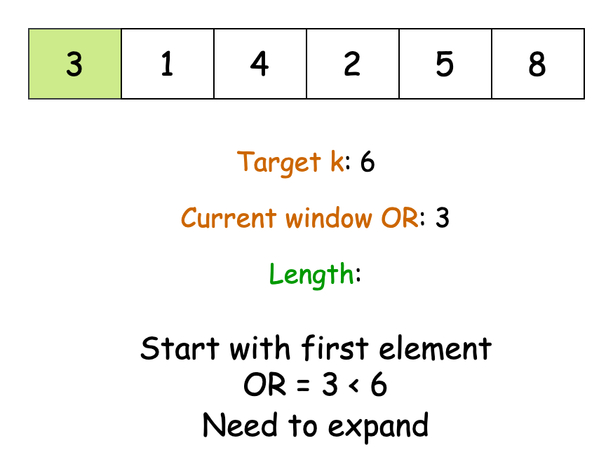

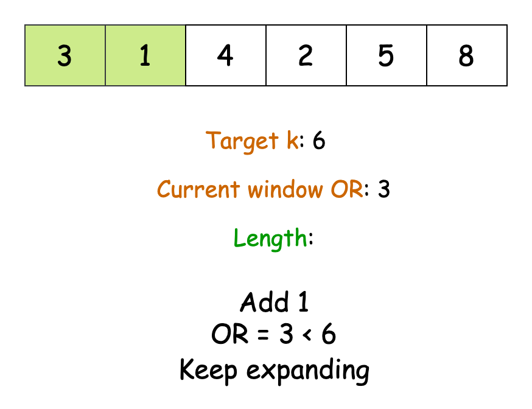

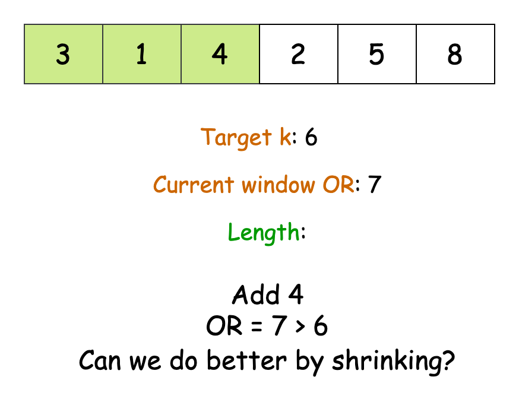

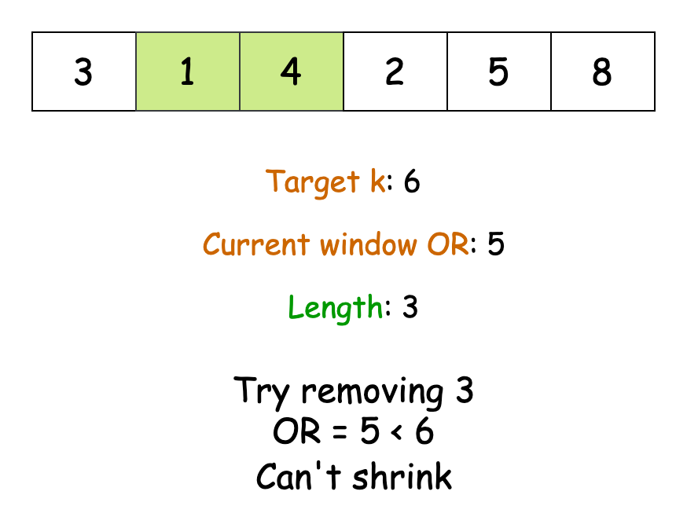

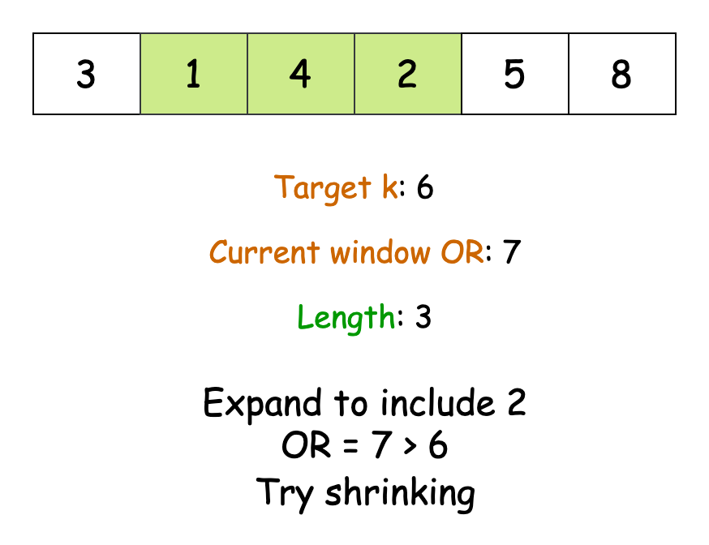

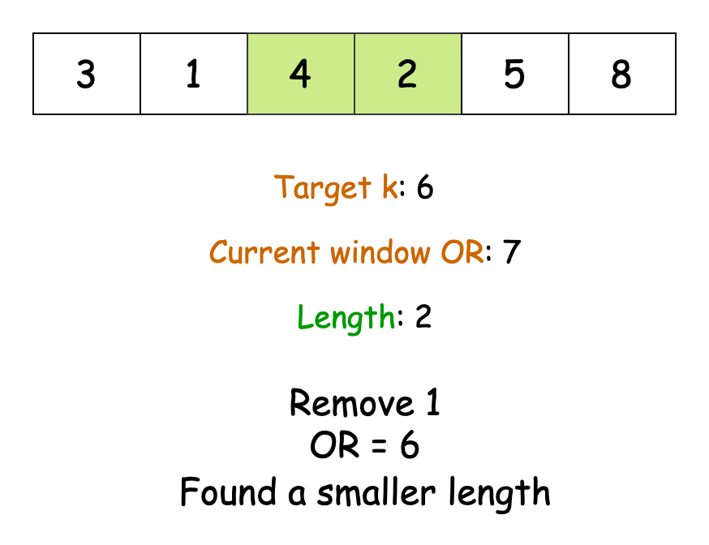

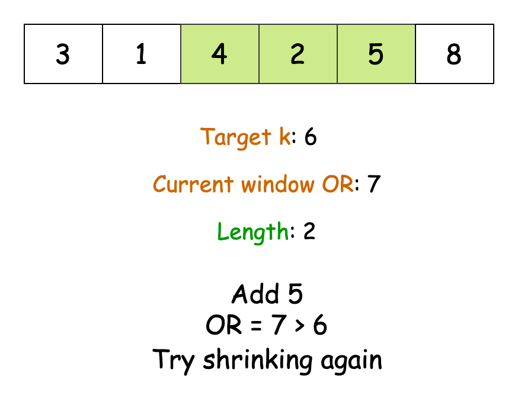

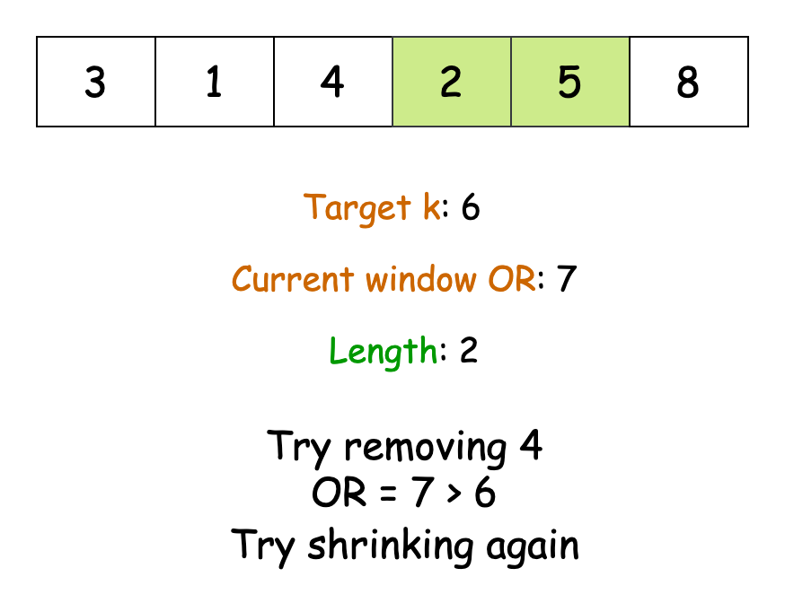

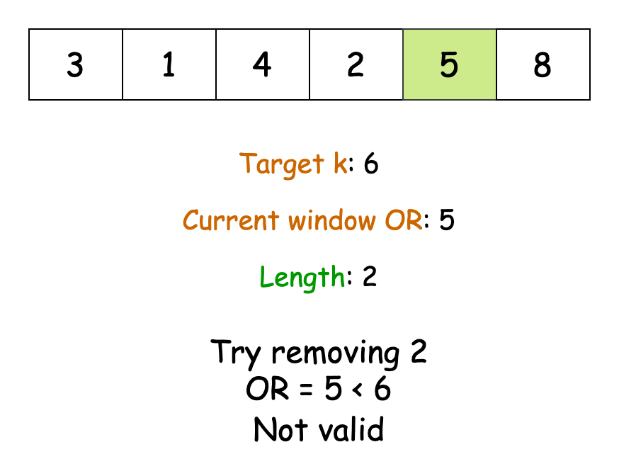

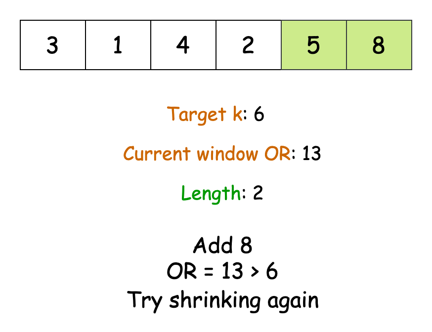

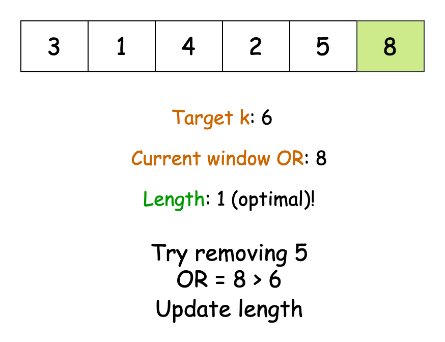

#### Algorithm

- Initialize:
  - a variable `minLength` to maximum possible integer value to track the shortest valid subarray length.
  - two pointers `windowStart` and `windowEnd` to 0 to implement a sliding window.
  - an array `bitCounts` of size 32 filled with zeros to keep track of set bits at each position.
- Start expanding the window while `windowEnd` is less than the array length:
  - Add the bits of current number at `windowEnd` to `bitCounts` by calling `updateBitCounts`.
  - While the window contains a valid subarray (OR of numbers $\geq$ k) and `windowStart` $\leq$ `windowEnd`:
- Update `minLength` to minimum of current `minLength` and current window size.
- Remove the bits of number at `windowStart` from `bitCounts`.
- Increment `windowStart` to shrink window from left.
  - Increment `windowEnd` to expand window from right.
- Return -1 if no valid subarray found (`minLength` still maximum), else return `minLength`.

Helper method `updateBitCounts(bitCounts, number, delta)`:
- For each bit position from 0 to 31:
  - Check if bit is set in given number using right shift and AND operation.
  - If bit is set, increment/decrement count at that position by delta.

Helper method `convertBitCountsToNumber(bitCounts)`:
- Initialize `result` to 0.
- For each bit position from 0 to 31:
  - If count at current position is non-zero, set corresponding bit in `result` using OR operation.
- Return the final `result`.

#### Implementation

```python
class Solution:
    def minimumSubarrayLength(self, nums: List[int], k: int) -> int:
        min_length = float("inf")
        window_start = window_end = 0
        bit_counts = [0] * 32  # Tracks count of set bits at each position

        # Expand window until end of array
        while window_end < len(nums):
            # Add current number to window
            self._update_bit_counts(bit_counts, nums[window_end], 1)

            # Contract window while OR value is valid
            while (
                window_start <= window_end
                and self._convert_bits_to_num(bit_counts) >= k
            ):
                # Update minimum length found so far
                min_length = min(min_length, window_end - window_start + 1)

                # Remove leftmost number and shrink window
                self._update_bit_counts(bit_counts, nums[window_start], -1)
                window_start += 1

            window_end += 1

        return -1 if min_length == float("inf") else min_length

    def _update_bit_counts(
        self, bit_counts: list, number: int, delta: int
    ) -> None:
        # Update counts for each set bit in the number
        for pos in range(32):
            if number & (1 << pos):
                bit_counts[pos] += delta

    def _convert_bits_to_num(self, bit_counts: list) -> int:
        # Convert bit counts to number using OR operation
        result = 0
        for pos in range(32):
            if bit_counts[pos]:
                result |= 1 << pos
        return result
```

#### Complexity Analysis

Let $n$ be the length of the `nums` array.

* Time complexity: $O(n)$

    The outer loop runs over the length of the input array. For each iteration, we perform two operations: the first operation updates the bit counts, and the second operation checks if the current window is valid by converting bit counts to numbers. Both these take $O(32) = O(1)$ time.

    The inner while loop can run at most $n$ times across all iterations of the outer loop, as `windowStart` can only be incremented $n$ times in total.

    Thus, the total time complexity of our algorithm is $O(n)$.

* Space complexity: $O(1)$

    The algorithm uses a fixed-size array `bitCounts` of size $32$ to store the count of set bits at each position. Besides this, it uses only a few integer variables (`minLength`, `windowStart`, `windowEnd`) for tracking the window and result.

    Therefore, the total space complexity is $O(1)$ as it uses constant extra space independent of input size.

---