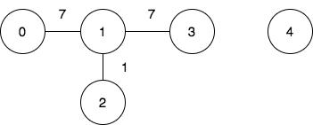
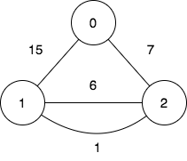

## Description

There is an undirected weighted graph with `n` vertices labeled from `0` to $n - 1$.

You are given the integer `n` and an array `edges`, where $\text{edges}[i] = [u_{i}, v_{i}, w_{i}]$ indicates that there is an edge between vertices $u_{i}$ and $v_{i}$ with a weight of $w_{i}$.

A walk on a graph is a sequence of vertices and edges. The walk starts and ends with a vertex, and each edge connects the vertex that comes before it and the vertex that comes after it. It's important to note that a walk may visit the same edge or vertex more than once.

The **cost** of a walk starting at node `u` and ending at node `v` is defined as the bitwise `AND` of the weights of the edges traversed during the walk. In other words, if the sequence of edge weights encountered during the walk is $w_{0}, w_{1}, w_{2}, ..., w_{k}$, then the cost is calculated as $w_{0} \& w_{1} \& w_{2} \& ... \& w_{k}$, where `&` denotes the bitwise `AND` operator.

You are also given a 2D array `query`, where $\text{query}[i] = [s_{i}, t_{i}]$. For each query, you need to find the minimum cost of the walk starting at vertex $s_{i}$ and ending at vertex $t_{i}$. If there exists no such walk, the answer is `-1`.

Return *the array *`answer`*, where *$\text{answer}[i]$* denotes the **minimum** cost of a walk for query *`i`.
### Function Contract

- `n`: Input parameter.
- Returns expected result.

### Examples
#### Example 1

**Input:** n = 5, edges = [[0,1,7],[1,3,7],[1,2,1]], query = [[0,3],[3,4]]

**Output:** [1,-1]

**Explanation:**

To achieve the cost of 1 in the first query, we need to move on the following edges: `0->1` (weight 7), `1->2` (weight 1), `2->1` (weight 1), `1->3` (weight 7).

In the second query, there is no walk between nodes 3 and 4, so the answer is -1.
#### Example 2

**Input:** n = 3, edges = [[0,2,7],[0,1,15],[1,2,6],[1,2,1]], query = [[1,2]]

**Output:** [0]

**Explanation:**

To achieve the cost of 0 in the first query, we need to move on the following edges: `1->2` (weight 1), `2->1` (weight 6), `1->2` (weight 1).

### Constraints

- $2 \le n \le 10^{5}$

- $0 \le \text{edges.length} \le 10^{5}$

- $\text{edges}[i].length = 3$

- $0 \le u_{i}, v_{i} \le n - 1$

- $u_{i} \neq v_{i}$

- $0 \le w_{i} \le 10^{5}$

- $1 \le \text{query.length} \le 10^{5}$

- $\text{query}[i].length = 2$

- $0 \le s_{i}, t_{i} \le n - 1$

- $s_{i} \neq t_{i}$