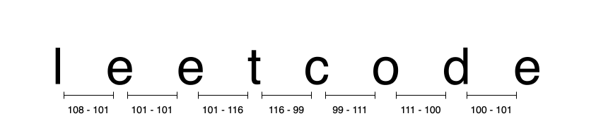

[TOC]

## Solution

---

### Approach: Linear Iteration

#### Intuition

To solve the problem, we must calculate the sum of the absolute differences between the ASCII values of all adjacent characters in the input string `s`.

The absolute difference between two numbers is the positive value of the difference between those numbers, regardless of which one is larger. For example, the absolute difference between $3$ and $8$ is $| 3 - 8 | = | -5 | = 5$.

<details>
  <summary> <u>If you are new to programming we recommend reading the following section to better understand what ASCII means in programming languages: (click to expand)</u></summary>

<br />

> ASCII stands for "American Standard Code for Information Interchange." It's a way to represent characters (like letters, numbers, and symbols) using numbers.
>
> In simpler terms, think of it like this: imagine each character on your keyboard has a number assigned to it. For example, the letter `'A'` is represented by the number `65`, `'B'` by `66`, and so on. You can see more ASCII codes [here](https://www.ascii-code.com/) represented in an ASCII table.
>
> <br />
>
> **Why is there a need to represent characters using numbers?**
>
> - ASCII provides a standard way to represent characters, ensuring that computers from different manufacturers can communicate with each other properly.
> - Numbers require less space than characters. Instead of storing `'A'`, `'B'`, `'C'`, etc., which would take up more memory, computers can store the ASCII numbers (`65`, `66`, `67`) efficiently.
> - Computers handle numbers efficiently, so ASCII allows computers to process text efficiently.

</details>

<br />

To solve the given problem, we'll iterate through the string `s` from the beginning. For each character at index `i`, we compute the difference between the ASCII values of the character at index `i` and the character at index $i + 1$. We then add the absolute value of this difference to a cumulative sum.
This iteration stops at the second-last character because each comparison involves the next character in the string.



Handling character data in different programming languages:

  - In C++ and Java, characters are treated as integer values based on their ASCII or Unicode representations. This allows for direct arithmetic operations such as subtraction between characters.

  - In Python, characters are represented as strings of length one rather than as integers. As a result, Python does not support direct arithmetic operations on characters. To perform such operations, we must first convert each character to its ASCII value using the `ord()` function, which returns the integer representation of the character. This conversion enables arithmetic operations between characters in Python.

#### Algorithm

1. Initialize a variable `score` to `0` to store the cumulative sum.
2. Iterate over all indices from `0` to $length - 1$ of the input string. For each index, calculate the absolute difference between the ASCII values of the character at the current index and the character at the next index. Add this difference to the `score`.
3. Return the `score` after the loop completes.

#### Implementation

```python
class Solution:
    def scoreOfString(self, s: str) -> int:
        score = 0
        # Iterate over all indices from 0 to the second-to-last index
        # Calculate and accumulate the absolute difference of ASCII values
        # between adjacent characters
        for i in range(len(s) - 1):
            score += abs(ord(s[i]) - ord(s[i + 1]))
        return score
```

#### Complexity Analysis

Here, $n$ is the length of the input string.

* Time Complexity: $O(n)$

- The process involves iterating through the string once, from the first character to the second-last character, making it a linear iteration over $n-1$ indices
- At each index, calculating the absolute difference between the ASCII values of two adjacent characters requires constant time.
- Hence, the total time complexity for this operation is $O(n-1) = O(n)$.

* Space Complexity: $O(1)$

- We only used a single additional variable, `score`, to accumulate the result. Therefore, the space complexity is $O(1)$, indicating that no additional space proportional to the input size is required.