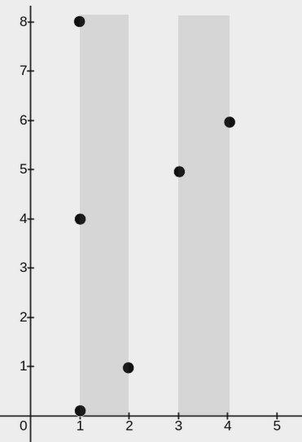
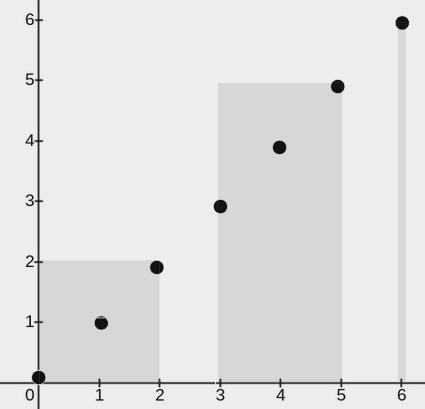
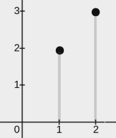

## Description

You are given a 2D integer array `points`, where $\text{points}[i] = [x_{i}, y_{i}]$. You are also given an integer `w`. Your task is to **cover** **all** the given points with rectangles.

Each rectangle has its lower end at some point $(x_{1}, 0)$ and its upper end at some point $(x_{2}, y_{2})$, where $x_{1} \le x_{2}$, $y_{2} \ge 0$, and the condition $x_{2} - x_{1} \le w$ **must** be satisfied for each rectangle.

A point is considered covered by a rectangle if it lies within or on the boundary of the rectangle.

Return an integer denoting the **minimum** number of rectangles needed so that each point is covered by **at least one** rectangle*.*

**Note:** A point may be covered by more than one rectangle.
### Function Contract

- `n`: Input parameter.
- Returns expected result.

### Examples

#### Example 1

**Input:** points = [[2,1],[1,0],[1,4],[1,8],[3,5],[4,6]], w = 1

**Output:** 2

**Explanation: **

The image above shows one possible placement of rectangles to cover the points:

- A rectangle with a lower end at `(1, 0)` and its upper end at `(2, 8)`

- A rectangle with a lower end at `(3, 0)` and its upper end at `(4, 8)`

#### Example 2

**Input:** points = [[0,0],[1,1],[2,2],[3,3],[4,4],[5,5],[6,6]], w = 2

**Output:** 3

**Explanation: **

The image above shows one possible placement of rectangles to cover the points:

- A rectangle with a lower end at `(0, 0)` and its upper end at `(2, 2)`

- A rectangle with a lower end at `(3, 0)` and its upper end at `(5, 5)`

- A rectangle with a lower end at `(6, 0)` and its upper end at `(6, 6)`

#### Example 3

**Input:** points = [[2,3],[1,2]], w = 0

**Output:** 2

**Explanation: **

The image above shows one possible placement of rectangles to cover the points:

- A rectangle with a lower end at `(1, 0)` and its upper end at `(1, 2)`

- A rectangle with a lower end at `(2, 0)` and its upper end at `(2, 3)`

### Constraints

- $1 \le \text{points.length} \le 10^{5}$

- $\text{points}[i].length = 2$

- $0 \le x_{i} = \text{points}[i][0] \le 10^{9}$

- $0 \le y_{i} = \text{points}[i][1] \le 10^{9}$

- $0 \le w \le 10^{9}$

- All pairs $(x_{i}, y_{i})$ are distinct.