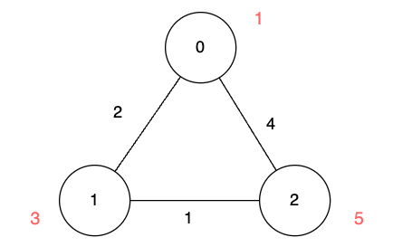

### 1. Description

There is an undirected graph of `n` nodes. You are given a 2D array `edges`, where $\text{edges}[i] = [u_{i}, v_{i}, \text{length}_{i}]$ describes an edge between node $u_{i}$ and node $v_{i}$ with a traversal time of $\text{length}_{i}$ units.

Additionally, you are given an array `disappear`, where $\text{disappear}[i]$ denotes the time when the node `i` disappears from the graph and you won't be able to visit it.

### 2. Function Contract

- `n`: Input parameter.
- Returns expected result.

### 3. Note

that the graph might be *disconnected* and might contain *multiple edges*.

Return the array `answer`, with $\text{answer}[i]$ denoting the **minimum** units of time required to reach node `i` from node 0. If node `i` is **unreachable** from node 0 then $\text{answer}[i]$ is `-1`.

### 4. Examples

#### Example 1

**Input:** n = 3, edges = [[0,1,2],[1,2,1],[0,2,4]], disappear = [1,1,5]

**Output:** [0,-1,4]

**Explanation:**

We are starting our journey from node 0, and our goal is to find the minimum time required to reach each node before it disappears.

- For node 0, we don't need any time as it is our starting point.

- For node 1, we need at least 2 units of time to traverse $\text{edges}[0]$. Unfortunately, it disappears at that moment, so we won't be able to visit it.

- For node 2, we need at least 4 units of time to traverse $\text{edges}[2]$.

#### Example 2

**Input:** n = 3, edges = [[0,1,2],[1,2,1],[0,2,4]], disappear = [1,3,5]

**Output:** [0,2,3]

**Explanation:**

We are starting our journey from node 0, and our goal is to find the minimum time required to reach each node before it disappears.

- For node 0, we don't need any time as it is the starting point.

- For node 1, we need at least 2 units of time to traverse $\text{edges}[0]$.

- For node 2, we need at least 3 units of time to traverse $\text{edges}[0]$ and $\text{edges}[1]$.

#### Example 3

**Input:** n = 2, edges = [[0,1,1]], disappear = [1,1]

**Output:** [0,-1]

**Explanation:**

Exactly when we reach node 1, it disappears.

### 5. Constraints

- $1 \le n \le 5 * 10^{4}$

- $0 \le \text{edges.length} \le 10^{5}$

- $\text{edges}[i] = [u_{i}, v_{i}, \text{length}_{i}]$

- $0 \le u_{i}, v_{i} \le n - 1$

- $1 \le \text{length}_{i} \le 10^{5}$

- $\text{disappear.length} = n$

- $1 \le \text{disappear}[i] \le 10^{5}$