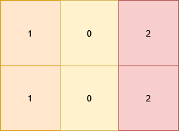
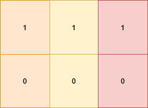
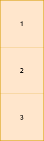

### 1. Description

You are given a 2D matrix `grid` of size `m x n`. You need to check if each cell $\text{grid}[i][j]$ is:

- Equal to the cell below it, i.e. $\text{grid}[i][j] = grid[i + 1][j]$ (if it exists).

- Different from the cell to its right, i.e. $\text{grid}[i][j] \neq \text{grid}[i][j + 1]$ (if it exists).

Return `true` if **all** the cells satisfy these conditions, otherwise, return `false`.

### 2. Function Contract

- `n`: Input parameter.
- Returns expected result.

### 3. Examples

#### Example 1

**Input:** grid = [[1,0,2],[1,0,2]]

**Output:** true

**Explanation:**

**

**

All the cells in the grid satisfy the conditions.

#### Example 2

**Input:** grid = [[1,1,1],[0,0,0]]

**Output:** false

**Explanation:**

**

**

All cells in the first row are equal.

#### Example 3

**Input:** grid = [[1],[2],[3]]

**Output:** false

**Explanation:**

Cells in the first column have different values.

### 4. Constraints

- $1 \le n, m \le 10$

- $0 \le \text{grid}[i][j] \le 9$