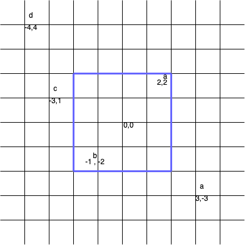
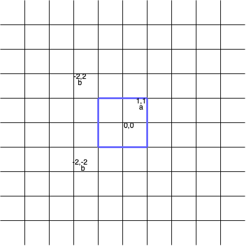

## Description

You are given a 2D** **array `points` and a string `s` where, $\text{points}[i]$ represents the coordinates of point `i`, and $s[i]$ represents the **tag** of point `i`.

A **valid** square is a square centered at the origin `(0, 0)`, has edges parallel to the axes, and **does not** contain two points with the same tag.

Return the **maximum** number of points contained in a **valid** square.

Note:

- A point is considered to be inside the square if it lies on or within the square's boundaries.

- The side length of the square can be zero.
### Function Contract

- `n`: Input parameter.
- Returns expected result.

### Examples
#### Example 1

**Input:** points = [[2,2],[-1,-2],[-4,4],[-3,1],[3,-3]], s = "abdca"

**Output:** 2

**Explanation:**

The square of side length 4 covers two points $\text{points}[0]$ and $\text{points}[1]$.

#### Example 2

**Input:** points = [[1,1],[-2,-2],[-2,2]], s = "abb"

**Output:** 1

**Explanation:**

The square of side length 2 covers one point, which is $\text{points}[0]$.

#### Example 3

**Input:** points = [[1,1],[-1,-1],[2,-2]], s = "ccd"

**Output:** 0

**Explanation:**

It's impossible to make any valid squares centered at the origin such that it covers only one point among $\text{points}[0]$ and $\text{points}[1]$.

### Constraints

- $1 \le \text{s.length}, \text{points.length} \le 10^{5}$

- $\text{points}[i].length = 2$

- $-10^{9} \le \text{points}[i][0], \text{points}[i][1] \le 10^{9}$

- $\text{s.length} = \text{points.length}$

- `points` consists of distinct coordinates.

- `s` consists only of lowercase English letters.