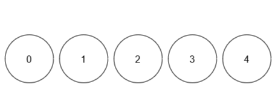

### 1. Description

You are given an integer `limit` and a 2D array `queries` of size `n x 2`.

There are $limit + 1$ balls with **distinct** labels in the range `[0, limit]`. Initially, all balls are uncolored. For every query in `queries` that is of the form `[x, y]`, you mark ball `x` with the color `y`. After each query, you need to find the number of colors among the balls.

Return an array `result` of length `n`, where $\text{result}[i]$ denotes the number of colors *after* $$i^{\text{th}}$$ query.

### 2. Function Contract

- `n`: Input parameter.
- Returns expected result.

### 3. Note

that when answering a query, lack of a color *will not* be considered as a color.

### 4. Examples

#### Example 1

**Input:** limit = 4, queries = [[1,4],[2,5],[1,3],[3,4]]

**Output:** [1,2,2,3]

**Explanation:**

- After query 0, ball 1 has color 4.

- After query 1, ball 1 has color 4, and ball 2 has color 5.

- After query 2, ball 1 has color 3, and ball 2 has color 5.

- After query 3, ball 1 has color 3, ball 2 has color 5, and ball 3 has color 4.

#### Example 2

**Input:** limit = 4, queries = [[0,1],[1,2],[2,2],[3,4],[4,5]]

**Output:** [1,2,2,3,4]

**Explanation:**

**

**

- After query 0, ball 0 has color 1.

- After query 1, ball 0 has color 1, and ball 1 has color 2.

- After query 2, ball 0 has color 1, and balls 1 and 2 have color 2.

- After query 3, ball 0 has color 1, balls 1 and 2 have color 2, and ball 3 has color 4.

- After query 4, ball 0 has color 1, balls 1 and 2 have color 2, ball 3 has color 4, and ball 4 has color 5.

### 5. Constraints

- $1 \le limit \le 10^{9}$

- $1 \le n = \text{queries.length} \le 10^{5}$

- $\text{queries}[i].length = 2$

- $0 \le \text{queries}[i][0] \le limit$

- $1 \le \text{queries}[i][1] \le 10^{9}$