[TOC]

## Solution

---

### Overview

Our task is to create a new string based on a given string `s` with the format `(frequency)(character)`. For example, "baaaaa" becomes "1b5a" because 'b' appears 1 time and 'a' appears 5 consecutive times.

However, there’s an important constraint: the frequency digit cannot exceed 9. If a character appears more than 9 consecutive times, the encoding must be split. For instance, if 'a' appears 13 consecutive times, we encode it as "9a4a" rather than "13a".

---

### Approach: String Manipulation

#### Intuition

We can solve this problem in a straightforward way by initializing a variable, `comp`, that we will update as we iterate through the given string. For this explanation, consider a "segment" to mean one letter of its kind standing alone in the string **or** a consecutive group of letters with the same value occurring 9 or less times in a row.

We'll use a nested while loop to solve this problem. Our outer loop will initialize the `consecutiveCount` of each new segment (starting at 0), and store the current letter we are tracking as `currentChar`.

The inner while loop will count the number of characters of each segment by incrementing `consecutiveCount` to count the number of times the current letter occurs in a row, and the counter `pos` to track our position in the given string. We continue in the inner loop until the letter changes, the count of this segment reaches 9, or we reach the end of the given string. Then, we break out into our outer loop where we append both the count and the letter to `comp`.

By the end of the process, `comp` will hold the compressed version of the string, which we then return.

The slideshow below demonstrates the algorithm in action:

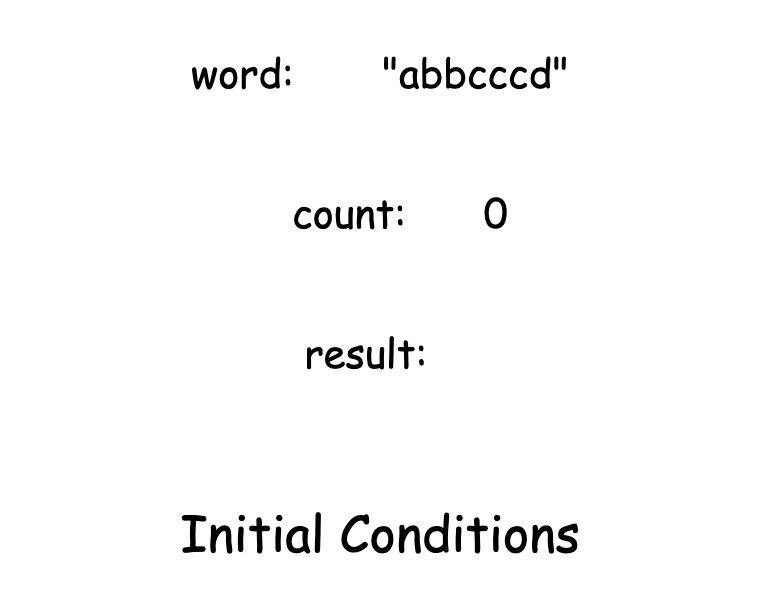

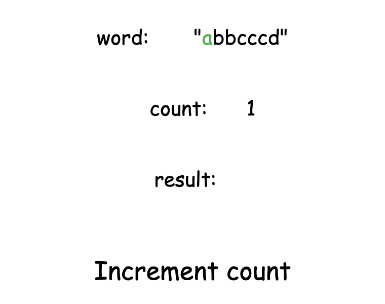

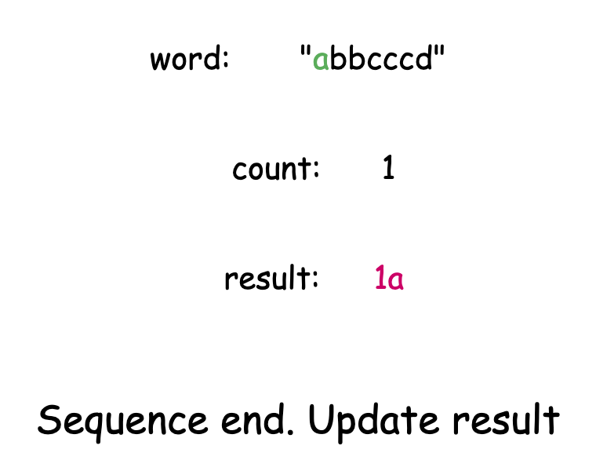

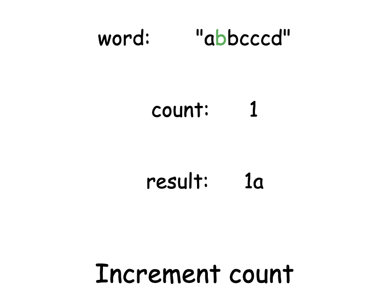

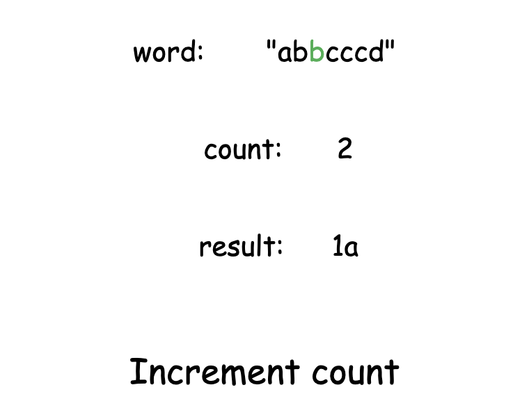

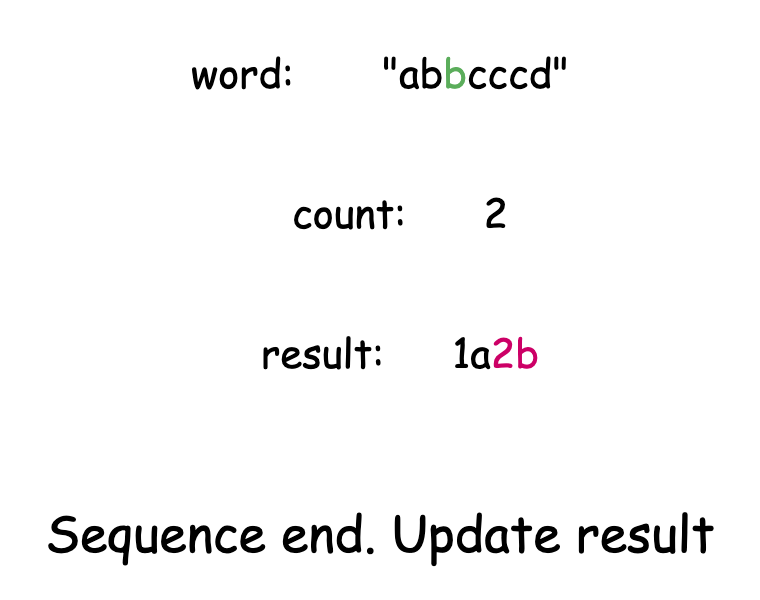

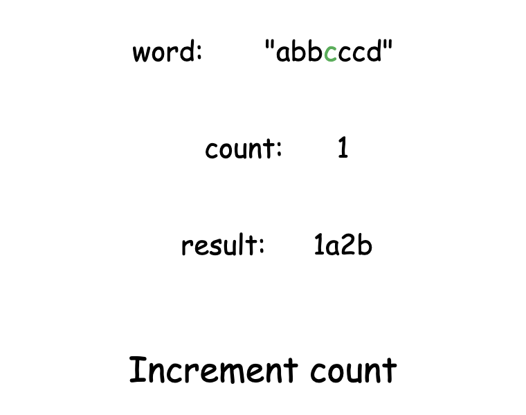

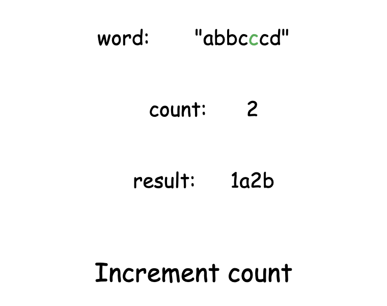

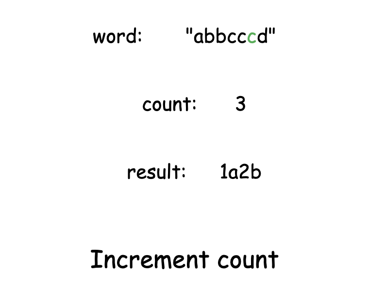

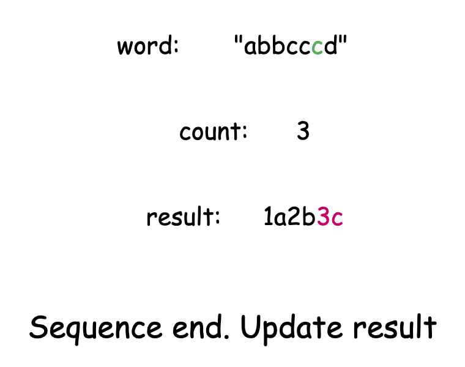

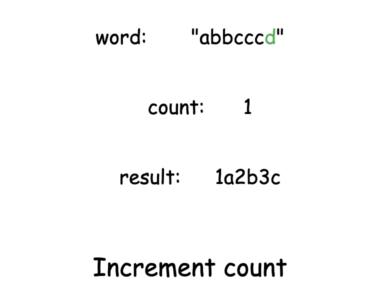

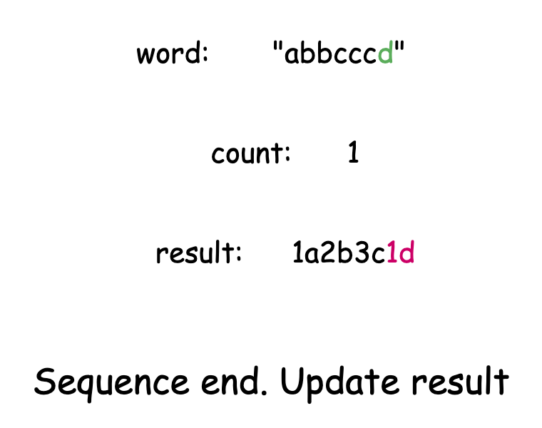

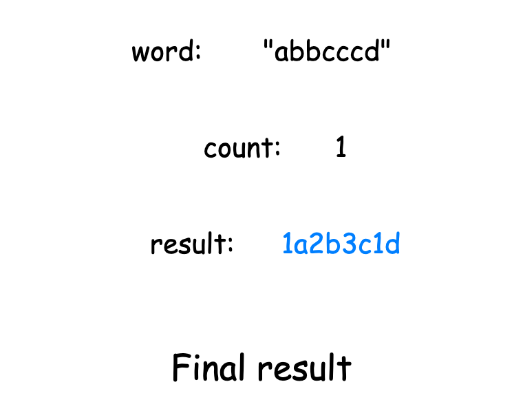

#### Algorithm

- Initialize a variable:
  - `comp` to an empty string to store the final compressed output.
  - `pos` to 0 to track the current position in the input string.
- While `pos` is less than the length of the input string `word`:
  - Initialize a variable :
- `consecutiveCount` to 0 to track the count of the current character.
- `currentChar` to the character at position `pos` in `word`.
- While all these conditions are true:
      - `pos` is less than the length of `word`
      - `consecutiveCount` is less than 9
      - character at position `pos` equals `currentChar`
- Increment `consecutiveCount` and `pos` by 1.
  - Append the string formed by concatenating `consecutiveCount` and `currentChar` to `comp`.
- Return the final compressed string stored in `comp`.

#### Implementation

```python
class Solution:
    def compressedString(self, word: str) -> str:
        comp = []

        # pos tracks our position in the input string
        pos = 0

        # Process until we reach end of string
        while pos < len(word):
            consecutive_count = 0

            current_char = word[pos]

            # Count consecutive occurrences (maximum 9)
            while (
                pos < len(word)
                and consecutive_count < 9
                and word[pos] == current_char
            ):
                consecutive_count += 1
                pos += 1

            # Append count followed by character to the list
            comp.append(str(consecutive_count))
            comp.append(current_char)

        # Join the list into a single string for the final result
        return "".join(comp)
```

#### Complexity Analysis

Let $n$ be the length of the given string `word`.

- Time complexity: $O(n)$

    The loop iterates over each character in the string exactly once. All increment and append operations inside the loop take constant time.

    Thus, the time complexity of the algorithm is $O(n)$.

    > Note: The usage of built-in functions like $\text{to}_{string}()$ does not significantly affect the overall complexity in this context, as its operation is constant with respect to the number of digits in the count (which is at most 2 for the range of counts allowed)

- Space complexity: $O(n)$ for Java and Python3, $O(1)$ for C++

    The space complexity of this algorithm varies by implementation language. In Java and Python3, we use an additional variable to build the output string, which requires $O(n)$ space. However, the C++ implementation modifies the output string in place, avoiding the need for additional storage. All other variables in the algorithm use only constant space.

    Thus, the overall space complexity is $O(n)$ for Java and Python3, while remaining $O(1)$ for C++.

---