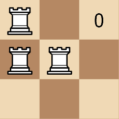
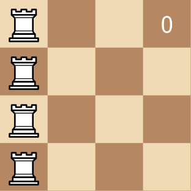

### 1. Description

Given a 2D array `rooks` of length `n`, where $\text{rooks}[i] = [x_{i}, y_{i}]$ indicates the position of a rook on an `n x n` chess board. Your task is to move the rooks **1 cell **at a time vertically or horizontally (to an *adjacent* cell) such that the board becomes **peaceful**.

A board is **peaceful** if there is **exactly** one rook in each row and each column.

Return the **minimum** number of moves required to get a *peaceful board*.

### 2. Function Contract

- Refer to method signature.

### 3. Note

that **at no point** can there be two rooks in the same cell.

### 4. Examples

#### Example 1

- **Input:** rooks = [[0,0],[1,0],[1,1]]

- **Output:** 3

- **Explanation:** 

#### Example 2

- **Input:** rooks = [[0,0],[0,1],[0,2],[0,3]]

- **Output:** 6

- **Explanation:** 

### 5. Constraints

- $1 \le n = \text{rooks.length} \le 500$

- $0 \le x_{i}, y_{i} \le n - 1$

- The input is generated such that there are no 2 rooks in the same cell.
