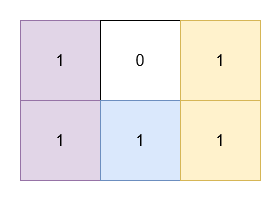
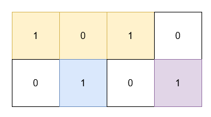

### 1. Description

You are given a 2D **binary** array `grid`. You need to find 3 **non-overlapping** rectangles having **non-zero** areas with horizontal and vertical sides such that all the 1's in `grid` lie inside these rectangles.

Return the **minimum** possible sum of the area of these rectangles.

### 2. Function Contract

**Inputs**

- `grid`: Input parameter (`List[List[int]]`).

**Return value**

- Returns `int`.

### 3. Note

that the rectangles are allowed to touch.

### 4. Examples

#### Example 1

- **Input:** grid = [[1,0,1],[1,1,1]]

- **Output:** 5

- **Explanation:** 

- The 1's at `(0, 0)` and `(1, 0)` are covered by a rectangle of area 2.

- The 1's at `(0, 2)` and `(1, 2)` are covered by a rectangle of area 2.

- The 1 at `(1, 1)` is covered by a rectangle of area 1.

#### Example 2

- **Input:** grid = [[1,0,1,0],[0,1,0,1]]

- **Output:** 5

- **Explanation:** 

- The 1's at `(0, 0)` and `(0, 2)` are covered by a rectangle of area 3.

- The 1 at `(1, 1)` is covered by a rectangle of area 1.

- The 1 at `(1, 3)` is covered by a rectangle of area 1.

### 5. Constraints

- $1 \le \text{grid.length}, \text{grid}[i].length \le 30$

- $\text{grid}[i][j]$ is either 0 or 1.

- The input is generated such that there are at least three 1's in `grid`.
