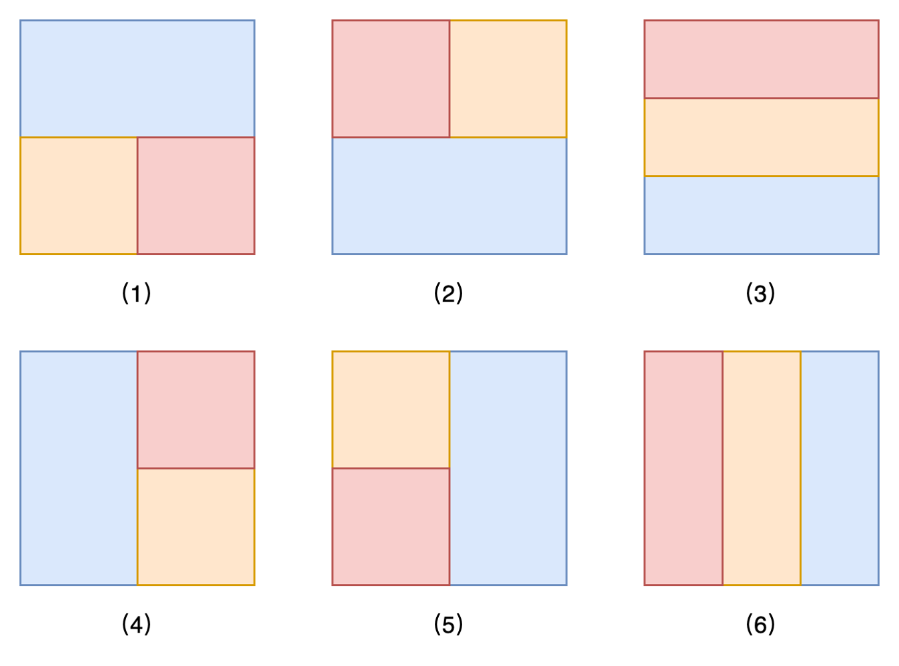

### Approach: Enumerate

#### Intuition

We can divide the $\textit{grid}$ into three non-overlapping sections and treat each section as a separate instance of the problem [「3195. Find the Minimum Area to Cover All Ones I」](https://leetcode.com/problems/find-the-minimum-area-to-cover-all-ones-i/description/).



As shown in the figure above, there are $6$ possible cases. For cases $(1), (2), (4),$ and $(5)$, we can enumerate the intersections of the three parts. For cases $(3)$ and $(6)$, we can enumerate the rows and columns being cut. The time complexity in these scenarios is $O(nm)$, $O(n^2)$, or $O(m^2)$.

Since $(1), (2), (3)$ rotated counterclockwise by $90$ degrees correspond to $(4), (5), (6)$, we only need to consider the original array and the two arrays rotated $90$ degrees, enumerating the first three cases separately.

#### Implementation

```python
class Solution:
    def minimumSum2(
        self, grid: List[List[int]], u: int, d: int, l: int, r: int
    ) -> int:
        min_i = len(grid)
        max_i = 0
        min_j = len(grid[0])
        max_j = 0

        for i in range(u, d + 1):
            for j in range(l, r + 1):
                if grid[i][j] == 1:
                    min_i = min(min_i, i)
                    min_j = min(min_j, j)
                    max_i = max(max_i, i)
                    max_j = max(max_j, j)

        return (
            (max_i - min_i + 1) * (max_j - min_j + 1)
            if min_i <= max_i
            else sys.maxsize // 3
        )

    def rotate(self, vec: List[List[int]]) -> List[List[int]]:
        n = len(vec)
        m = len(vec[0]) if n > 0 else 0
        ret = [[0] * n for _ in range(m)]

        for i in range(n):
            for j in range(m):
                ret[m - j - 1][i] = vec[i][j]

        return ret

    def solve(self, grid: List[List[int]]) -> int:
        n = len(grid)
        m = len(grid[0]) if n > 0 else 0
        res = n * m

        for i in range(n - 1):
            for j in range(m - 1):
                res = min(
                    res,
                    self.minimumSum2(grid, 0, i, 0, m - 1)
                    + self.minimumSum2(grid, i + 1, n - 1, 0, j)
                    + self.minimumSum2(grid, i + 1, n - 1, j + 1, m - 1),
                )

                res = min(
                    res,
                    self.minimumSum2(grid, 0, i, 0, j)
                    + self.minimumSum2(grid, 0, i, j + 1, m - 1)
                    + self.minimumSum2(grid, i + 1, n - 1, 0, m - 1),
                )

        for i in range(n - 2):
            for j in range(i + 1, n - 1):
                res = min(
                    res,
                    self.minimumSum2(grid, 0, i, 0, m - 1)
                    + self.minimumSum2(grid, i + 1, j, 0, m - 1)
                    + self.minimumSum2(grid, j + 1, n - 1, 0, m - 1),
                )

        return res

    def minimumSum(self, grid: List[List[int]]) -> int:
        rgrid = self.rotate(grid)
        return min(self.solve(grid), self.solve(rgrid))
```

#### Complexity Analysis

Let $n$ be the number of rows in the $\textit{grid}$ and $m$ be the number of columns.

- Time complexity: $O(n^2 \cdot m^2)$.

  We divide the grid into three parts for processing. The time complexity of each part is $O(n \cdot m)$, $O(n^2)$, or $O(m^2)$. When combined, the overall complexity becomes $O(n^2 \cdot m^2)$.

- Space complexity: $O(n \cdot m)$.

  We need to store the three divided parts.

---