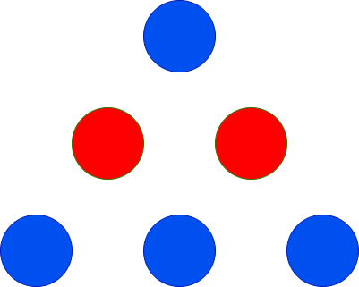
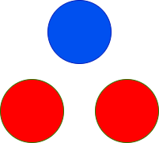

## Description

You are given two integers `red` and `blue` representing the count of red and blue colored balls. You have to arrange these balls to form a triangle such that the 1^st row will have 1 ball, the 2^nd row will have 2 balls, the 3^rd row will have 3 balls, and so on.

All the balls in a particular row should be the **same** color, and adjacent rows should have **different** colors.

Return the **maximum*** height of the triangle* that can be achieved.
### Function Contract

- `n`: Input parameter.
- Returns expected result.

### Examples
#### Example 1

**Input:** red = 2, blue = 4

**Output:** 3

**Explanation:**

The only possible arrangement is shown above.

#### Example 2

**Input:** red = 2, blue = 1

**Output:** 2

**Explanation:**

The only possible arrangement is shown above.

#### Example 3

**Input:** red = 1, blue = 1

**Output:** 1

#### Example 4

**Input:** red = 10, blue = 1

**Output:** 2

**Explanation:**

The only possible arrangement is shown above.

### Constraints

- $1 \le red, blue \le 100$