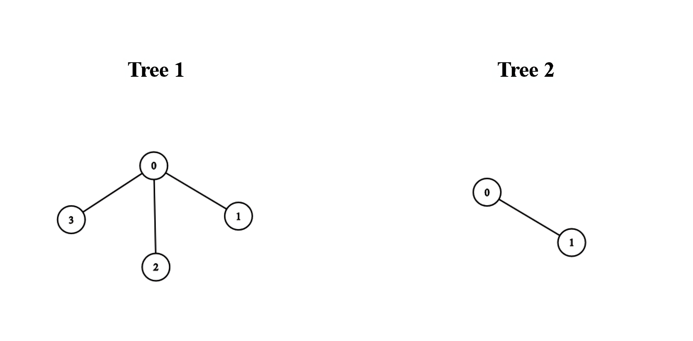
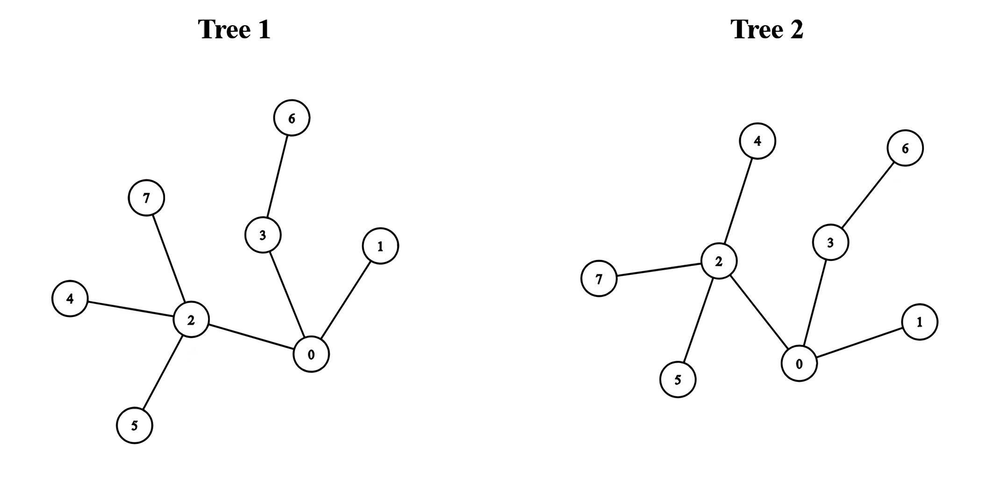

### 1. Description

There exist two **undirected **trees with `n` and `m` nodes, numbered from `0` to $n - 1$ and from `0` to $m - 1$, respectively. You are given two 2D integer arrays `edges1` and `edges2` of lengths $n - 1$ and $m - 1$, respectively, where $\text{edges1}[i] = [a_{i}, b_{i}]$ indicates that there is an edge between nodes $a_{i}$ and $b_{i}$ in the first tree and $\text{edges2}[i] = [u_{i}, v_{i}]$ indicates that there is an edge between nodes $u_{i}$ and $v_{i}$ in the second tree.

You must connect one node from the first tree with another node from the second tree with an edge.

Return the **minimum **possible **diameter **of the resulting tree.

The **diameter** of a tree is the length of the *longest* path between any two nodes in the tree.

### 2. Function Contract

**Inputs**

- `edges1`: Input parameter (`List[List[int]]`).
- `edges2`: Input parameter (`List[List[int]]`).

**Return value**

- Returns `int`.

### 3. Examples

#### Example 1

- **Input:** edges1 = [[0,1],[0,2],[0,3]], edges2 = [[0,1]]

- **Output:** 3

- **Explanation:** We can obtain a tree of diameter 3 by connecting node 0 from the first tree with any node from the second tree.

#### Example 2

- **Input:** edges1 = [[0,1],[0,2],[0,3],[2,4],[2,5],[3,6],[2,7]], edges2 = [[0,1],[0,2],[0,3],[2,4],[2,5],[3,6],[2,7]]

- **Output:** 5

- **Explanation:** We can obtain a tree of diameter 5 by connecting node 0 from the first tree with node 0 from the second tree.

### 4. Constraints

- $1 \le n, m \le 10^{5}$

- $\text{edges1.length} = n - 1$

- $\text{edges2.length} = m - 1$

- $\text{edges1}[i].length = \text{edges2}[i].length = 2$

- $\text{edges1}[i] = [a_{i}, b_{i}]$

- $0 \le a_{i}, b_{i} < n$

- $\text{edges2}[i] = [u_{i}, v_{i}]$

- $0 \le u_{i}, v_{i} < m$

- The input is generated such that `edges1` and `edges2` represent valid trees.
