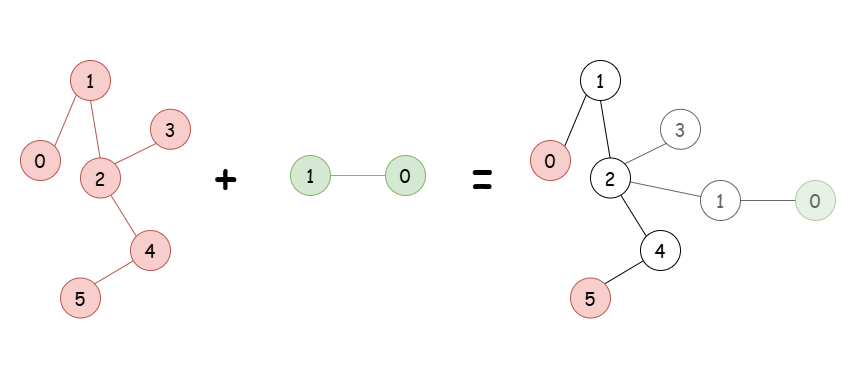
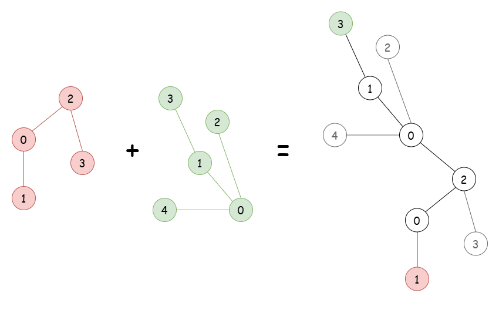
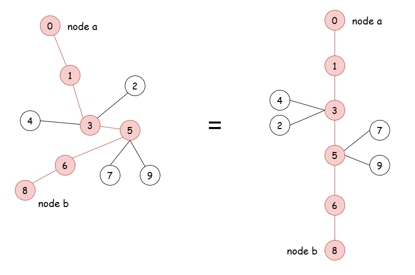

[TOC]

## Solution

---

### Overview

We are given two trees: one with `n` nodes and the other with `m` nodes. Our goal is to add an edge between a node from the first tree and a node from the second tree, in such a way that the *diameter* of the resulting tree is minimized.

> The *diameter* of a tree is the longest path between any two nodes in the tree.

Let us consider the two ways that the longest path can be formed:

1. The path starts and ends at nodes within the same tree.

    

    In this case, the problem reduces to finding the maximum diameter of the two original trees.

2. The path starts at a node in the first tree and ends at a node in the second.

    

    In this case, the selection of the nodes to connect is crucial for minimizing the overall diameter. Intuitively, we aim to select these nodes so that, if chosen as roots, the heights of their respective trees are minimized. In practice, this often involves selecting nodes near the "center" of each tree, ensuring their subtrees are as balanced as possible.

    <details>
    <summary>Click here for a formal proof</summary>

    Specifically, for the node that is in the middle of the diameter, the following holds:

1. Its maximum distance to any node of the tree is equal to $\lceil \frac{\text{diameter}}{2} \rceil$.
    This is because its maximum distance is determined by the farthest endpoint of the diameter. We can prove this by contradiction. Suppose the maximum distance were to some other node outside the diameter path. This would require the existence of a longer path than the diameter, contradicting the definition of the diameter as the longest path in the tree. Therefore:
-   If the $\text{diameter}$ is even, the middle node is equidistant from both endpoints of the diameter, with a distance of $\frac{\text{diameter}}{2}$ to each.
-   If the $\text{diameter}$ is odd, each of the two middle nodes has distances $\frac{\text{diameter} - 1}{2}$ to one endpoint and $\frac{\text{diameter} + 1}{2}$ to the other. In this case, the maximum distance is $\frac{\text{diameter} + 1}{2}$ = $\lceil \frac{\text{diameter}}{2} \rceil$.
2. For any other node in the tree, its maximum distance to another node is greater than or equal to $\lceil \frac{\text{diameter}}{2} \rceil$.
    Again, the maximum distance for any node is towards one of the endpoints of the diameter, denoted as $a$ and $b$. Consider a node $u$, and assume $u$ is closer to $a$ than $b$. The distance of $u$ to $b$ can be lower-bounded as follows:
-   Let $m$ be the midpoint of the diameter, located at a distance of at least $\lfloor \frac{\text{diameter}}{2} \rfloor$ to $b$.
-   Since $u$ is closer to $a$, it lies either on the path between $a$ and $m$, or off the diameter in a subtree connected to this path.
-   In either case, the shortest path from $u$ to $b$ must pass through $m$ or a point even farther from $b$. Thus, the distance from $u$ to $b$ is at least the distance from $m$ to $b$ plus 1, or $\lceil \frac{\text{diameter}}{2} \rceil$.

    </details>

    By adding an edge between the two centers of the trees, the maximum distance between each of them and a node within the same tree is at most $\lceil \frac{\text{diameter}}{2} \rceil$. Thus, the combined diameter of the tree is the sum of the halves of the original diameters plus one for the extra edge:

    $$\begin{aligned}
        \lceil \frac{\text{diameter}_1}{2} \rceil + \lceil \frac{\text{diameter}_2}{2} \rceil + 1.
    \end{aligned}$$

    Therefore, the problem simplifies to returning the maximum among the diameter of each tree and the above value.

Feel free to try solving these problems first as great prerequisites to this one:
1. [Minimum Height Trees](https://leetcode.com/problems/minimum-height-trees/description/).
2. [Tree Diameter](https://leetcode.com/problems/tree-diameter/description/)

---

### Approach 1: Farthest of Farthest (BFS)

#### Intuition

Let's break down the problem of calculating the diameter of a tree. First of all, we observe that any tree can be seen as:

-   The sequence of nodes on the diameter itself, plus
-   Additional subtrees branching out from nodes along the diameter.



For any node in the tree, its minimum distance to one of the diameter's endpoints (say $a$ and $b$) is always less than or equal to the diameter. This can be proven via contradiction. If one endpoint of the diameter ($a$) is known, the other endpoint ($b$) is simply the farthest node from $a$.

Based on that, one naive way to find the diameter is:
1. Assume each node is one endpoint of the diameter.
2. Calculate the farthest node from it.
3. Record the longest path found.

However, this approach involves computing the farthest node for all nodes, leading to a time complexity of $O(n^2)$, which will result in a TLE (Time Limit Exceeded) for the given constraints.

For the optimized approach, we observe that we only need to find the farthest node of a single arbitrary node $u$ and that node would be one of the endpoints of the diameter. Why does this work? Let's consider the following cases:

- Case 1: $u$ lies on the diameter
Running a BFS for the longest path from $u$ will find an endpoint of the diameter.
    <details>
    <summary>Click here for a formal proof</summary>
    <br>

    We will prove this statement by contradiction. Let $v$ ($v \neq a, b$) be the farthest node from $u$, implying $\text{dist}(u, b) < \text{dist}(u, v)$. Assume $u$ is closer to $a$ than $b$, so $\text{dist}(u, a) \leq \text{dist}(u, b)$. Combining these inequalities gives us:

    $$\begin{aligned}
    \text{dist}(u, b) + \text{dist}(u, a) \&< \text{dist}(u, v) + \text{dist}(u, b)  \\
    \text{dist}(a, b) \&< \text{dist}(v, b),
    \end{aligned}$$

    which is a contradiction, since the diameter ($a \rightarrow b$) is the longest path in the tree.
    </details>
- Case 2: $u$ does not lie on the diameter
The path from $u$ to the farthest node passes through the diameter so the problem reduces to Case 1.
    <details>
    <summary>Click here for a formal proof</summary>
    <br>

    Let $v$ ($v \neq a, b$) be the farthest node from $u$, and $u^*$ the root of $u$'s subtree. The path $u \to v$ avoids the diameter only if $u$ and $v$ are within the same subtree. In this case:

    $$\begin{aligned}
    \text{dist}(u, v) \&> \text{dist}(u, b) \\
    \text{dist}(u, u^*) + \text{dist}(u^*, v) \geq \text{dist}(u, v) \&> \text{dist}(u, u^*) + \text{dist}(u^*, b) \\
    \text{dist}(u^*, v) \&> \text{dist}(u^*, b) \\
    \text{dist}(a, u^*) + \text{dist}(u^*, v) \&> \text{dist}(a, u^*) + \text{dist}(u^*, b) \\
    \text{dist}(a, v) \&> \text{dist}(a, b) \\
    \end{aligned}$$
    which is a contradiction, since the diameter ($a \rightarrow b$) is the longest path in the tree.
    </details>

Therefore, to calculate the diameter of a tree, only two BFS calls are needed:

1. First BFS starting from any arbitrary node to find the *farthest* node from it, which is also an endpoint of the diameter.
2. Second BFS starting from this *farthest* node to find the *farthest node* from it, which is equal to the second endpoint of the diameter.

> **Breadth-First Search (BFS)**: For a more comprehensive understanding of breadth-first search, check out the [BFS Explore Card](https://leetcode.com/explore/featured/card/graph/620/breadth-first-search-in-graph/). This resource provides an in-depth look at BFS, explaining its key concepts and applications with a variety of problems to solidify understanding of the pattern.

#### Algorithm

##### Main Function: `minimumDiameterAfterMerge`
- Calculate the number of nodes for each tree:
  - `n` is the number of nodes in Tree 1.
  - `m` is the number of nodes in Tree 2.

- Build adjacency lists for both trees:
  - Call `buildAdjList(n, edges1)` to construct the adjacency list for the first tree.
  - Call `buildAdjList(m, edges2)` to construct the adjacency list for the second tree.

- Calculate the diameters of both trees:
  - Call `findDiameter(n, adjList1)` to find the diameter of the first tree.
  - Call `findDiameter(m, adjList2)` to find the diameter of the second tree.

- Calculate the longest path that spans across both trees:
  - Calculate `combinedDiameter` as the sum of half the diameters of both trees, plus 1 (rounded up).

- Return the maximum of the three possibilities:
  - Return the maximum of `diameter1`, `diameter2`, and `combinedDiameter`.

##### `buildAdjList` function:
  - Create an adjacency list of size `size`.
  - For each edge in `edges`, add the nodes to each other's adjacency list.

##### `findDiameter` function:
  - Call `findFarthestNode(n, adjList, 0)` to find the farthest node from an arbitrary starting node (e.g., node 0).
  - Call `findFarthestNode(n, adjList, farthestNode)` from the previously found farthest node to determine the tree diameter.

##### `findFarthestNode` function:
  - Initialize a queue and a visited array to perform BFS starting from `sourceNode`.
  - Traverse the graph, updating the farthest node each time a node is dequeued.
  - Return the farthest node and the distance (diameter).

#### Implementation

```python
class Solution:
    def minimumDiameterAfterMerge(self, edges1, edges2):
        # Calculate the number of nodes for each tree
        n = len(edges1) + 1
        m = len(edges2) + 1

        # Build adjacency lists for both trees
        adj_list1 = self.build_adj_list(n, edges1)
        adj_list2 = self.build_adj_list(m, edges2)

        # Calculate the diameters of both trees
        diameter1 = self.find_diameter(n, adj_list1)
        diameter2 = self.find_diameter(m, adj_list2)

        # Calculate the longest path that spans across both trees
        combined_diameter = ceil(diameter1 / 2) + ceil(diameter2 / 2) + 1

        # Return the maximum of the three possibilities
        return max(diameter1, diameter2, combined_diameter)

    def build_adj_list(self, size, edges):
        adj_list = [[] for _ in range(size)]
        for edge in edges:
            adj_list[edge[0]].append(edge[1])
            adj_list[edge[1]].append(edge[0])
        return adj_list

    def find_diameter(self, n, adj_list):
        # First BFS to find the farthest node from an arbitrary node (e.g., 0)
        farthest_node, _ = self.find_farthest_node(n, adj_list, 0)

        # Second BFS to find the diameter starting from the farthest node
        _, diameter = self.find_farthest_node(n, adj_list, farthest_node)
        return diameter

    def find_farthest_node(self, n, adj_list, source_node):
        queue = deque([source_node])
        visited = [False] * n
        visited[source_node] = True

        maximum_distance = 0
        farthest_node = source_node

        while queue:
            for _ in range(len(queue)):
                current_node = queue.popleft()
                farthest_node = current_node

                for neighbor in adj_list[current_node]:
                    if not visited[neighbor]:
                        visited[neighbor] = True
                        queue.append(neighbor)

            if queue:
                maximum_distance += 1

        return farthest_node, maximum_distance
```

#### Complexity Analysis

Let $n$ be the number of nodes in the first tree and $m$ the number of nodes in the second tree.

-   Time complexity: $O(n + m)$

    To calculate the diameter of a tree, we perform two BFS calls using the `findFarthestNode` function. Each BFS visits every node and edge exactly once, and since the number of edges is $k - 1 = O(k)$ for a tree of size $k$, the time complexity of one BFS is $O(k)$. Thus, finding the diameter of the first tree takes $O(n)$, and for the second tree, it takes $O(m)$, as each involves two BFS calls.

    The combined diameter of the tree is calculated using constant-time operations like addition and comparison, contributing $O(1)$ to the overall time complexity of $O(n + m)$.

-   Space complexity: $O(n + m)$

    All the data structures used in the algorithm, including the adjacency lists, the `visited` array, and the `nodesQueue`, have linear space complexity in terms of the size of the tree being processed. Therefore, the total space complexity is $O(n + m)$.

### Approach 2: Depth First Search

#### Intuition

Let’s start with a simple observation based on the definition of the diameter:

-   For each node in the tree, we calculate the length of the longest path passing through it. The longest of these paths represents the diameter of the tree.

To determine the longest path that passes through a node $u$, we perform a DFS to calculate the two longest distances from $u$ to any leaf nodes in the tree. The sum of these two distances gives the length of the longest path through $u$.

During the recursive calls, each node returns two values:

1. The diameter of its subtree.
2. The longest path to a leaf in its subtree, or its *depth*. This avoids redundant calculations, reusing previously computed values.

> **Depth-First Search (DFS)**: For a more comprehensive understanding of depth-first search, check out the [DFS Explore Card](https://leetcode.com/explore/learn/card/graph/619/depth-first-search-in-graph/). This resource provides an in-depth look at DFS, explaining its key concepts and applications with a variety of problems to solidify understanding of the pattern.

#### Algorithm

##### Main Function: `minimumDiameterAfterMerge`

- Calculate the number of nodes for each tree:
  - `n` is the number of nodes in Tree 1.
  - `m` is the number of nodes in Tree 2.

- Build adjacency lists for both trees:
  - Use the `buildAdjList` function to construct the adjacency list for both trees (`adjList1` and `adjList2`).

- Find the diameter of Tree 1:
  - Call `findDiameter(adjList1, 0, -1)` to start a DFS from node 0 in Tree 1.
  - Store the diameter of Tree 1 in `diameter1`.

- Find the diameter of Tree 2:
  - Call `findDiameter(adjList2, 0, -1)` to start a DFS from node 0 in Tree 2.
  - Store the diameter of Tree 2 in `diameter2`.

- Calculate the diameter of the combined tree:
  - The combined diameter accounts for the longest path spanning both trees.
  - It is calculated as $ceil(diameter1 / 2.0) + ceil(diameter2 / 2.0) + 1$.

- Return the maximum diameter:
  - Return the maximum of the three values: `diameter1`, `diameter2`, and `combinedDiameter`.

##### Helper Function: `buildAdjList`
- Given the number of nodes `size` and an edge list `edges`, build an adjacency list (`adjList`):
  - Iterate through each edge and add the corresponding nodes to the adjacency list.

##### Helper Function: `findDiameter`
- Given the adjacency list `adjList`, the current `node`, and its `parent`, calculate the diameter of the tree:
  - Initialize two variables `maxDepth1` and `maxDepth2` to track the two largest depths from the current node.
  - Initialize `diameter` to track the diameter of the subtree.

- For each neighbor of the current node:
  - Skip the parent node to avoid cycles.
  - Recursively calculate the diameter and depth of the neighbor’s subtree.
  - Update `diameter` with the maximum of the current diameter and the child’s diameter.
  - Increment the depth and update the two largest depths (`maxDepth1` and `maxDepth2`).

- The diameter of the current node is updated as $maxDepth1 + maxDepth2$.

- Return the `diameter` and `maxDepth1` (to be used by the parent).

#### Implementation

```python
class Solution:
    def minimumDiameterAfterMerge(
        self, edges1: list[list[int]], edges2: list[list[int]]
    ) -> int:
        # Calculate the number of nodes for each tree (number of edges + 1)
        n = len(edges1) + 1
        m = len(edges2) + 1

        # Build adjacency lists for both trees
        adj_list1 = self.build_adj_list(n, edges1)
        adj_list2 = self.build_adj_list(m, edges2)

        # Calculate the diameter of both trees
        diameter1, _ = self.find_diameter(
            adj_list1, 0, -1
        )  # Start DFS for Tree 1
        diameter2, _ = self.find_diameter(
            adj_list2, 0, -1
        )  # Start DFS for Tree 2

        # Calculate the diameter of the combined tree
        # This accounts for the longest path spanning both trees
        combined_diameter = ceil(diameter1 / 2) + ceil(diameter2 / 2) + 1

        # Return the maximum diameter among the two trees and the combined tree
        return max(diameter1, diameter2, combined_diameter)

    # Helper function to build an adjacency list from an edge list
    def build_adj_list(
        self, size: int, edges: list[list[int]]
    ) -> list[list[int]]:
        adj_list = [[] for _ in range(size)]
        for edge in edges:
            adj_list[edge[0]].append(edge[1])
            adj_list[edge[1]].append(edge[0])
        return adj_list

    # Helper function to find the diameter of a tree
    # Returns the diameter and the depth of the node's subtree
    def find_diameter(
        self, adj_list: list[list[int]], node: int, parent: int
    ) -> tuple[int, int]:
        max_depth1 = max_depth2 = (
            0  # Tracks the two largest depths from the current node
        )
        diameter = 0  # Tracks the maximum diameter of the subtree

        for neighbor in adj_list[node]:
            if neighbor == parent:
                continue  # Skip the parent to avoid cycles

            # Recursively calculate the diameter and depth of the neighbor's subtree
            child_diameter, depth = self.find_diameter(adj_list, neighbor, node)
            depth += 1  # Increment depth to include edge to neighbor

            # Update the maximum diameter of the subtree
            diameter = max(diameter, child_diameter)

            # Update the two largest depths from the current node
            if depth > max_depth1:
                max_depth2 = max_depth1
                max_depth1 = depth
            elif depth > max_depth2:
                max_depth2 = depth

        # Update the diameter to include the path through the current node
        diameter = max(diameter, max_depth1 + max_depth2)

        # Return the diameter and the longest depth
        return diameter, max_depth1
```

#### Complexity Analysis

Let $n$ be the number of nodes in the first tree and $m$ the number of nodes in the second tree.

-   Time complexity: $O(n + m)$

    The `findDiameter` function uses Depth-First Search (DFS) on the tree, with a time complexity of $O(k)$, where $k$ is the tree's size. The diameter calculation itself takes $O(n + m)$ time. Since combining the diameters involves only constant-time operations, the overall time complexity is $O(n + m)$.

-   Space complexity: $O(n + m)$

    The space complexity depends on the size of the data structures and the recursion depth. Using an adjacency list representation of the trees requires $O(n + m)$ space. Additionally, the recursion depth can reach $O(k)$, where $k$ is the number of nodes in the processed tree. Thus, the total space complexity is $O(n + m)$.

### Approach 3: Topological Sorting

#### Intuition

In this approach, we will again calculate the diameter of each tree separately and then apply the method described in [the overview section](#overview) to determine the diameter of the resulting tree.

First, observe that the diameter endpoints must be leaves, as any non-leaf endpoints would allow the diameter to extend further in the opposite direction, contradicting the definition of the diameter.

Therefore, removing all leaves reduces the diameter by 2, and the remaining diameter becomes the diameter of the reduced tree. As a result, the remaining part of the diameter will still be the diameter of the reduced tree.

If we continue removing the leaves, the remaining diameter will get progressively smaller until only one or two nodes are left.

- If one node is left, the diameter equals the number of nodes removed during the reduction.
- If two nodes remain, we count the edge connecting them as part of the diameter.

To track the current leaves of the reduced tree, we will update the counters of their neighboring nodes, also known as the *degree* of each node. Once a node's degree reaches 1, we will enqueue that node in the `nodesQueue` for further processing.

#### Algorithm

##### Main Function: `minimumDiameterAfterMerge`

- Calculate the number of nodes for each tree:
  - `n` is the number of nodes in Tree 1.
  - `m` is the number of nodes in Tree 2.

- Build adjacency lists for both trees:
  - Use the `buildAdjList` function to construct the adjacency list for each tree (`adjList1` for Tree 1 and `adjList2` for Tree 2).

- Calculate the diameters of both trees:
  - Call `findDiameter(n, adjList1)` to find the diameter of Tree 1 (`diameter1`).
  - Call `findDiameter(m, adjList2)` to find the diameter of Tree 2 (`diameter2`).

- Calculate the longest path that spans both trees:
  - Compute `combinedDiameter` as the sum of half of `diameter1`, half of `diameter2`, and an additional 1 to account for the merging edge.
  - The formula is: $combinedDiameter = ceil(diameter1 / 2.0) + ceil(diameter2 / 2.0) + 1$.

- Return the maximum value among `diameter1`, `diameter2`, and `combinedDiameter`.

##### `buildAdjList` function:
  - Initialize an empty adjacency list `adjList` of the given size (`size`).
  - Iterate through the edges and populate the adjacency list by adding neighbors for each node.

##### `findDiameter` function:
  - Initialize a queue `leavesQueue` to hold leaves (nodes with degree 1) and a `degrees` vector to track the degree (number of neighbors) of each node.
  - Add all leaves (nodes with degree 1) to the `leavesQueue`.
  - Process the leaves iteratively, removing them and updating the degrees of their neighbors.
  - Continue until only 2 or fewer nodes remain:
- For each leaf, reduce the degree of its neighbors, and if a neighbor becomes a leaf, add it to the queue.
  - If exactly two nodes remain, return the diameter as twice the number of layers of leaves removed + 1 (final connecting edge).
  - If only one node remains, return twice the number of layers of leaves removed.

#### Implementation

```python
class Solution:
    def minimumDiameterAfterMerge(self, edges1, edges2):
        # Calculate the number of nodes for each tree (number of edges + 1)
        n = len(edges1) + 1
        m = len(edges2) + 1

        # Build adjacency lists for both trees
        adj_list1 = self.build_adj_list(n, edges1)
        adj_list2 = self.build_adj_list(m, edges2)

        # Calculate the diameter of both trees
        diameter1 = self.find_diameter(n, adj_list1)
        diameter2 = self.find_diameter(m, adj_list2)

        # Calculate the longest path that spans across both trees
        combined_diameter = ceil(diameter1 / 2) + ceil(diameter2 / 2) + 1

        # Return the maximum of the three possibilities
        return max(diameter1, diameter2, combined_diameter)

    # Function to build an adjacency list from an edge list
    def build_adj_list(self, size, edges):
        adj_list = [[] for _ in range(size)]
        for edge in edges:
            adj_list[edge[0]].append(edge[1])
            adj_list[edge[1]].append(edge[0])
        return adj_list

    # Function to find the diameter of a tree
    def find_diameter(self, n, adj_list):
        leaves_queue = deque()
        degrees = [0] * n

        # Initialize the degree of each node and add leaves (nodes with degree 1) to the queue
        for node in range(n):
            degrees[node] = len(adj_list[node])
            if degrees[node] == 1:
                leaves_queue.append(node)

        remaining_nodes = n
        leaves_layers_removed = 0

        # Process the leaves until there are 2 or fewer nodes remaining
        while remaining_nodes > 2:
            size = len(leaves_queue)
            remaining_nodes -= size
            leaves_layers_removed += 1

            # Remove the leaves from the queue and update the degrees of their neighbors
            for _ in range(size):
                current_node = leaves_queue.popleft()

                # Process the neighbors of the current leaf
                for neighbor in adj_list[current_node]:
                    degrees[neighbor] -= 1
                    if degrees[neighbor] == 1:
                        leaves_queue.append(neighbor)

        # If exactly two nodes remain, return the diameter as twice the number of layers of leaves removed + 1
        if remaining_nodes == 2:
            return 2 * leaves_layers_removed + 1

        return 2 * leaves_layers_removed
```

#### Complexity Analysis

Let $n$ be the number of nodes in the first tree and $m$ the number of nodes in the second tree.

-   Time complexity: $O(n + m)$

    In the `findDiameter` function, each node is added and removed from the `leavesQueue` once. Each edge is processed once when updating the degrees of neighboring nodes. Therefore, the time complexity is $O(k)$, where $k$ is the size of the input tree. Consequently, calculating the diameter for both trees takes $O(n + m)$ time.

    The calculation of the diameter of the combined tree involves only a few constant-time operations, such as adding and comparing values. This step contributes $O(1)$ to the total time complexity, which is still $O(n + m)$.

-   Space complexity: $O(n + m)$

    Similar to the first approach, all the data structures used (adjacency lists, `leavesQueue` and,the `degrees` array), have a linear space complexity in terms of the size of the tree being processed. Therefore, the total space complexity is $O(n + m)$.

---