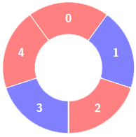
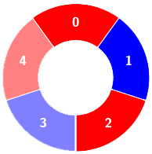
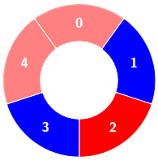
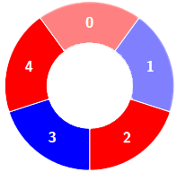
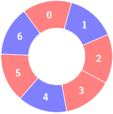
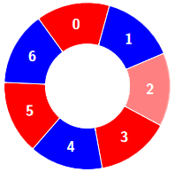
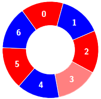
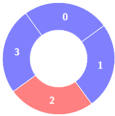

## Description

There is a circle of red and blue tiles. You are given an array of integers `colors` and an integer `k`. The color of tile `i` is represented by $\text{colors}[i]$:

- $\text{colors}[i] = 0$ means that tile `i` is **red**.

- $\text{colors}[i] = 1$ means that tile `i` is **blue**.

An **alternating** group is every `k` contiguous tiles in the circle with **alternating** colors (each tile in the group except the first and last one has a different color from its **left** and **right** tiles).

Return the number of **alternating** groups.

**Note** that since `colors` represents a **circle**, the **first** and the **last** tiles are considered to be next to each other.
### Function Contract

- `n`: Input parameter.
- Returns expected result.

### Examples

#### Example 1

**Input:** colors = [0,1,0,1,0], k = 3

**Output:** 3

**Explanation:**

**

**

Alternating groups:

#### Example 2

**Input:** colors = [0,1,0,0,1,0,1], k = 6

**Output:** 2

**Explanation:**

**

**

Alternating groups:

#### Example 3

**Input:** colors = [1,1,0,1], k = 4

**Output:** 0

**Explanation:**

### Constraints

- $3 \le \text{colors.length} \le 10^{5}$

- $0 \le \text{colors}[i] \le 1$

- $3 \le k \le \text{colors.length}$