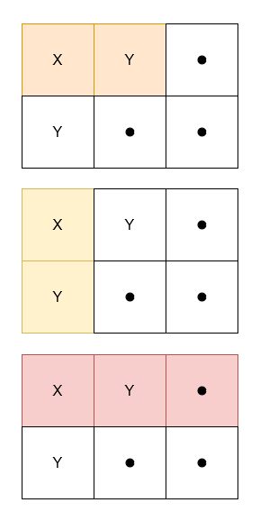

## Description

Given a 2D character matrix `grid`, where $\text{grid}[i][j]$ is either `'X'`, `'Y'`, or `'.'`, return the number of submatrices that contain:

- $\text{grid}[0][0]$

- an **equal** frequency of `'X'` and `'Y'`.

- **at least** one `'X'`.
### Function Contract

- `n`: Input parameter.
- Returns expected result.

### Examples

#### Example 1

**Input:** grid = [["X","Y","."],["Y",".","."]]

**Output:** 3

**Explanation:**

**

**

#### Example 2

**Input:** grid = [["X","X"],["X","Y"]]

**Output:** 0

**Explanation:**

No submatrix has an equal frequency of `'X'` and `'Y'`.

#### Example 3

**Input:** grid = [[".","."],[".","."]]

**Output:** 0

**Explanation:**

No submatrix has at least one `'X'`.

### Constraints

- $1 \le \text{grid.length}, \text{grid}[i].length \le 1000$

- $\text{grid}[i][j]$ is either `'X'`, `'Y'`, or `'.'`.