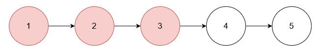
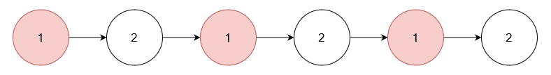
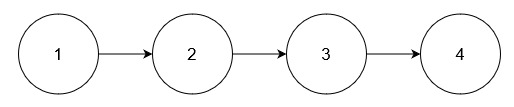

## Description

You are given an array of integers `nums` and the `head` of a linked list. Return the `head` of the modified linked list after **removing** all nodes from the linked list that have a value that exists in `nums`.
### Function Contract

- `n`: Input parameter.
- Returns expected result.

### Examples

#### Example 1

**Input:** nums = [1,2,3], head = [1,2,3,4,5]

**Output:** [4,5]

**Explanation:**

**

**

Remove the nodes with values 1, 2, and 3.

#### Example 2

**Input:** nums = [1], head = [1,2,1,2,1,2]

**Output:** [2,2,2]

**Explanation:**

Remove the nodes with value 1.

#### Example 3

**Input:** nums = [5], head = [1,2,3,4]

**Output:** [1,2,3,4]

**Explanation:**

**

**

No node has value 5.

### Constraints

- $1 \le \text{nums.length} \le 10^{5}$

- $1 \le \text{nums}[i] \le 10^{5}$

- All elements in `nums` are unique.

- The number of nodes in the given list is in the range $[1, 10^{5}]$.

- $1 \le \text{Node.val} \le 10^{5}$

- The input is generated such that there is at least one node in the linked list that has a value not present in `nums`.