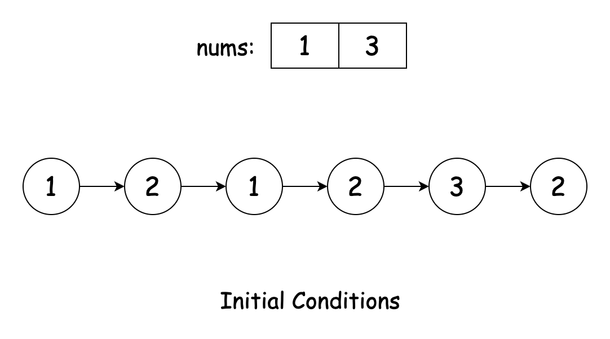
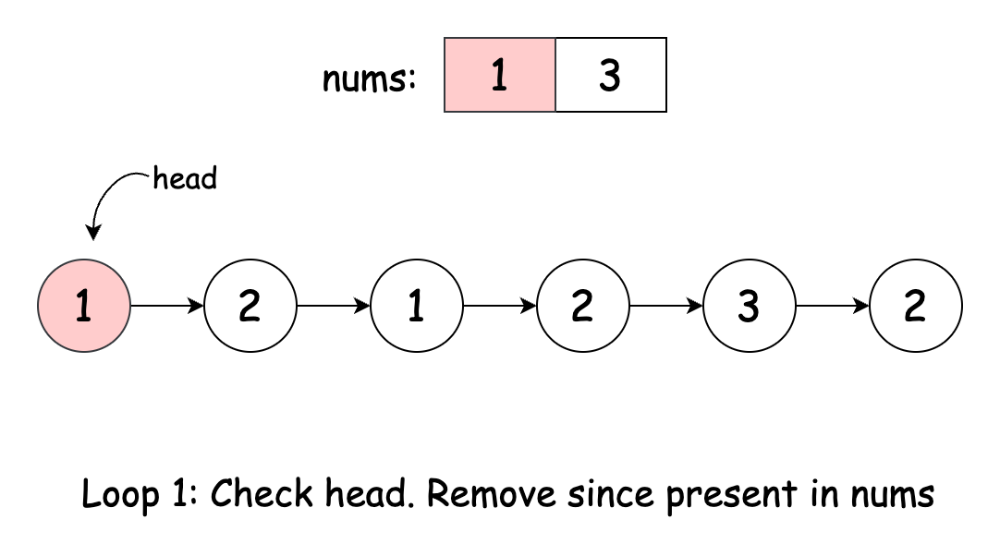
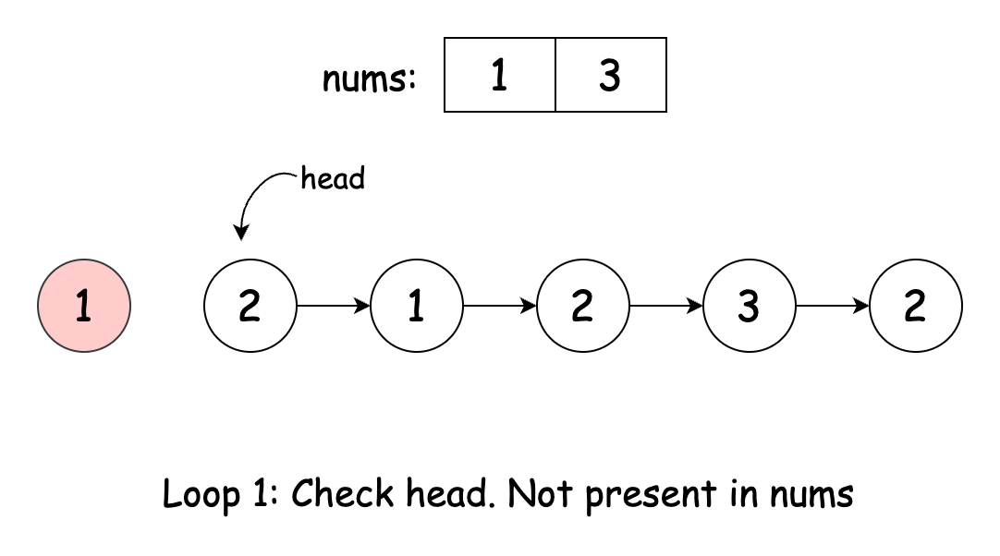
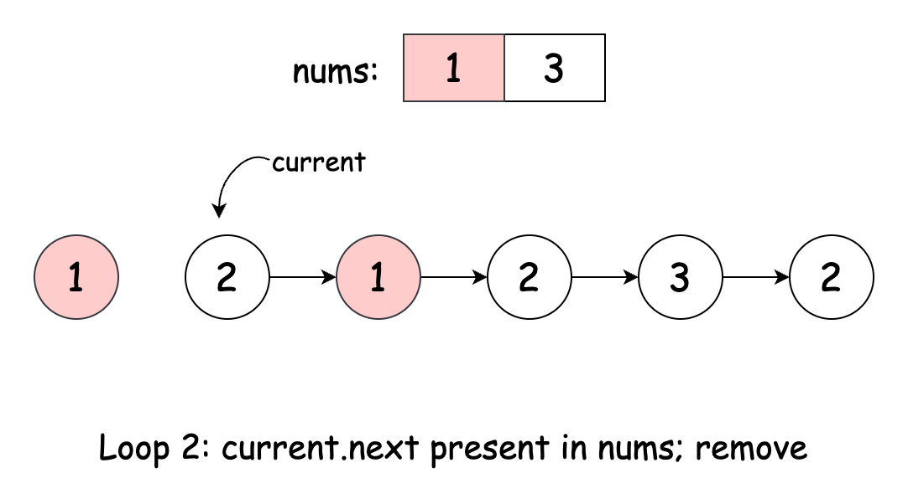
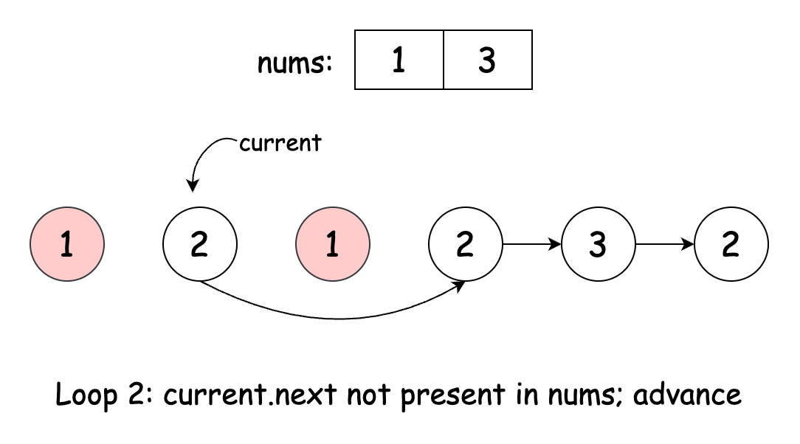
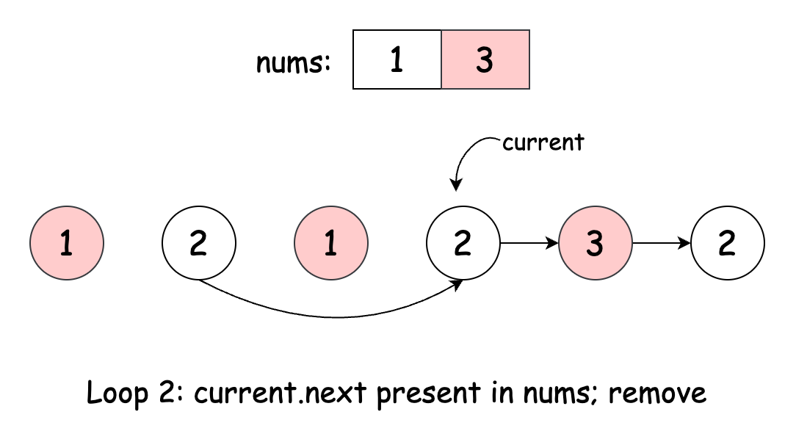
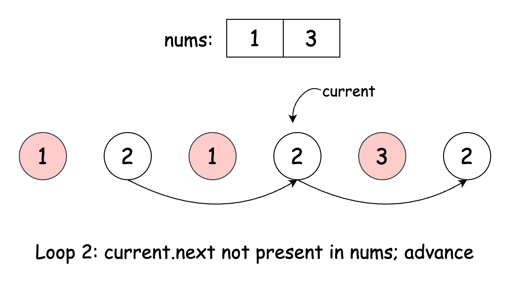
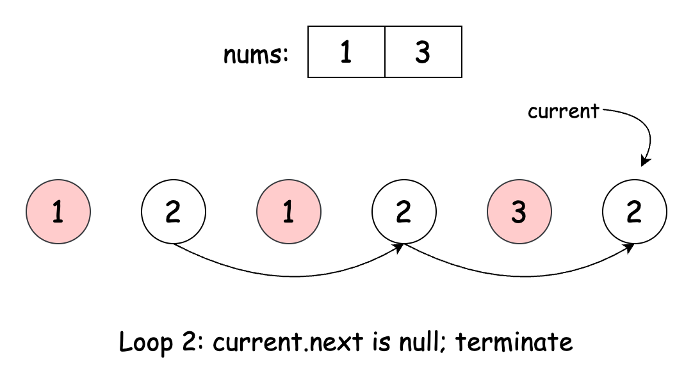
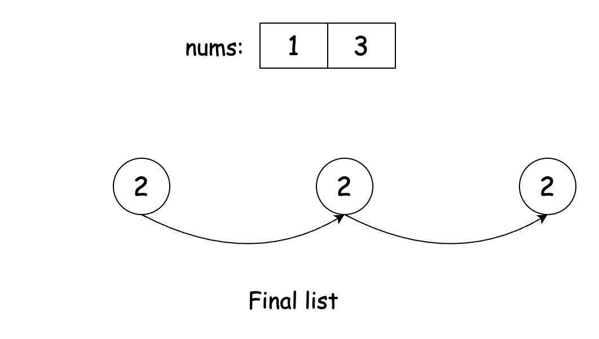

## Solution

---

### Approach: Hash Set

#### Intuition

The first challenge is efficiently determining whether a linked list value exists in the `nums` array. A naive approach would involve searching through `nums` for each node, but this is inefficient for large arrays. Instead, we can use a Hash Set, which allows constant-time lookups. By adding all elements of `nums` to the set, we can check if a node should be removed by verifying if its value exists in constant time.

> If you're unfamiliar with hash sets, you can refer to [this LeetCode explore card](https://leetcode.com/explore/learn/card/hash-table/183/combination-with-other-algorithms/) for an in-depth tutorial.

With the lookup mechanism in place, we handle the linked list. The head requires special attention, as removing it alters the starting point of the list. We loop through the list to remove nodes from the beginning if their values are found in the hash set, then store the updated head. After this loop, the modified `head` is stored as the new starting point of the linked list.

Next, we traverse the rest of the list using a `current` node. As we iterate, we check if `current.next`'s value is in the hash set. If it is, we adjust `current.next` to skip over that node, removing it from the list.

Once the traversal is complete, we return the modified head of the list.

The algorithm is visualized below:



















#### Algorithm

- Initialize a set `valuesToRemove` and populate it with the values of the `nums` array.
- While the `head` of the linked list is not null and the `head`'s value is present in `valuesToRemove`:
  - Move `head` to `head.next`.
- If the `head` is `null`, return `null` since all nodes have been removed.
- Start iterating from the `head` of the modified list:
  - For each node `current`, check if the value of the next node (`current.next`) is in the `valuesToRemove` set.
- If it is, skip the next node by updating `current.next` to `current.next.next`
  - If it is not, move the `current` pointer to the next node in the list.
- Return the updated `head` of the list.

#### Implementation

> Note 1: In C++, memory management is manual, unlike languages with automatic garbage collection (like Java or Python). When you remove a node from a linked list, its memory remains allocated unless you explicitly free it. In the solution provided below, the memory of each removed node is properly deallocated using `delete`. However, if you're working in a production environment or during an interview, ensure that you discuss how the list nodes were allocated (e.g., via `new`) and ensure they are deallocated appropriately to avoid memory leaks. If possible, consider using smart pointers ($std::\text{shared}_{ptr}$ or $std::\text{unique}_{ptr}$) for automatic memory management, which can help simplify the code and avoid manual memory management issues.

> Note 2: In C++, you should not manually delete linked list nodes inside your solution. The LeetCode runtime automatically frees all list nodes after your function returns. If you explicitly call delete on any node, the runtime will attempt to free it again, causing a heap-use-after-free or double free error under AddressSanitizer. Instead, just unlink the nodes you want to remove.

```python
class Solution:
    def modifiedList(
        self, nums: List[int], head: Optional[ListNode]
    ) -> Optional[ListNode]:
        # Create a set for efficient lookup of values in nums
        values_to_remove = set(nums)

        # Handle the case where the head node needs to be removed
        while head and head.val in values_to_remove:
            head = head.next

        # If the list is empty after removing head nodes, return None
        if not head:
            return None

        # Iterate through the list, removing nodes with values in the set
        current = head
        while current.next:
            if current.next.val in values_to_remove:
                # Skip the next node by updating the pointer
                current.next = current.next.next
            else:
                # Move to the next node
                current = current.next

        return head
```

#### Complexity Analysis

Let $m$ and $n$ be the lengths of the `nums` array and the linked list, respectively.

- Time complexity: $O(m + n)$

    Iterating through the `nums` array and inserting each element into the hash set takes $O(m)$ time, as each insertion into the set is $O(1)$ on average.

    The algorithm traverses the entire linked list exactly once, checking if each node's value is in the hash set. This operation takes $O(n)$ time.

    Thus, the overall time complexity of the algorithm is $O(m) +$\mathcal{O}(n)$= O(m + n)$.

- Space complexity: $O(m)$

    The hash set can store up to $m$ elements, one for each unique value in the `nums` array, leading to a space complexity of $O(m)$. All additional variables used take constant space.

---