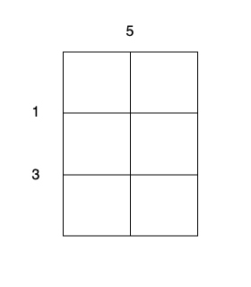

### 1. Description

There is an `m x n` cake that needs to be cut into `1 x 1` pieces.

You are given integers `m`, `n`, and two arrays:

- `horizontalCut` of size $m - 1$, where $\text{horizontalCut}[i]$ represents the cost to cut along the horizontal line `i`.

- `verticalCut` of size $n - 1$, where $\text{verticalCut}[j]$ represents the cost to cut along the vertical line `j`.

In one operation, you can choose any piece of cake that is not yet a `1 x 1` square and perform one of the following cuts:

- Cut along a horizontal line `i` at a cost of $\text{horizontalCut}[i]$.

- Cut along a vertical line `j` at a cost of $\text{verticalCut}[j]$.

After the cut, the piece of cake is divided into two distinct pieces.

The cost of a cut depends only on the initial cost of the line and does not change.

Return the **minimum** total cost to cut the entire cake into `1 x 1` pieces.

### 2. Function Contract

- `n`: Input parameter.
- Returns expected result.

### 3. Examples

#### Example 1

**Input:** m = 3, n = 2, horizontalCut = [1,3], verticalCut = [5]

**Output:** 13

**Explanation:**

- Perform a cut on the vertical line 0 with cost 5, current total cost is 5.

- Perform a cut on the horizontal line 0 on `3 x 1` subgrid with cost 1.

- Perform a cut on the horizontal line 0 on `3 x 1` subgrid with cost 1.

- Perform a cut on the horizontal line 1 on `2 x 1` subgrid with cost 3.

- Perform a cut on the horizontal line 1 on `2 x 1` subgrid with cost 3.

The total cost is $5 + 1 + 1 + 3 + 3 = 13$.

#### Example 2

**Input:** m = 2, n = 2, horizontalCut = [7], verticalCut = [4]

**Output:** 15

**Explanation:**

- Perform a cut on the horizontal line 0 with cost 7.

- Perform a cut on the vertical line 0 on `1 x 2` subgrid with cost 4.

- Perform a cut on the vertical line 0 on `1 x 2` subgrid with cost 4.

The total cost is $7 + 4 + 4 = 15$.

### 4. Constraints

- $1 \le m, n \le 10^{5}$

- $\text{horizontalCut.length} = m - 1$

- $\text{verticalCut.length} = n - 1$

- $1 \le \text{horizontalCut}[i], \text{verticalCut}[i] \le 10^{3}$