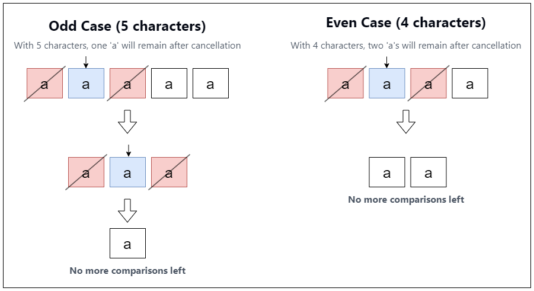

[TOC]

## Solution

---

### Overview

We are given a string `s`. The goal is to repeatedly perform the following operation until it is no longer possible:

1. Choose an index `i` such that:
   - There is at least one character equal to $s[i]$ to its left.
   - There is at least one character equal to $s[i]$ to its right.
2. Once such an index is found, the following characters are removed:
   - The closest matching character to the left of index `i`.
   - The closest matching character to the right of index `i`.

We need to find the smallest possible length of the string after applying this operation repeatedly.

---

### Approach 1: Using Hash Map

#### Intuition

To approach this problem, we need to consider how often each character appears in the string. The goal is to figure out how many characters need to be removed to minimize the string, based on how many times each character occurs:

- If a character appears an odd number of times, we can keep exactly one instance of it, and remove the rest.
- If a character appears an even number of times, we can keep two instances of it—one on the left side and one on the right side, ensuring a valid operation.

For example, let's consider the case where we have 5 `'a'` characters. Since 5 is odd, we'll end up with exactly one `'a'`. We can remove the first and third `'a'` characters because they are closest to the second `'a'`. After that, we are left with three `'a'` characters, and we repeat the process of removing pairs. In the end, only one `'a'` remains. This is because each pair cancels out, leaving the extra character.

Now, let's look at the case with 4 `'a'` characters. Since 4 is even, we first remove the first and third `'a'` characters, which are closest to the second `'a'`. We're left with 2 `'a'` characters, but for comparisons, we need three characters: one as the reference pivot and two indices, one on the left and one on the right, to remove. So, we stop here in the even case.

The entire intuition can be summarized with the help of the image below.



#### Algorithm

- Count the frequency of each character in the string:
  - Initialize a frequency map (`charFrequencyMap`).
  - For each character in the string `s`, increment its frequency in the map.

- Calculate the number of characters to delete:
  - Initialize `deleteCount` to 0.
  - For each character's frequency in the map:
- If the frequency is odd, add $frequency - 1$ to `deleteCount` (remove all but one).
- If the frequency is even, add $frequency - 2$ to `deleteCount` (remove all but two).

- Return the smallest length of the string after deletions:
  - Subtract `deleteCount` from the original string length.

#### Implementation

```python
class Solution:
    def minimumLength(self, s: str) -> int:
        # Step 1: Count the frequency of each character in the string
        char_frequency_map = Counter(s)

        # Step 2: Calculate the number of characters to delete
        delete_count = 0
        for frequency in char_frequency_map.values():
            if frequency % 2 == 1:
                # If frequency is odd, delete all except one
                delete_count += frequency - 1
            else:
                # If frequency is even, delete all except two
                delete_count += frequency - 2

        # Step 3: Return the minimum length after deletions
        return len(s) - delete_count
```

#### Complexity Analysis

Let $n$ be the size of the string `s`, and let `k` be the size of the character set.

- Time Complexity: $O(n)$

    The first loop iterates over each character in the string `s`, which takes $O(n)$ time. This is because inserting or updating elements in an map has an average time complexity of $O(1)$ per operation. The second loop iterates over the `charFrequencyMap`, which has at most $k$ unique characters. This loop takes $O(k)$ time. Since $k$ is typically much smaller than $n$ (e.g., $k = 26$ for lowercase letters), the overall time complexity is dominated by the first loop, resulting in $O(n)$.

- Space complexity: $O(1)$ or $O(k)$

    The space used by the `charFrequencyMap` depends on the size of the character set $k$. In our case, $k$ is fixed (e.g., 26 for lowercase letters), so the space complexity is $O(1)$. Alternatively, it can also be expressed as $O(k)$.

---

### Approach 2: Using Frequency Array

#### Intuition

In the previous approach, we used a hash map to count how often each character appears in the string. Hash maps are flexible and can handle cases where the characters are not limited to a specific set. However, they come with some downsides.

A hash map uses a dynamic data structure, which requires extra memory to store keys and values. This leads to higher space usage compared to an array. Additionally, the process of hashing (calculating a unique code for each character) takes time. While hash map operations like insertion and lookup are generally fast (on average, they take $O(1)$ time), they can sometimes be slower due to *hashing collisions* (when two keys produce the same hash) and memory allocation.

In this problem, we only need to deal with lowercase English letters (`'a'` to `'z'`). Since there are only 26 possible characters, we can use a *fixed-size array* of size 26 to count character frequencies.

To achieve this, we use a simple hashing operation to map each character to a position in a frequency array. In ASCII, each lowercase letter can be represented as the value of `'a'` plus its index in the alphabet. By subtracting the ASCII value of `'a'` from any character, we get a unique integer between 0 and 25, which corresponds to its position in the frequency array.

This approach is more efficient for this specific case because of two reasons.

1. Better Runtime: When we access an element in an array, it’s always a constant time operation. On the other hand, hash maps are $O(1)$ on average, but they can occasionally slow down because of the hashing process or when collisions happen.
2. Space Efficiency: An array of size 26 uses a fixed, small chunk of memory. Unlike hash maps, arrays don’t need additional structures like hash buckets or key-value pairs, so they’re much more memory-efficient.

Apart from using this array, the key idea remains the same as the previous approach:
- If a character appears an odd number of times, we keep one instance.
- If a character appears an even number of times, we keep two instances.

#### Algorithm

- Initialize a `charFrequency` array of size `26` to store the count of occurrences for each character in the string.
- Initialize `totalLength` to 0, which will hold the final result.

- Iterate through each character `currentChar` in string `s`:
  - Increment the corresponding index (`currentChar` - `'a'`) in `charFrequency` based on `currentChar`.

- Calculate the total length of characters that will remain:
  - Iterate through each `frequency` in `charFrequency`:
- If `frequency` is 0, skip the character (it doesn't appear in the string).
- If `frequency` is even, add 2 to `totalLength`.
- If `frequency` is odd, add 1 to `totalLength`.

- Return `totalLength`, the smallest length of the string after deletions.

#### Implementation

```python
class Solution:
    def minimumLength(self, s: str) -> int:
        # Step 1: Initialize a frequency array to count occurrences of each character
        char_frequency = [0] * 26
        total_length = 0

        # Step 2: Count the frequency of each character in the string
        for current_char in s:
            char_frequency[ord(current_char) - ord("a")] += 1

        # Step 3: Calculate the total length after deletions count
        for frequency in char_frequency:
            if frequency == 0:
                continue  # Skip characters that don't appear
            if frequency % 2 == 0:
                total_length += 2  # If frequency is even, add 2 characters
            else:
                total_length += 1  # If frequency is odd, add 1 character

        # Step 4: Return the minimum length after deletions count
        return total_length
```

#### Complexity Analysis

Let $n$ be the size of the string `s`, and let `k` be the size of the character set.

- Time complexity: $O(n)$

    The first loop iterates over each character in the string `s`, which takes $O(n)$ time. The second loop iterates over the `charFrequency` array, which has a size of $k$. This loop runs in $O(k)$ time. Since $k$ is typically a constant, the second loop is often considered $O(1)$. However, in the general case, the time complexity is $O(n + k)$. For most practical purposes, $k$ is small compared to $n$, so the overall time complexity is dominated by $O(n)$.

- Space complexity: $O(1)$ or $O(k)$

    The space used by the `charFrequency` depends on the size of the character set $k$. In our case, $k$ is fixed (e.g., 26 for lowercase letters), so the space complexity is $O(1)$. Alternatively, it can also be expressed as $O(k)$.

---

### Approach 3: Using Bitwise

#### Intuition

The ability to remove characters hinges on their occurrences. Specifically, characters that appear an even number of times can be fully removed by pairing them up, while characters with an odd number of occurrences will leave one unpaired character behind.

This means that the specific frequency of each character is irrelevant as long as we know if it contributes an odd or even number of times. Thus, we can collapse the space required to track character occurrences from a full array of 26 integers (one for each letter) to just a few integers.

To achieve this, we use three integers:
1. `present`: This keeps track of which letters are present in the string, using bits to represent each letter. If a letter is present, the corresponding bit is set to `1`.
2. `parity`: This tracks the parity (odd or even occurrences) of each character in the string. If a character has an odd number of occurrences, its corresponding bit is set to `1`.
3. `placevalue`: This variable is used to isolate the position of each letter in the bit representation.

As we iterate through the string, for each character, we update `present` by setting the corresponding bit to indicate its presence. We also update `parity` by toggling the bit to track whether the character's occurrences are odd or even.

After processing the string, `present` shows which characters are in the string, and `parity` shows whether their occurrences are odd or even. To determine the remaining characters after pairing, we examine both masks. If a character has an odd number of occurrences, it contributes to the final string length, while characters with even occurrences can be fully removed. This continues until all characters have been checked.

#### Algorithm

- Initialize `present` to `0`, `parity` to `0`, and `placevalue` for bit manipulation.

- Iterate through the string `s`:
  - For each character, calculate the bit position corresponding to the character by shifting `1` to the left by $(s[k] - 'a')$.
  - Set the corresponding bit in the `present` bitmask using the bitwise OR operation (`present |= placevalue`).
  - Toggle the corresponding bit in the `parity` bitmask using the bitwise XOR operation ($parity ^= placevalue$).

- Initialize `totalLength` to `0`, which will store the result.

- Process the `present` bitmask to calculate the minimum length:
  - While there are still set bits in `present`:
- Clear the least significant bit in `present` using $placevalue = present \& (present - 1)$.
- Check if the corresponding bit in `parity` is set:
      - If the bit is set in `parity`, it indicates an odd occurrence of that character, so add `1` to `totalLength`.
      - Otherwise, add `2` to `totalLength`.
- Update `present` to remove the least significant bit (using $present = placevalue$).

- Return `totalLength`, the smallest length of the string after deletions.

#### Implementation

```python
class Solution:
    def minimumLength(self, s: str) -> int:
        present = 0
        parity = 0
        place_value = 0

        # Iterate through the string and update the present and parity bitmasks
        for char in s:
            # Calculate the bit position for the character
            place_value = 1 << (ord(char) - ord("a"))

            # Set the corresponding bit in the present bitmask
            present |= place_value

            # Toggle the corresponding bit in the parity bitmask
            parity ^= place_value

        total_length = 0

        # Process the present bitmask and check the parity bitmask to calculate
        # the minimum length
        while present > 0:
            # Clear the least significant bit in present
            place_value = present & (present - 1)
            # If the corresponding parity bit is set, it indicates an odd
            # occurrence, so add 1
            total_length += 2 - ((parity & (present - place_value)) != 0)
            present = place_value

        return total_length
```

#### Complexity Analysis

Let $n$ be the size of the string `s`.

- Time complexit: $O(n)$

    The first loop iterates through the string `s` once, performing bitwise operations for each character. Since there are $n$ characters, this loop runs in $O(n)$ time.

    The second loop processes the `present` bitmask. The number of iterations in this loop is equal to the number of unique characters in the string, which is at most 26 (since there are 26 lowercase English letters). Therefore, this loop runs in $O(1)$ time.

    Thus, the overall time complexity is dominated by the first loop, which is $O(n)$.

- Space complexi: $O(1)$

    The space used by the variables `present`, `parity`, `placeValue`, and `count` is constant, as they are simple integers. The algorithm does not use any additional data structures that grow with the input size.

    Therefore, the space complexity is $O(1)$.

---