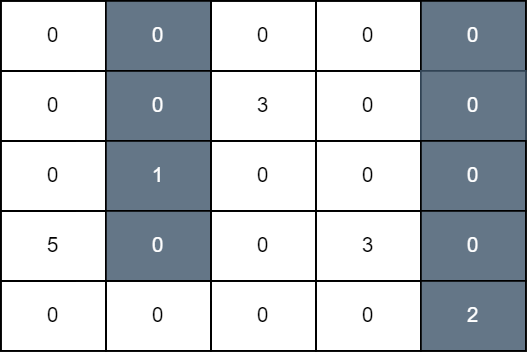
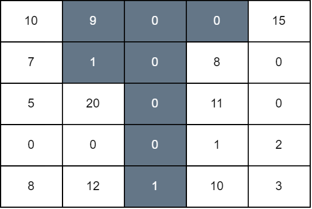

## Description

You are given a 2D matrix `grid` of size `n x n`. Initially, all cells of the grid are colored white. In one operation, you can select any cell of indices `(i, j)`, and color black all the cells of the $$j^{\text{th}}$$column starting from the top row down to the$$i^{\text{th}}$$ row.

The grid score is the sum of all $\text{grid}[i][j]$ such that cell `(i, j)` is white and it has a horizontally adjacent black cell.

Return the **maximum** score that can be achieved after some number of operations.
### Function Contract

- `n`: Input parameter.
- Returns expected result.

### Examples
#### Example 1

**Input:** grid = [[0,0,0,0,0],[0,0,3,0,0],[0,1,0,0,0],[5,0,0,3,0],[0,0,0,0,2]]

**Output:** 11

**Explanation:**

In the first operation, we color all cells in column 1 down to row 3, and in the second operation, we color all cells in column 4 down to the last row. The score of the resulting grid is $\text{grid}[3][0] + \text{grid}[1][2] + \text{grid}[3][3]$ which is equal to 11.

#### Example 2

**Input:** grid = [[10,9,0,0,15],[7,1,0,8,0],[5,20,0,11,0],[0,0,0,1,2],[8,12,1,10,3]]

**Output:** 94

**Explanation:**

We perform operations on 1, 2, and 3 down to rows 1, 4, and 0, respectively. The score of the resulting grid is $\text{grid}[0][0] + \text{grid}[1][0] + \text{grid}[2][1] + \text{grid}[4][1] + \text{grid}[1][3] + \text{grid}[2][3] + \text{grid}[3][3] + \text{grid}[4][3] + \text{grid}[0][4]$ which is equal to 94.

### Constraints

- $1 \le n = \text{grid.length} \le 100$

- $n = \text{grid}[i].length$

- $0 \le \text{grid}[i][j] \le 10^{9}$