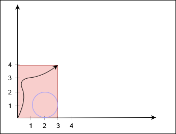
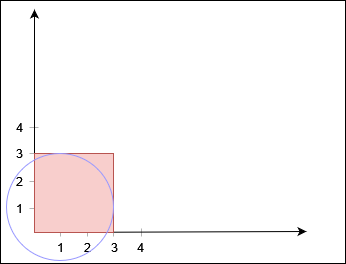
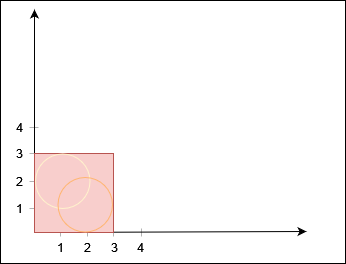
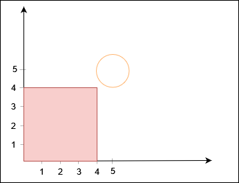

### 1. Description

You are given two positive integers `xCorner` and `yCorner`, and a 2D array `circles`, where $\text{circles}[i] = [x_{i}, y_{i}, r_{i}]$ denotes a circle with center at $(x_{i}, y_{i})$ and radius $r_{i}$.

There is a rectangle in the coordinate plane with its bottom left corner at the origin and top right corner at the coordinate `(xCorner, yCorner)`. You need to check whether there is a path from the bottom left corner to the top right corner such that the **entire path** lies inside the rectangle, **does not** touch or lie inside **any** circle, and touches the rectangle **only** at the two corners.

Return `true` if such a path exists, and `false` otherwise.

### 2. Function Contract

- `n`: Input parameter.
- Returns expected result.

### 3. Examples

#### Example 1

**Input:** xCorner = 3, yCorner = 4, circles = [[2,1,1]]

**Output:** true

**Explanation:**

The black curve shows a possible path between `(0, 0)` and `(3, 4)`.

#### Example 2

**Input:** xCorner = 3, yCorner = 3, circles = [[1,1,2]]

**Output:** false

**Explanation:**

No path exists from `(0, 0)` to `(3, 3)`.

#### Example 3

**Input:** xCorner = 3, yCorner = 3, circles = [[2,1,1],[1,2,1]]

**Output:** false

**Explanation:**

No path exists from `(0, 0)` to `(3, 3)`.

#### Example 4

**Input:** xCorner = 4, yCorner = 4, circles = [[5,5,1]]

**Output:** true

**Explanation:**

### 4. Constraints

- $3 \le xCorner, yCorner \le 10^{9}$

- $1 \le \text{circles.length} \le 1000$

- $\text{circles}[i].length = 3$

- $1 \le x_{i}, y_{i}, r_{i} \le 10^{9}$