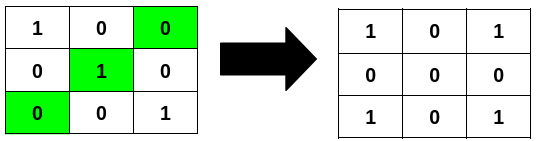
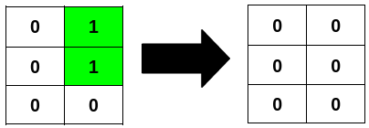
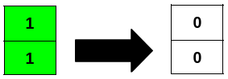

### 1. Description

You are given an `m x n` binary matrix `grid`.

A row or column is considered **palindromic** if its values read the same forward and backward.

You can **flip** any number of cells in `grid` from `0` to `1`, or from `1` to `0`.

Return the **minimum** number of cells that need to be flipped to make **all** rows and columns **palindromic**, and the total number of `1`'s in `grid` **divisible** by `4`.

### 2. Function Contract

- `n`: Input parameter.
- Returns expected result.

### 3. Examples

#### Example 1

**Input:** grid = [[1,0,0],[0,1,0],[0,0,1]]

**Output:** 3

**Explanation:**

#### Example 2

**Input:** grid = [[0,1],[0,1],[0,0]]

**Output:** 2

**Explanation:**

#### Example 3

**Input:** grid = [[1],[1]]

**Output:** 2

**Explanation:**

### 4. Constraints

- $m = \text{grid.length}$

- $n = \text{grid}[i].length$

- $1 \le m * n \le 2 * 10^{5}$

- $0 \le \text{grid}[i][j] \le 1$