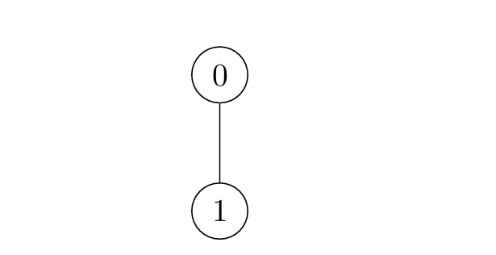

## Description

There exists an **undirected** tree with `n` nodes numbered `0` to $n - 1$. You are given a 2D integer array `edges` of length $n - 1$, where $\text{edges}[i] = [u_{i}, v_{i}]$ indicates that there is an edge between nodes $u_{i}$ and $v_{i}$ in the tree.

Initially, **all** nodes are **unmarked**. For each node `i`:

- If `i` is odd, the node will get marked at time `x` if there is **at least** one node *adjacent* to it which was marked at time $x - 1$.

- If `i` is even, the node will get marked at time `x` if there is **at least** one node *adjacent* to it which was marked at time $x - 2$.

Return an array `times` where $\text{times}[i]$ is the time when all nodes get marked in the tree, if you mark node `i` at time $t = 0$.

**Note** that the answer for each $\text{times}[i]$ is **independent**, i.e. when you mark node `i` all other nodes are *unmarked*.
### Function Contract

- `n`: Input parameter.
- Returns expected result.

### Examples
#### Example 1

**Input:** edges = [[0,1],[0,2]]

**Output:** [2,4,3]

**Explanation:**

- For $i = 0$:

		<li>Node 1 is marked at $t = 1$, and Node 2 at $t = 2$.

	</li>
- For $i = 1$:

		<li>Node 0 is marked at $t = 2$, and Node 2 at $t = 4$.

	</li>
- For $i = 2$:

		<li>Node 0 is marked at $t = 2$, and Node 1 at $t = 3$.

	</li>

#### Example 2

**Input:** edges = [[0,1]]

**Output:** [1,2]

**Explanation:**

- For $i = 0$:

		<li>Node 1 is marked at $t = 1$.

	</li>
- For $i = 1$:

		<li>Node 0 is marked at $t = 2$.

	</li>

#### Example 3

**Input:** edges = [[2,4],[0,1],[2,3],[0,2]]

**Output:** [4,6,3,5,5]

**Explanation:**

### Constraints

- $2 \le n \le 10^{5}$

- $\text{edges.length} = n - 1$

- $\text{edges}[i].length = 2$

- $0 \le \text{edges}[i][0], \text{edges}[i][1] \le n - 1$

- The input is generated such that `edges` represents a valid tree.