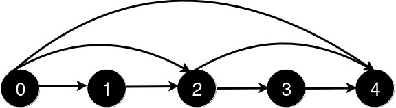
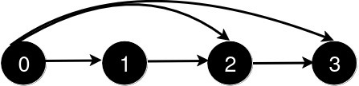

### 1. Description

You are given an integer `n` and a 2D integer array `queries`.

There are `n` cities numbered from `0` to $n - 1$. Initially, there is a **unidirectional** road from city `i` to city $i + 1$ for all $0 \le i < n - 1$.

$\text{queries}[i] = [u_{i}, v_{i}]$ represents the addition of a new **unidirectional** road from city $u_{i}$ to city $v_{i}$. After each query, you need to find the **length** of the **shortest path** from city `0` to city $n - 1$.

Return an array `answer` where for each `i` in the range `[0, queries.length - 1]`, $\text{answer}[i]$ is the *length of the shortest path* from city `0` to city $n - 1$ after processing the **first **$i + 1$ queries.

### 2. Function Contract

- `n`: Input parameter.
- Returns expected result.

### 3. Examples

#### Example 1

**Input:** n = 5, queries = [[2,4],[0,2],[0,4]]

**Output:** [3,2,1]

**Explanation: **

After the addition of the road from 2 to 4, the length of the shortest path from 0 to 4 is 3.

After the addition of the road from 0 to 2, the length of the shortest path from 0 to 4 is 2.

After the addition of the road from 0 to 4, the length of the shortest path from 0 to 4 is 1.

#### Example 2

**Input:** n = 4, queries = [[0,3],[0,2]]

**Output:** [1,1]

**Explanation:**

After the addition of the road from 0 to 3, the length of the shortest path from 0 to 3 is 1.

After the addition of the road from 0 to 2, the length of the shortest path remains 1.

### 4. Constraints

- $3 \le n \le 500$

- $1 \le \text{queries.length} \le 500$

- $\text{queries}[i].length = 2$

- $0 \le \text{queries}[i][0] < \text{queries}[i][1] < n$

- $1 < \text{queries}[i][1] - \text{queries}[i][0]$

- There are no repeated roads among the queries.