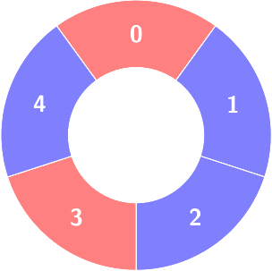
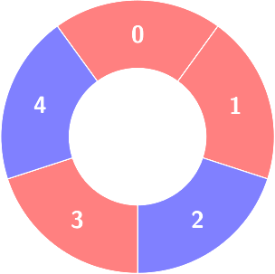
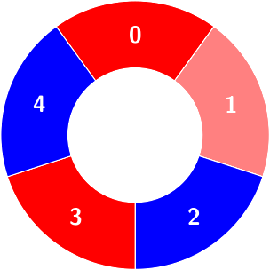
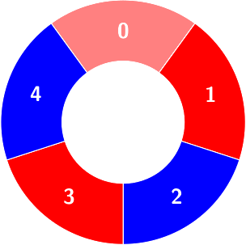
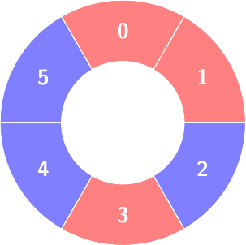
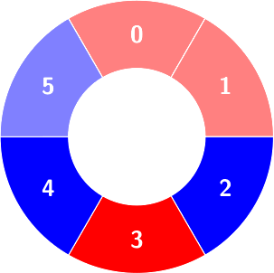
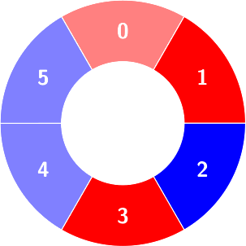

### 1. Description

There are some red and blue tiles arranged circularly. You are given an array of integers `colors` and a 2D integers array `queries`.

The color of tile `i` is represented by $\text{colors}[i]$:

- $\text{colors}[i] = 0$ means that tile `i` is **red**.

- $\text{colors}[i] = 1$ means that tile `i` is **blue**.

An **alternating** group is a contiguous subset of tiles in the circle with **alternating** colors (each tile in the group except the first and last one has a different color from its **adjacent** tiles in the group).

You have to process queries of two types:

- $\text{queries}[i] = [1, \text{size}_{i}]$, determine the count of **alternating** groups with size $\text{size}_{i}$.

- $\text{queries}[i] = [2, \text{index}_{i}, \text{color}_{i}]$, change $colors[\text{index}_{i}]$ to $\text{color}_{i}$.

Return an array `answer` containing the results of the queries of the first type *in order*.

### 2. Function Contract

**Inputs**

- `colors`: Input parameter (`List[int]`).
- `queries`: Input parameter (`List[List[int]]`).

**Return value**

- Returns `List[int]`.

### 3. Note

that since `colors` represents a **circle**, the **first** and the **last** tiles are considered to be next to each other.

### 4. Examples

#### Example 1

- **Input:** colors = [0,1,1,0,1], queries = [[2,1,0],[1,4]]

- **Output:** [2]

- **Explanation:** 

**

**

First query:

Change $\text{colors}[1]$ to 0.

Second query:

Count of the alternating groups with size 4:

#### Example 2

- **Input:** colors = [0,0,1,0,1,1], queries = [[1,3],[2,3,0],[1,5]]

- **Output:** [2,0]

- **Explanation:** 

First query:

Count of the alternating groups with size 3:

Second query: `colors` will not change.

Third query: There is no alternating group with size 5.

### 5. Constraints

- $4 \le \text{colors.length} \le 5 * 10^{4}$

- $0 \le \text{colors}[i] \le 1$

- $1 \le \text{queries.length} \le 5 * 10^{4}$

- $\text{queries}[i][0] = 1$ or $\text{queries}[i][0] = 2$

- For all `i` that:

		- $\text{queries}[i][0] = 1$: $\text{queries}[i].length = 2$, $3 \le \text{queries}[i][1] \le \text{colors.length} - 1$

- $\text{queries}[i][0] = 2$: $\text{queries}[i].length = 3$, $0 \le \text{queries}[i][1] \le \text{colors.length} - 1$, $0 \le \text{queries}[i][2] \le 1$
