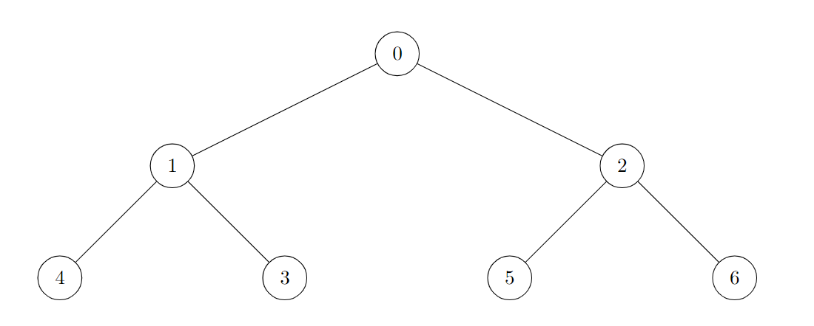
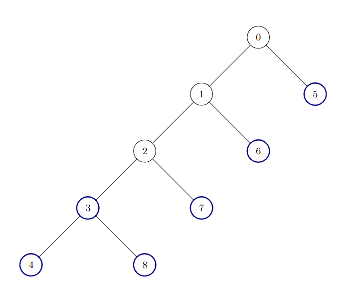
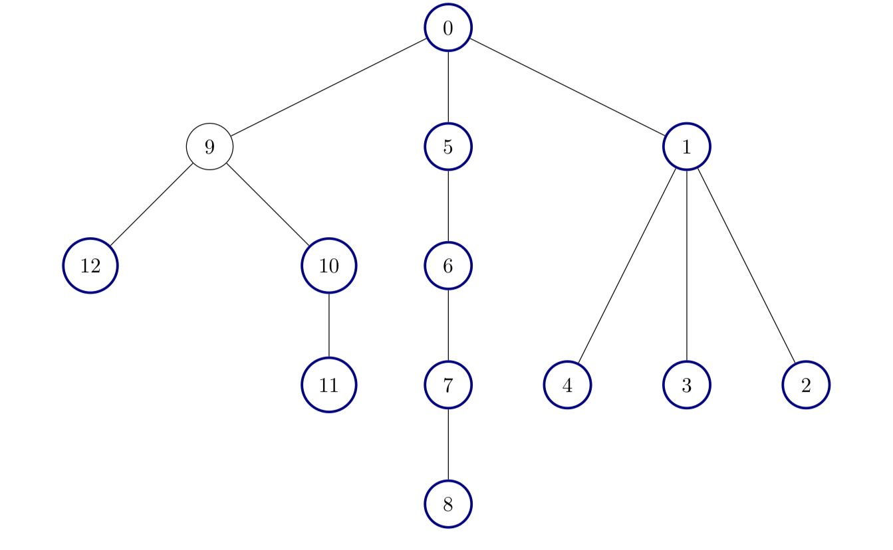

## Description

There is an **undirected** tree with `n` nodes labeled from `0` to $n - 1$, and rooted at node `0`. You are given a 2D integer array `edges` of length $n - 1$, where $\text{edges}[i] = [a_{i}, b_{i}]$ indicates that there is an edge between nodes $a_{i}$ and $b_{i}$ in the tree.

A node is **good** if all the subtrees rooted at its children have the same size.

Return the number of **good** nodes in the given tree.

A **subtree** of `treeName` is a tree consisting of a node in `treeName` and all of its descendants.
### Function Contract

- `n`: Input parameter.
- Returns expected result.

### Examples
#### Example 1

**Input:** edges = [[0,1],[0,2],[1,3],[1,4],[2,5],[2,6]]

**Output:** 7

**Explanation:**

All of the nodes of the given tree are good.

#### Example 2

**Input:** edges = [[0,1],[1,2],[2,3],[3,4],[0,5],[1,6],[2,7],[3,8]]

**Output:** 6

**Explanation:**

There are 6 good nodes in the given tree. They are colored in the image above.
#### Example 3

**Input:** edges = [[0,1],[1,2],[1,3],[1,4],[0,5],[5,6],[6,7],[7,8],[0,9],[9,10],[9,12],[10,11]]

**Output:** 12

**Explanation:**

All nodes except node 9 are good.

### Constraints

- $2 \le n \le 10^{5}$

- $\text{edges.length} = n - 1$

- $\text{edges}[i].length = 2$

- $0 \le a_{i}, b_{i} < n$

- The input is generated such that `edges` represents a valid tree.