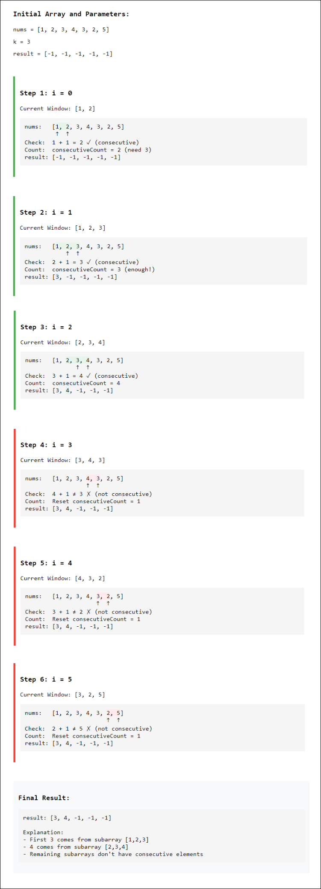

## Solution

---

### Approach 1: Brute Force

#### Intuition

A logical approach is to check every possible subarray of size `k` within the given array. Our goal is to determine if these subarrays contain consecutive integers in ascending order and their power.

For each starting index $i$, we extract the subarray of elements from $\text{nums}[i]$ to $nums[i + k - 1]$. We then need to verify two conditions: the elements must be sorted in ascending order, and they must be consecutive integers.

To check the consecutive property, we iterate through the elements in the subarray and compare each element with the next. If two adjacent elements are not consecutive (meaning the next element is not equal to the current element plus one), we mark the subarray as invalid. If the subarray passes both checks, we take the last element as the maximum, as the elements are sorted.

#### Algorithm

- Initialize `length` to the size of `nums`.
- Create an integer array `result` with size $length - k + 1$ to store the output.

- Iterate through each starting position of the subarray in `nums` using `start`:
  - Set `isConsecutiveAndSorted` to `true` to assume the subarray is valid initially.

  - Check if the current subarray (of size `k`) is sorted and consecutive:
- Loop through each element in the subarray (from `start` to $start + k - 2$):
      - If the next element is not exactly `1` greater than the current element, set `isConsecutiveAndSorted` to `false` and break out of the loop.

  - After the loop, if `isConsecutiveAndSorted` is still `true`:
- Set $\text{result}[start]$ to the maximum element in the subarray, which is $nums[start + k - 1]$.
  - Otherwise, set $\text{result}[start]$ to `-1`.

- Return `result`, where indices with valid sequences contain the last element of the sequence, and others remain `-1`.

#### Implementation

```python
class Solution:
    def resultsArray(self, nums: List[int], k: int) -> List[int]:
        length = len(nums)
        result = [0] * (length - k + 1)

        for start in range(length - k + 1):
            is_consecutive_and_sorted = True

            # Check if the current subarray is sorted and consecutive
            for index in range(start, start + k - 1):
                if nums[index + 1] != nums[index] + 1:
                    is_consecutive_and_sorted = False
                    break

            # If valid, take the maximum of the subarray, otherwise set to -1
            if is_consecutive_and_sorted:
                # Maximum element of this subarray
                result[start] = nums[start + k - 1]
            else:
                result[start] = -1

        return result
```

#### Complexity Analysis

Let $n$ be the length of the input array `nums` and $k$ be the length of the subarrays we are checking.

- Time complexity: $O(n \cdot k)$

    The outer loop iterates $n - k + 1$ times, as we are checking each possible starting point for subarrays of length $k$ within `nums`.

    For each starting position, the inner loop iterates $k - 1$ times to verify if the subarray is consecutive and sorted.

    Therefore, the total time complexity is $O((n - k + 1) \cdot (k - 1))$, which simplifies to $O(n \cdot k)$.

- Space complexity: $O(1)$

    The `result` array has a size of $n - k + 1$, which is required to store the output. However, since this is the required output (stated in the problem statement), it does not count as auxiliary space.

---

### Approach 2: Sliding Window with Deque

#### Intuition

For a more efficient approach, we can use the sliding window technique to avoid rechecking the entire subarray from scratch each time we move the window.

We use a deque to store the indices of elements in the valid sequence. We'll maintain a window of size `k` to slide through the array, focusing on two aspects: keeping track of the current valid window, and ensuring the consecutive property holds.

As we move to a new element, we first check if it breaks the consecutive sequence with the last inserted element in the deque. If it does, we invalidate the entire window and clear the deque. Otherwise, we add the current element’s index to the deque.

When our window size reaches `k`, we examine the size of the deque. If the deque contains exactly `k` indices, we conclude that we have a valid subarray, and we can retrieve the maximum element efficiently from the end of the deque. If the deque does not have `k` elements, we set the result for that position to -1.

#### Algorithm

- Initialize `length` to the size of the `nums` array and `result` array of size $length - k + 1$.
- Create a deque `indexDeque` to store indices within the sliding window.

- Loop through each index `currentIndex` in `nums`:
  - If `indexDeque` is not empty and the index at the front of `indexDeque` is out of the window range, remove it to maintain the sliding window size.

  - If `indexDeque` is not empty and $\text{nums}[currentIndex]$ does not follow the consecutive and sorted condition (i.e., $\text{nums}[currentIndex]$ is not $nums[currentIndex - 1] + 1$), clear `indexDeque` as the current sequence is invalid.

  - Add `currentIndex` to the end of `indexDeque`.

  - If `currentIndex` has reached at least $k - 1$ (window has a full size of `k`):
- If `indexDeque` contains exactly `k` elements, set $result[currentIndex - k + 1]$ to the value at `nums[indexDeque.peekLast()]` since the window is valid.
- Otherwise, set $result[currentIndex - k + 1]$ to `-1` as it indicates an invalid window.

- Return `result`, where indices with valid sequences contain the last element of the sequence, and others remain -1.

#### Implementation

```python
class Solution:
    def resultsArray(self, nums: List[int], k: int) -> List[int]:
        length = len(nums)
        result = [-1] * (length - k + 1)
        index_deque = collections.deque()

        for current_index in range(length):
            # Remove elements that are out of the window
            if index_deque and index_deque[0] < current_index - k + 1:
                index_deque.popleft()
            # Check if current element breaks the consecutive and sorted condition
            if (
                index_deque
                and nums[current_index] != nums[current_index - 1] + 1
            ):
                index_deque.clear()  # Invalidate the entire deque if condition breaks

            # Add current element index to the deque
            index_deque.append(current_index)

            # Check if the window is of size k and update result
            if current_index >= k - 1:
                if len(index_deque) == k:  # Valid window of size k
                    result[current_index - k + 1] = nums[index_deque[-1]]
                else:
                    result[current_index - k + 1] = -1  # Not valid, return -1

        return result
```

#### Complexity Analysis

Let $n$ be the length of the input array `nums` and $k$ be the length of the subarrays we are checking.

- Time complexity: $O(n)$

    The `for` loop iterates over each element in `nums`, making it $O(n)$.

    Inside the loop:
      - Removing elements from the `indexDeque` and clearing it takes $O(1)$ since the `Deque` operations are all constant-time operations.
      - Each index is added and removed from the `indexDeque` at most once, resulting in $O(n)$ total operations for managing the `Deque`.

    Thus, the overall time complexity is $O(n)$.

- Space complexity: $O(k)$

    The space complexity is primarily due to the `indexDeque`, which can hold at most $k$ elements at any time, as elements that are out of the window are removed from the `Deque`.

    Thus, the auxiliary space complexity is $O(k)$.

---

### Approach 3: Optimized Via Counter

#### Intuition

In the previous approach, we used a deque to track a sequence of size `k` and check if each new element is consecutive with the last element added to the deque. However, this raises an important question: why use a deque at all if we’re only interested in checking whether the current element follows directly from the last one we examined?

This leads us to a simpler approach: we can replace the deque with a simple counter that tracks the length of the consecutive sequence. As we go through the array, we check each element with the one that follows it. If they are consecutive, we increase our counter. Otherwise, we reset the counter to 1 since the sequence is broken.

When our counter reaches `k`, it signals that we’ve found a valid subarray of size `k`. At this point, we store the last element of this sequence as the result. For any indices that don’t meet the consecutive condition, we set their result to -1.



#### Algorithm

- If `k` is 1, return `nums` directly, as each single element is a valid subarray.

- Initialize `length` to the length of `nums` and create an array `result` of size $length - k + 1$.
  - Fill `result` with -1 to represent non-matching positions.

- Initialize `consecutiveCount` to 1, which keeps track of consecutive elements.

- Loop through `nums` from the start to $length - 1$:
  - If $\text{nums}[index] + 1$ equals $nums[index + 1]$, increment `consecutiveCount`.
  - If the elements are not consecutive, reset `consecutiveCount` to 1.

  - If `consecutiveCount` reaches or exceeds `k`, update `result` at position $index - k + 2$ with $nums[index + 1]$.
- This indicates that a valid sequence of length `k` ending at $nums[index + 1]$ was found.

- Return `result`, where indices with valid sequences contain the last element of the sequence, and others remain -1.

#### Implementation

```python
class Solution:
    def resultsArray(self, nums, k):
        if k == 1:
            return nums  # If k is 1, every single element is a valid subarray

        length = len(nums)
        result = [-1] * (length - k + 1)
        consecutive_count = 1  # Count of consecutive elements

        for index in range(length - 1):
            if nums[index] + 1 == nums[index + 1]:
                consecutive_count += 1
            else:
                consecutive_count = 1  # Reset count if not consecutive

            # If we have enough consecutive elements, update the result
            if consecutive_count >= k:
                result[index - k + 2] = nums[index + 1]

        return result
```

#### Complexity Analysis

Let $n$ be the length of the input array `nums` and $k$ be the length of the subarrays we are checking.

- Time complexity: $O(n)$

    The filling of the array with -1 takes $O(n)$ since it initializes the `result` array.

    The `for` loop iterates over each element in `nums` once (up to $length - 1$), making the primary loop $O(n)$.

    Inside the loop:
      - We perform a constant-time check to determine if the current element is consecutive with the next element and increment or reset `consecutiveCount`.
      - The `result` array is updated in constant time as well when a valid subarray of size $k$ is found.

    Thus, the overall time complexity is $O(n)$.

- Space complexity: $O(1)$

    The `result` array has a size of $n - k + 1$, which is required to store the output. However, since this is the required output(stated in the problem statement), it does not count as auxiliary space.

---