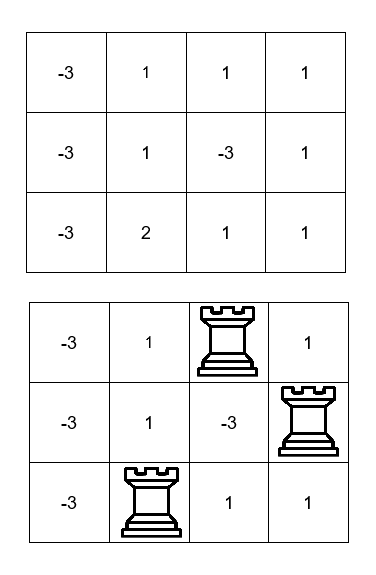

## Description

You are given a `m x n` 2D array `board` representing a chessboard, where $\text{board}[i][j]$ represents the **value** of the cell `(i, j)`.

Rooks in the **same** row or column **attack** each other. You need to place *three* rooks on the chessboard such that the rooks **do not** **attack** each other.

Return the **maximum** sum of the cell **values** on which the rooks are placed.
### Function Contract

- `n`: Input parameter.
- Returns expected result.

### Examples
#### Example 1

**Input:** board = [[-3,1,1,1],[-3,1,-3,1],[-3,2,1,1]]

**Output:** 4

**Explanation:**

We can place the rooks in the cells `(0, 2)`, `(1, 3)`, and `(2, 1)` for a sum of $1 + 1 + 2 = 4$.

#### Example 2

**Input:** board = [[1,2,3],[4,5,6],[7,8,9]]

**Output:** 15

**Explanation:**

We can place the rooks in the cells `(0, 0)`, `(1, 1)`, and `(2, 2)` for a sum of $1 + 5 + 9 = 15$.

#### Example 3

**Input:** board = [[1,1,1],[1,1,1],[1,1,1]]

**Output:** 3

**Explanation:**

We can place the rooks in the cells `(0, 2)`, `(1, 1)`, and `(2, 0)` for a sum of $1 + 1 + 1 = 3$.

### Constraints

- $3 \le m = \text{board.length} \le 500$

- $3 \le n = \text{board}[i].length \le 500$

- $-10^{9} \le \text{board}[i][j] \le 10^{9}$