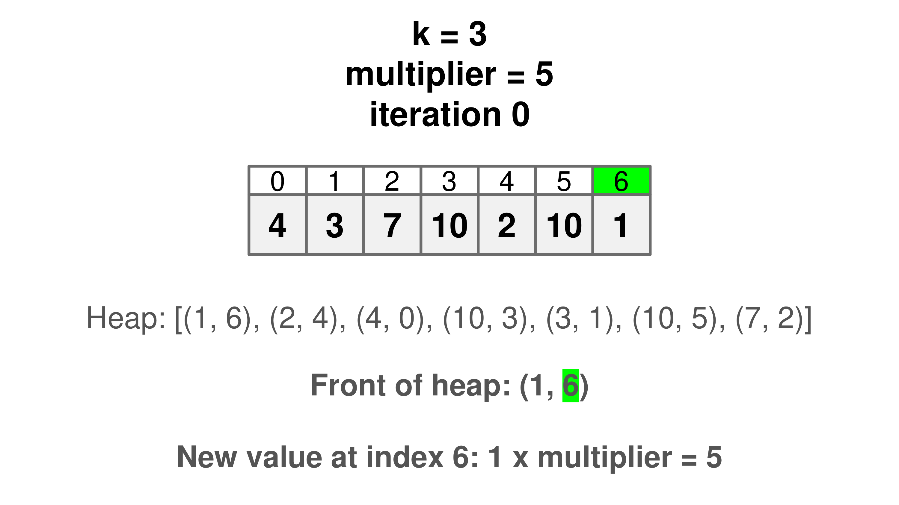
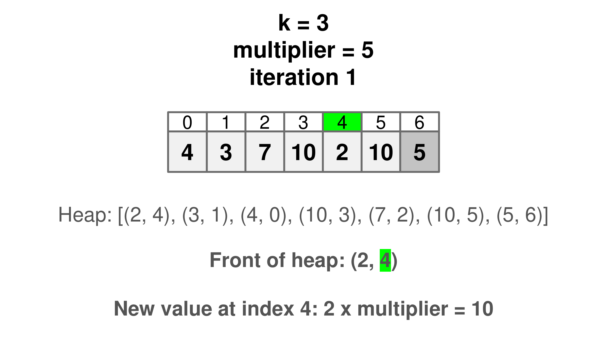
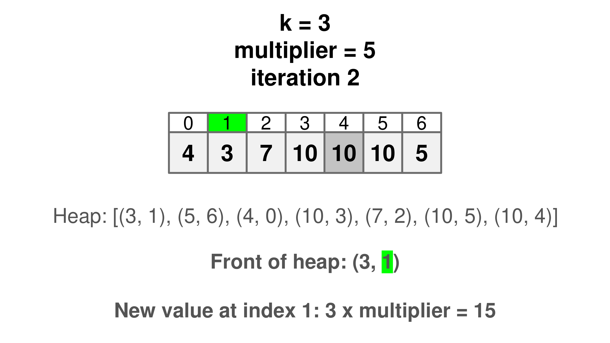
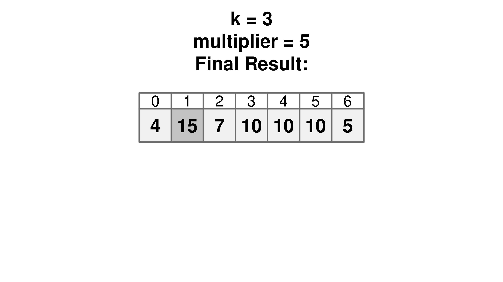

[TOC]

## Solution

---

### Overview

We need to perform `k` operations on an integer array. In each operation, we identify the smallest value, multiply it by a given multiplier, and then replace the original value with the new one. The main challenge is to efficiently track and update the smallest element in the array.

This kind of problem often arises in resource management scenarios, where tasks or items need to be prioritized or adjusted based on criteria such as price or urgency.

---

### Approach 1: K Full Array Scans for Minimum Element Multiplication

#### Intuition

First, let's consider the task: repeatedly finding the smallest value in an array and updating it. We know that every time we modify the smallest value, it might no longer be the smallest element in the array. This means we need to evaluate the entire array again to find the next smallest value. This tells us that finding the minimum at each step is a key part of the process.

Now, think about how we find the smallest value. To ensure we always pick the first occurrence of the minimum when there are duplicates, we need to check each element in the array in order. As we go through the array, we compare the values we encounter with the smallest value we've seen so far. If we find a smaller value, we update our record of what the smallest value is and where it’s located.

Once we know where the smallest value is, the next step is to modify it. We multiply the value by the `multiplier` and replace it in its original position. With this updated array, we repeat the same process to find and modify the smallest value a total of `k` times.

#### Algorithm

1. The length of the array `nums` is stored in `n`.
2. The outer loop runs `k` times. Each iteration represents one operation where the smallest element in the array is identified and modified.
3. Inside the outer loop, we initialize $\text{min}_{index}$ to `0`. Then, we start iterating over the array with the inner loop.
4. The inner loop runs from $i = 0$ to $i = n - 1$. For each element in the array, we check if the current element $\text{nums}[i]$ is smaller than the element at the current $\text{min}_{index}$. If it is, we update $\text{min}_{index}$ to `i`.
5. After the inner loop finishes the smallest element is multiplied by the `multiplier`, and the result is stored back at the $\text{min}_{index}$ position in the array.
6. Once all `k` iterations are complete, the final state of the array is returned.

#### Implementation

```python
class Solution:
    def getFinalState(self, nums: List[int], k: int, multiplier: int):
        n = len(nums)

        for _ in range(k):
            # Find the index of the smallest element in the array
            min_index = 0
            for i in range(n):
                if nums[i] < nums[min_index]:
                    min_index = i

            # Multiply the smallest element by the multiplier
            nums[min_index] *= multiplier

        return nums
```

Let $N$ be the length of `nums`.

* Time Complexity: $O(N \cdot k)$

    The approach iterates through the `nums` list `k` times, where each iteration involves locating the index of the smallest element. This requires a full scan of the array, which incurs an $O(N)$ time complexity. Given that each operation within the inner loop is performed in constant time, the overall time complexity amounts to $O(N \cdot k)$.

* Space Complexity: $O(1)$

    The approach uses a fixed amount of extra space, independent of the input array `nums` size. It uses only a few variables - such as `n`, $\text{min}_{index}$, and loop counters to track intermediate values. Thus, the space complexity remains constant.

---

### Approach 2: Heap-Optimized K Minimum Value Multiplication

#### Intuition

In the previous approach, we were doing full array scans to find the minimum element. To optimize this, we can use a data structure that is designed for quickly retrieving and modifying the smallest element: a heap. A heap allows us to access the smallest element in constant time and efficiently supports removing and inserting elements with logarithmic time complexity.

To implement this, we can start by creating a list where each element is paired with its index in the original array. The index is crucial because after modifying an element, we need to know where to place the updated value in the array. This way, we can keep track of the original position of each element while sorting them based on their values.

Once the list is created, we convert it into a heap. In a heap, the smallest element can be accessed and removed efficiently. For each of the `k` operations, we need to perform 3 steps:

1. Pop the smallest element from the heap: This gives us both the value of the smallest element and its index in the original array.
2. Multiply the value by the `multiplier`: Update the array at the corresponding index with this new value.
3. Push the modified value back into the heap: Include its index so that it can be considered for future operations.

After completing all `k` operations, we return the modified array.









> For a more comprehensive understanding of heaps and priority queues, check out the [Heap Explore Card 🔗](https://leetcode.com/explore/learn/card/heap/). This resource provides an in-depth look at heap-based algorithms, explaining their key concepts and applications with a variety of problems to solidify understanding of the pattern.

#### Algorithm

1. Create a list where each element is paired with its index from the input `nums`.
2. Convert the list into a heap.
3. Loop through the process `k` times, where each iteration represents one operation of finding and updating the smallest value.
4. In each iteration, remove the smallest element from the heap, which gives us both the value and its index in the original array.
5. Multiply the value at the identified index by the `multiplier` and update the value in `nums`.
6. Insert the updated value and its index back into the heap.
7. After completing all `k` operations, return the updated array.

#### Implementation

> Note: Heap sort is an unstable sorting algorithm, meaning the relative order of equal-valued elements may not be preserved. While the implementation in the language below preserves order, special care must be taken when implementing in other languages to ensure the first occurrence of the minimum value is selected correctly.

```python
class Solution:
    def getFinalState(self, nums: List[int], k: int, multiplier: int):
        pq = [(val, i) for i, val in enumerate(nums)]
        heapify(pq)

        for _ in range(k):
            _, i = heappop(pq)
            nums[i] *= multiplier
            heappush(pq, (nums[i], i))

        return nums
```

Let $N$ be the length of `nums`.

* Time Complexity: $O(N + k \cdot \log N)$

    The approach uses a heap (priority queue) to efficiently find and update the smallest element in the `nums` list. Initially, building the heap takes $O(N)$ time.

    Each of the `k` iterations involves removing the smallest element from the heap and then reinserting the updated element. Both the removal and insertion operations take $O(\log N)$ time.

    Therefore, the total time complexity for `k` iterations is $O(k \cdot \log N)$, resulting in a total time complexity of $O(N + k \cdot \log N)$.

    > Note: The time complexity of the Java solution is $O(N \cdot \log N + k \cdot \log N)$ because we aren't using an inbuilt heapify method in Java.

* Space Complexity: $O(N)$

    The approach uses a heap to store the elements of the `nums` list along with their indices. The heap requires additional space proportional to the number of elements in the `nums` list.

    Therefore, the space complexity is $O(N)$.

---