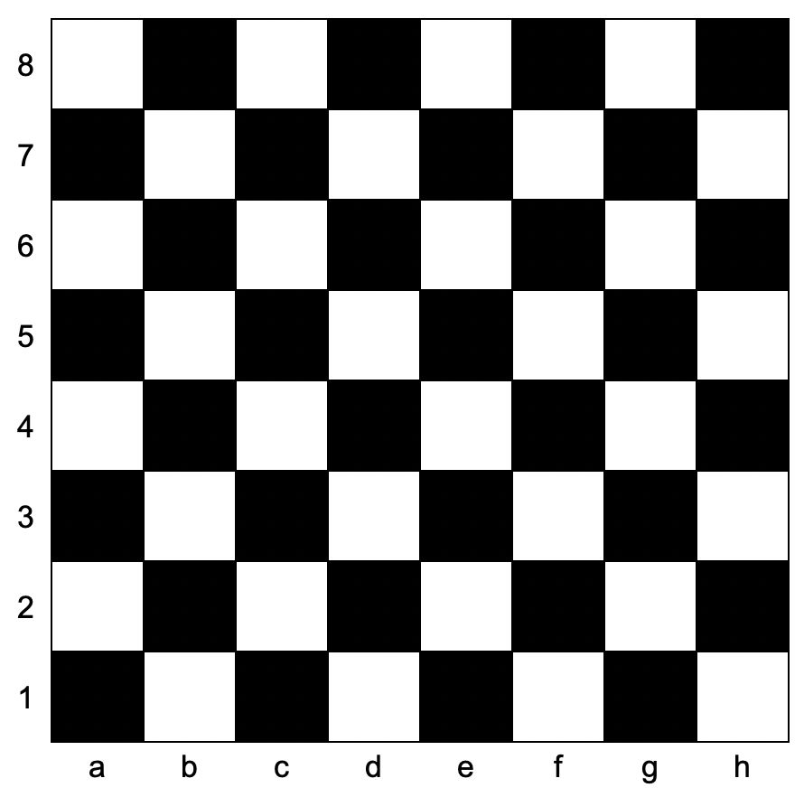

### 1. Description

You are given two strings, `coordinate1` and `coordinate2`, representing the coordinates of a square on an `8 x 8` chessboard.

Below is the chessboard for reference.

Return `true` if these two squares have the same color and `false` otherwise.

The coordinate will always represent a valid chessboard square. The coordinate will always have the letter first (indicating its column), and the number second (indicating its row).

### 2. Function Contract

**Inputs**

- `coordinate1`: Input parameter (`str`).
- `coordinate2`: Input parameter (`str`).

**Return value**

- Returns `bool`.

### 3. Examples

#### Example 1

- **Input:** coordinate1 = "a1", coordinate2 = "c3"

- **Output:** true

- **Explanation:** Both squares are black.

#### Example 2

- **Input:** coordinate1 = "a1", coordinate2 = "h3"

- **Output:** false

- **Explanation:** Square `"a1"` is black and `"h3"` is white.

### 4. Constraints

- $\text{coordinate1.length} = \text{coordinate2.length} = 2$

- $'a' \le \text{coordinate1}[0], \text{coordinate2}[0] \le 'h'$

- $'1' \le \text{coordinate1}[1], \text{coordinate2}[1] \le '8'$
