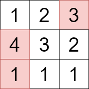
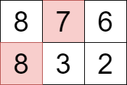

## Description

You are given a 2D matrix `grid` consisting of positive integers.

You have to select *one or more* cells from the matrix such that the following conditions are satisfied:

- No two selected cells are in the **same** row of the matrix.

- The values in the set of selected cells are **unique**.

Your score will be the **sum** of the values of the selected cells.

Return the **maximum** score you can achieve.
### Function Contract

- `n`: Input parameter.
- Returns expected result.

### Examples
#### Example 1

**Input:** grid = [[1,2,3],[4,3,2],[1,1,1]]

**Output:** 8

**Explanation:**

We can select the cells with values 1, 3, and 4 that are colored above.

#### Example 2

**Input:** grid = [[8,7,6],[8,3,2]]

**Output:** 15

**Explanation:**

We can select the cells with values 7 and 8 that are colored above.

### Constraints

- $1 \le \text{grid.length}, \text{grid}[i].length \le 10$

- $1 \le \text{grid}[i][j] \le 100$