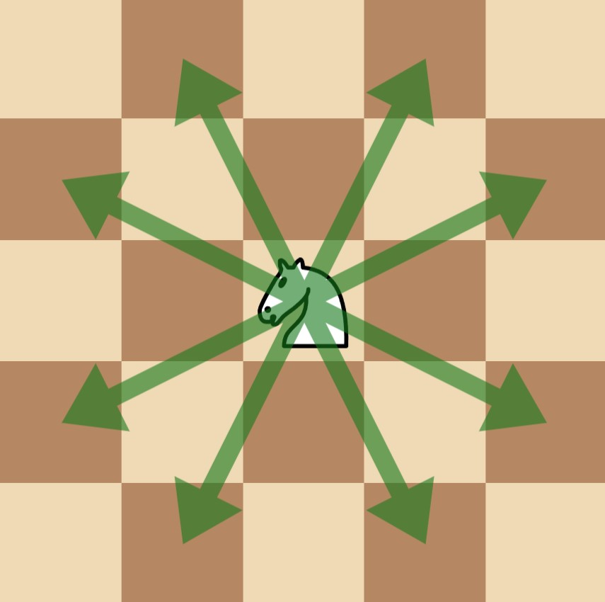
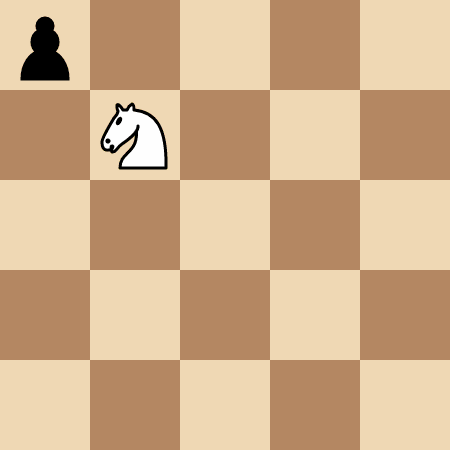
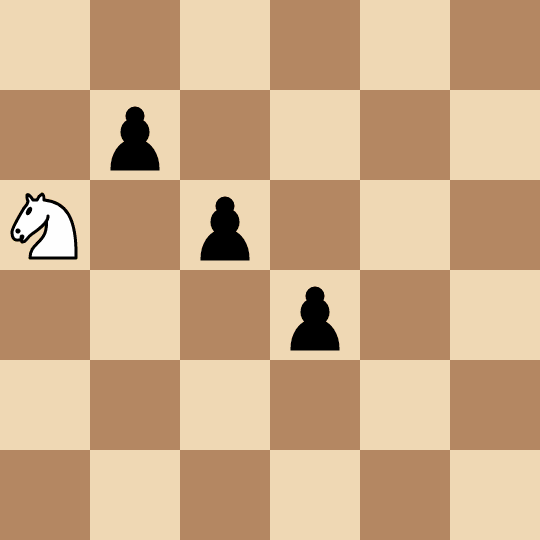

## Description

There is a `50 x 50` chessboard with **one** knight and some pawns on it. You are given two integers `kx` and `ky` where `(kx, ky)` denotes the position of the knight, and a 2D array `positions` where $\text{positions}[i] = [x_{i}, y_{i}]$ denotes the position of the pawns on the chessboard.

Alice and Bob play a *turn-based* game, where Alice goes first. In each player's turn:

- The player *selects *a pawn that still exists on the board and captures it with the knight in the **fewest** possible **moves**. **Note** that the player can select **any** pawn, it **might not** be one that can be captured in the **least** number of moves.

- In the process of capturing the *selected* pawn, the knight **may** pass other pawns **without** capturing them. **Only** the *selected* pawn can be captured in *this* turn.

Alice is trying to **maximize** the **sum** of the number of moves made by *both* players until there are no more pawns on the board, whereas Bob tries to **minimize** them.

Return the **maximum** *total* number of moves made during the game that Alice can achieve, assuming both players play **optimally**.

Note that in one **move, **a chess knight has eight possible positions it can move to, as illustrated below. Each move is two cells in a cardinal direction, then one cell in an orthogonal direction.

### Function Contract

- `n`: Input parameter.
- Returns expected result.

### Examples
#### Example 1

**Input:** kx = 1, ky = 1, positions = [[0,0]]

**Output:** 4

**Explanation:**

The knight takes 4 moves to reach the pawn at `(0, 0)`.

#### Example 2

**Input:** kx = 0, ky = 2, positions = [[1,1],[2,2],[3,3]]

**Output:** 8

**Explanation:**

**

**

- Alice picks the pawn at `(2, 2)` and captures it in two moves: `(0, 2) -> (1, 4) -> (2, 2)`.

- Bob picks the pawn at `(3, 3)` and captures it in two moves: `(2, 2) -> (4, 1) -> (3, 3)`.

- Alice picks the pawn at `(1, 1)` and captures it in four moves: `(3, 3) -> (4, 1) -> (2, 2) -> (0, 3) -> (1, 1)`.

#### Example 3

**Input:** kx = 0, ky = 0, positions = [[1,2],[2,4]]

**Output:** 3

**Explanation:**

- Alice picks the pawn at `(2, 4)` and captures it in two moves: `(0, 0) -> (1, 2) -> (2, 4)`. Note that the pawn at `(1, 2)` is not captured.

- Bob picks the pawn at `(1, 2)` and captures it in one move: `(2, 4) -> (1, 2)`.

### Constraints

- $0 \le kx, ky \le 49$

- $1 \le \text{positions.length} \le 15$

- $\text{positions}[i].length = 2$

- $0 \le \text{positions}[i][0], \text{positions}[i][1] \le 49$

- All $\text{positions}[i]$ are unique.

- The input is generated such that $\text{positions}[i] \neq [kx, ky]$ for all $0 \le i < \text{positions.length}$.