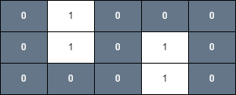
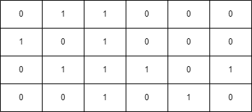
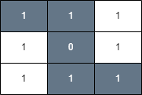

## Description

You are given an `m x n` binary matrix `grid` and an integer `health`.

You start on the upper-left corner `(0, 0)` and would like to get to the lower-right corner $(m - 1, n - 1)$.

You can move up, down, left, or right from one cell to another adjacent cell as long as your health *remains* **positive**.

Cells `(i, j)` with $\text{grid}[i][j] = 1$ are considered **unsafe** and reduce your health by 1.

Return `true` if you can reach the final cell with a health value of 1 or more, and `false` otherwise.
### Function Contract

- `n`: Input parameter.
- Returns expected result.

### Examples
#### Example 1

**Input:** grid = [[0,1,0,0,0],[0,1,0,1,0],[0,0,0,1,0]], health = 1

**Output:** true

**Explanation:**

The final cell can be reached safely by walking along the gray cells below.

#### Example 2

**Input:** grid = [[0,1,1,0,0,0],[1,0,1,0,0,0],[0,1,1,1,0,1],[0,0,1,0,1,0]], health = 3

**Output:** false

**Explanation:**

A minimum of 4 health points is needed to reach the final cell safely.

#### Example 3

**Input:** grid = [[1,1,1],[1,0,1],[1,1,1]], health = 5

**Output:** true

**Explanation:**

The final cell can be reached safely by walking along the gray cells below.

Any path that does not go through the cell `(1, 1)` is unsafe since your health will drop to 0 when reaching the final cell.

### Constraints

- $m = \text{grid.length}$

- $n = \text{grid}[i].length$

- $1 \le m, n \le 50$

- $2 \le m * n$

- $1 \le health \le m + n$

- $\text{grid}[i][j]$ is either 0 or 1.