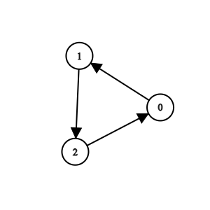

### 1. Description

You are maintaining a project that has `n` methods numbered from `0` to $n - 1$.

You are given two integers `n` and `k`, and a 2D integer array `invocations`, where $\text{invocations}[i] = [a_{i}, b_{i}]$ indicates that method $a_{i}$ invokes method $b_{i}$.

There is a known bug in method `k`. Method `k`, along with any method invoked by it, either **directly** or **indirectly**, are considered **suspicious** and we aim to remove them.

A group of methods can only be removed if no method **outside** the group invokes any methods **within** it.

Return an array containing all the remaining methods after removing all the **suspicious** methods. You may return the answer in *any order*. If it is not possible to remove **all** the suspicious methods, **none** should be removed.

### 2. Function Contract

- `n`: Input parameter.
- Returns expected result.

### 3. Examples

#### Example 1

**Input:** n = 4, k = 1, invocations = [[1,2],[0,1],[3,2]]

**Output:** [0,1,2,3]

**Explanation:**

Method 2 and method 1 are suspicious, but they are directly invoked by methods 3 and 0, which are not suspicious. We return all elements without removing anything.

#### Example 2

**Input:** n = 5, k = 0, invocations = [[1,2],[0,2],[0,1],[3,4]]

**Output:** [3,4]

**Explanation:**

Methods 0, 1, and 2 are suspicious and they are not directly invoked by any other method. We can remove them.

#### Example 3

**Input:** n = 3, k = 2, invocations = [[1,2],[0,1],[2,0]]

**Output:** []

**Explanation:**

All methods are suspicious. We can remove them.

### 4. Constraints

- $1 \le n \le 10^{5}$

- $0 \le k \le n - 1$

- $0 \le \text{invocations.length} \le 2 * 10^{5}$

- $\text{invocations}[i] = [a_{i}, b_{i}]$

- $0 \le a_{i}, b_{i} \le n - 1$

- $a_{i} \neq b_{i}$

- $\text{invocations}[i] \neq \text{invocations}[j]$