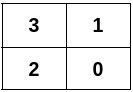
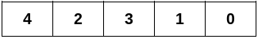
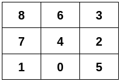

### 1. Description

You are given a 2D integer array `edges` representing an **undirected** graph having `n` nodes, where $\text{edges}[i] = [u_{i}, v_{i}]$ denotes an edge between nodes $u_{i}$ and $v_{i}$.

Construct a 2D grid that satisfies these conditions:

- The grid contains **all nodes** from `0` to $n - 1$ in its cells, with each node appearing exactly **once**.

- Two nodes should be in adjacent grid cells (**horizontally** or **vertically**) **if and only if** there is an edge between them in `edges`.

It is guaranteed that `edges` can form a 2D grid that satisfies the conditions.

Return a 2D integer array satisfying the conditions above. If there are multiple solutions, return *any* of them.

### 2. Function Contract

- `n`: Input parameter.
- Returns expected result.

### 3. Examples

#### Example 1

**Input:** n = 4, edges = [[0,1],[0,2],[1,3],[2,3]]

**Output:** [[3,1],[2,0]]

**Explanation:**

#### Example 2

**Input:** n = 5, edges = [[0,1],[1,3],[2,3],[2,4]]

**Output:** [[4,2,3,1,0]]

**Explanation:**

#### Example 3

**Input:** n = 9, edges = [[0,1],[0,4],[0,5],[1,7],[2,3],[2,4],[2,5],[3,6],[4,6],[4,7],[6,8],[7,8]]

**Output:** [[8,6,3],[7,4,2],[1,0,5]]

**Explanation:**

### 4. Constraints

- $2 \le n \le 5 * 10^{4}$

- $1 \le \text{edges.length} \le 10^{5}$

- $\text{edges}[i] = [u_{i}, v_{i}]$

- $0 \le u_{i} < v_{i} < n$

- All the edges are distinct.

- The input is generated such that `edges` can form a 2D grid that satisfies the conditions.