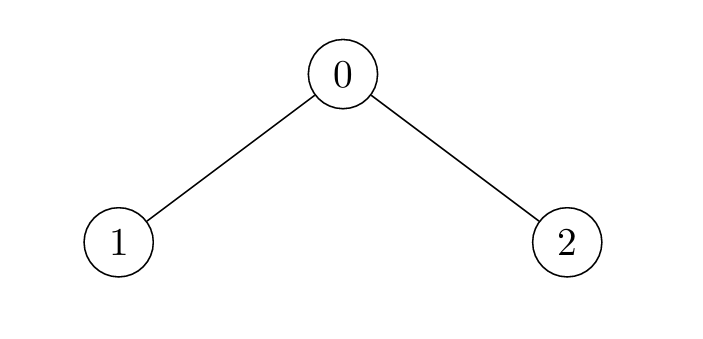
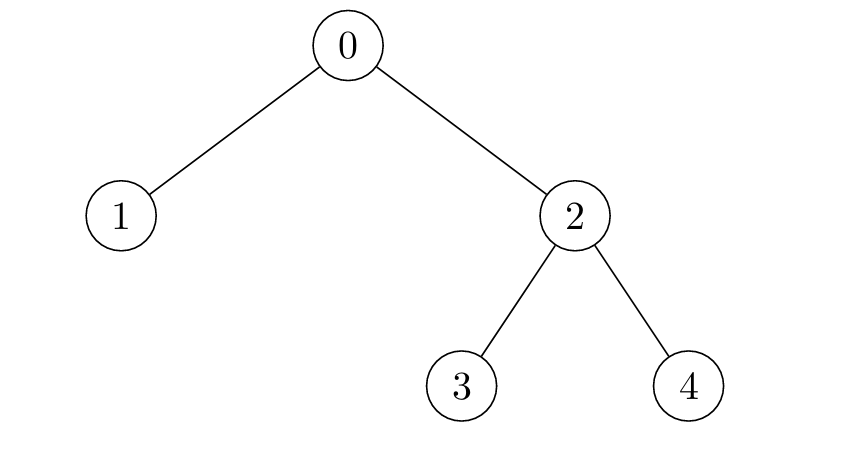

### 1. Description

There exists an **undirected** tree with `n` nodes numbered `0` to $n - 1$. You are given a 2D integer array `edges` of length $n - 1$, where $\text{edges}[i] = [u_{i}, v_{i}]$ indicates that there is an edge between nodes $u_{i}$ and $v_{i}$ in the tree.

Initially, **all** nodes are **unmarked**. After every second, you mark all unmarked nodes which have **at least** one marked node *adjacent* to them.

Return an array `nodes` where $\text{nodes}[i]$ is the last node to get marked in the tree, if you mark node `i` at time $t = 0$. If $\text{nodes}[i]$ has *multiple* answers for any node `i`, you can choose** any** one answer.

### 2. Function Contract

- Refer to method signature.

### 3. Examples

#### Example 1

**Input:** edges = [[0,1],[0,2]]

**Output:** [2,2,1]

**Explanation:**

- For $i = 0$, the nodes are marked in the sequence: `[0] -> [0,1,2]`. Either 1 or 2 can be the answer.

- For $i = 1$, the nodes are marked in the sequence: `[1] -> [0,1] -> [0,1,2]`. Node 2 is marked last.

- For $i = 2$, the nodes are marked in the sequence: `[2] -> [0,2] -> [0,1,2]`. Node 1 is marked last.

#### Example 2

**Input:** edges = [[0,1]]

**Output:** [1,0]

**Explanation:**

- For $i = 0$, the nodes are marked in the sequence: `[0] -> [0,1]`.

- For $i = 1$, the nodes are marked in the sequence: `[1] -> [0,1]`.

#### Example 3

**Input:** edges = [[0,1],[0,2],[2,3],[2,4]]

**Output:** [3,3,1,1,1]

**Explanation:**

- For $i = 0$, the nodes are marked in the sequence: `[0] -> [0,1,2] -> [0,1,2,3,4]`.

- For $i = 1$, the nodes are marked in the sequence: `[1] -> [0,1] -> [0,1,2] -> [0,1,2,3,4]`.

- For $i = 2$, the nodes are marked in the sequence: `[2] -> [0,2,3,4] -> [0,1,2,3,4]`.

- For $i = 3$, the nodes are marked in the sequence: `[3] -> [2,3] -> [0,2,3,4] -> [0,1,2,3,4]`.

- For $i = 4$, the nodes are marked in the sequence: `[4] -> [2,4] -> [0,2,3,4] -> [0,1,2,3,4]`.

### 4. Constraints

- $2 \le n \le 10^{5}$

- $\text{edges.length} = n - 1$

- $\text{edges}[i].length = 2$

- $0 \le \text{edges}[i][0], \text{edges}[i][1] \le n - 1$

- The input is generated such that `edges` represents a valid tree.